# IMX93-GW8016 16-channel LoRaWAN gateway user manual

**Shenzhen Weichuan Technology Co., Ltd.**
**Shenzhen Winext Technology Co., Ltd.**

---

## Table of contents

1. [Product introduction](# Product Introduction)
2. [Product advantages](# Product Advantages)
3. [GW8000 series gateway parameter comparison](#gw8000 series gateway parameter comparison)
4. [Hardware release notes](#hardware version notes)
5. [Software features](#Software features)
6. [System architecture](#system architecture)
7. [Log in to the gateway page](#Log in to the gateway page)
8. [WAN port static IP configuration](#wan port static ip configuration)
9. [Configure LoRa communication mode](#Configure LoRa communication mode)
10. [Built-in Chirpstack device management](#built-inchirpstack device management)
11. [Data collection example](#data collection example)
12. [Advanced web management features](#Advanced web management features)
13. [FUOTA firmware over-the-air upgrade](#fuotafirmware over-the-air upgrade)
14. [Gateway cluster management](#gateway cluster management)
15. [Product competitiveness summary](# Product competitiveness summary)

---

## Product introduction

IMX93-GW8016 is a professional industrial-grade LoRaWAN edge gateway product that can be installed outdoors. It uses a high-performance NXP i.MX93 triple-core processor and integrates dual SX1302 radio frequency chips to provide 16 LoRa uplink channels and 2 downlink channels. This gateway is specially designed for large-scale IoT deployment. It has a built-in chirpstack V4.x network server and supports a variety of communication protocols and data forwarding methods. It can meet the needs of various application scenarios such as smart cities, smart agriculture, and industrial IoT.

The product adopts a fully industrial-grade design, supports IP67 protection level, has an operating temperature range of -40℃ to +75℃, is equipped with multiple network connection methods (4G LTE, WiFi, Ethernet), supports PoE power supply, and can achieve rapid deployment and remote management.

---

## Product advantages

The IMX93-GW8016 gateway has the following core advantages:

### 1. High-performance processor platform
- Adopts industrial-grade NXP i.MX93 3 processors (dual-core Cortex-A55 @ 1.7GHz + low-power single-core Cortex-M33 @ 250MHz)
- Integrated NPU neural processing unit, providing 0.5 TOPS computing power and supporting edge AI applications
- 2GB LPDDR4 memory + 32GB eMMC storage to ensure smooth system operation

### 2. Double LoRa channel capacity
- 16 upstream channels + 2 downstream channels, twice the capacity of GW8000 (8 channels)
- Support more concurrent device access, reduce packet loss rate, and improve network efficiency
- Dual SX1302 RF architecture, receiving sensitivity up to -142 dBm

### 3. Diversified connection methods
- 4G LTE full network communication (supports multiple frequency bands at home and abroad)
- Dual-band WiFi (2.4G/5.8G, 2×2 MIMO)
- Dual network ports (WAN Gigabit + LAN 100M)


### 4. Built-in web server
- Pre-installed chirpstack V4.x web server, supports local device management
- LoRaWAN device access and data collection can be completed without the need for an external cloud platform
- Regularly updated to the latest version of chirpstack

### 5. Rich protocol support
- LoRa protocol: UDP GWMP, MQTT, Basic Station (LNS/CUPS), chirpstack-mqtt-forwarder
- Data forwarding protocols: MQTT v3.1.1, HTTP, Modbus TCP, BACnet BIP
- Supports connecting to external NS (TTN, chirpstack, Helium, Microsoft, AWS, etc.)

### 6. Industrial grade reliability
- IP67 protection grade, suitable for harsh outdoor environments
- Working temperature -40℃ to +75℃, humidity 5%~95% RH
- External TI industrial-grade hardware watchdog to ensure stable operation of the system
- Built-in RTC + backup battery, supports offline timing
- Power-off alarm function to promptly notify abnormal status

### 7. Flexible deployment and management
- Supports PoE (IEEE 802.3at/af) power supply, simplifying installation and wiring
- Wall and pole mounting kits available
- Built-in GPS/Beidou/Galileo/GLONASS multi-mode positioning
-Support VPN remote access to facilitate remote maintenance and technical support

### 8. Strong secondary development capabilities
- Python 3.11 script support, custom data processing logic can be written
- IoT Hub supports TSL (Thing Specification Language) definition of object model and flexibly configures device attributes
-Support cluster management and device roaming functions
- OpenWrt system architecture, supports Chinese and English page display

### 9. LBT (Listen-Before-Talk) spectrum monitoring technology
- **Regulatory Compliance**: Meets spectrum sharing regulatory requirements in Europe (EU868), Asia (AS923, KR920) and other regions
- **Intelligent Avoidance Mechanism**: The device listens to the channel RSSI before sending to detect whether other devices are using it to avoid signal collisions
- **Improve network efficiency**: In high-density deployment environments, packet conflicts and retransmissions are significantly reduced and network throughput is improved.
- **Beyond ALOHA protocol**: Compared with traditional random access methods, LBT improves network performance by 30-50%
- **Hardware level support**: SX1302 + SX1262 hardware implementation, fast response and lower power consumption than SX1301 solution
- **Applicable frequency bands**: AS923-1/AS923-2/AS923-3/AS923-4, KR920, EU868 are fully supported, and RU864 and IN865 are also applicable
- **Note**: The US915 and AU915 frequency bands use BW500KHz bandwidth for downlink, and LBT only supports BW125KHz, so the LBT function is not supported.

### 10. Complete data traceability capabilities
- **Real-time data query**: Obtain ChirpStack standard protocol data and data parsed by the object model (Hub) in real time through HTTP API
- **Historical Data Retrieval**: Supports querying historical data by latest number and time period to meet the needs of different scenarios
- **Multi-dimensional data recording**: Record LoRaWAN frame details, original Payload (Base64 + Hex), decoded JSON data
- **Excel data export**: Export historical data into Excel tables with one click to facilitate offline analysis and auditing
- **Offline Data Cache**: Automatically cache data when the network is interrupted, and automatically resume transmission after the network is restored to ensure that data is not lost.
- **Data Integrity**: Each frame of LoRaWAN data is completely saved, including all events such as uplink, downlink, network access, confirmation, etc.
- **Quick Search**: Based on PostgreSQL database index, supports querying large amounts of historical data in seconds
- **Application scenarios**: fault analysis, equipment debugging, data auditing, compliance inspection, etc.

### 11. FUOTA firmware remote upgrade capability
- **No on-site operation required**: Remotely upgrade device firmware through the LoRaWAN network, saving labor and time costs
- **LDPC Forward Error Correction**: Using advanced LDPC algorithm, tolerates 20-30% packet loss rate
- **Batch Upgrade**: Supports multicast mode and can upgrade hundreds of devices at the same time
- **Standard Protocol**: Based on the LoRa Alliance standard, used with the company's various LoRaWAN devices
- **Application Scenarios**: Bug fixes, feature upgrades, security patches, large-scale equipment maintenance

---

## GW8000 series gateway parameter comparison

| Parameter items | LoRa 16-channel version | LoRa 8-channel version |
| ------ | ------------- | --------------- |
| Model | GW8016 | GW8000 |
| CPU | NXP i.MX93 triple-core processor | NXP i.MX93 triple-core processor |
| Chip Architecture | Dual ARM® Cortex™-A55 core + Cortex-M33 core, i.MX93 up to 1.7GHz, Cortex®-M33 up to 250 MHz | Dual ARM® Cortex™-A55 core + Cortex-M33 core, i.MX93 up to 1.7GHz, Cortex®-M33 up to 250 MHz |
| NPU | Neural Processor Unit: Delivers up to 0.5 TOPS | Neural Processor Unit: Delivers up to 0.5 TOPS |
| RAM | 2 GB LPDDR4 | 1 GB LPDDR4 |
| Flash | eMMC 32 GB | eMMC 8 GB |
| Power supply (PoE) | Provides standard PoE power supply and supports IEEE 802.3at/af | Provides standard PoE power supply and supports IEEE 802.3at/af |
| Power supply (DC) | DC 12~24 V/2A | DC 12~24 V/2A |
| Software system | openwrt-24.10 | openwrt-24.10 |
| Linux kernel | linux-6.6.52 | linux-6.6.52 |
| LoRa main chip | SX1302 / SX1303 / SX1301 | SX1302 / SX1303 / SX1301 |
| LoRa working frequency band | CN470-510 / EU863-870 / US902-928 / AS923-1 / AS923-2 / AS923-3 / AS923-4 / AU915-928 / KR920-923 / RU864-870 / IN865-867 | Same as left |
| LoRa communication rate | 292 bps ~ 5.4 kbps, supports spreading factor SF7~SF12 (SX1302/SX1303 supports SF5/SF6) | Same as left |
| LoRa transmit power | Provides 10 / 14 / 16 / 17 / 20 / 23 / 25 / 27 dBm levels | Same as left |
| LoRa full-duplex support frequency band | CN470-510 | CN470-510 |
| LoRa receiving sensitivity | -143 dBm @ SF12 (half-duplex) / -141 dBm @ SF12 (full-duplex) | Same as left |
| LoRa noise floor scanning | SX1302 solution support | SX1302 solution support |
| LoRa Antenna | 2 5 dBi fiberglass antennas | 1 5 dBi fiberglass antenna |
| LoRa Antenna Types | Omnidirectional | Omnidirectional |
| LoRa LBT | SX1302 solution support | SX1302 solution support |
| LoRa Channel | Uplink 16 channels / Downlink 2 channels | Uplink 8 channels / Downlink 1 channel |
| Outdoor positioning | GPS, Beidou, Galileo, GLONASS multi-mode integration | Same as left |
| Gateway timing | Built-in RTC chip, backup button battery, providing off-network timing; GPS; network NTP synchronization | Same as left |
| Power-down alarm | A dedicated supercapacitor provides an alarm after a power-off | A dedicated supercapacitor provides an alarm after a power-down |
| Hardware watchdog | External TI industrial-grade watchdog | External TI industrial-grade watchdog |
| Wi-Fi | 2.4G / 5.8G AP mode, 2×2 MIMO, supports STA connection to router | Same as left |
| BT | BLE 5.0 and above | BLE 5.0 and above |
| Antenna interface | 5 pcs | 4 pcs |
| RJ45 network port | Two network ports: WAN port Gigabit (supports PoE), LAN port 100M | Same as left |
| IP protection | IP67 | IP67 |
| Operating temperature | -40℃ ~ +75℃ | -40℃ ~ +75℃ |
| Operating humidity | 5% ~ 95% RH non-condensing | 5% ~ 95% RH non-condensing |
| Installation method | Provides installation kit, supports wall mounting, pole mounting, and antenna supports feeder installation | Same as left |
| Lightning protection | Complies with the Class B lightning protection level specified in GB50343-2004 | Complies with the Class B lightning protection level specified in GB50343-2004 |
| Dimensions | 288 mm × 215 mm × 59 mm (Gateway)<br>486 mm × 400 mm × 150 mm (Packaging) | Same as left |

---

## Hardware version description

The IMX93-GW8016 gateway series provides 3 hardware versions, respectively targeting different frequency bands and regional requirements:

### 1. IMX93-2-470F-x.x.x (CN470 full-duplex version)

**Applicable areas**: Mainland China

**RF Architecture**:
- Integrate two SX1302 RF boards, each using the official SX1302 + 2×SX1255 + SX1262 full-duplex reference design
- Working mode: full-duplex mode, using a duplexer to separate sending and receiving

**Frequency band range**:
- Receiving frequency band: 470MHz ~ 490MHz
- Transmission frequency band: 500MHz ~ 510MHz

**LBT Features**:
- LBT is not enabled, LoRa LBT (Listen Before Talk) is a key mechanism in LoRa/LoRaWAN networks, which allows devices to check whether the communication channel is clear (not busy) by listening for interference (RSSI) before transmitting, thus preventing collisions, improving efficiency in dense environments, and meeting regulatory requirements for spectrum sharing (such as Japan/South Korea), thus improving network performance beyond basic ALOHA
- In the CN470 band SX1262 is only used for noise floor scanning

**Protocol Compatibility**:
-Supports CN470 frequency point defined by LoRaWAN V1.0.3 standard
- Does not support V1.0.4 frequency point (V1.0.4 frequency point was modified by Alibaba)

---

### 2. IMX93-2-868-x.x.x (EU868 LBT version)

**Applicable areas**: European Union, Russia, India and other regions

**RF Architecture**:
- Integrate two SX1302 RF boards, each using the official SX1302 + 2×SX1250 + SX1262 LBT reference design
- Working mode: Half-duplex mode, supports full LBT function

**LBT Features**:
- Enable all LBT (Listen Before Talk) functions in the EU868 band while retaining the noise floor scanning capability

**Band switching**:
- EU863-870 (Europe)
- RU864-870 (Russia)
- IN865-867 (India)

---

### 3. IMX93-2-915-x.x.x (US915/AS923 LBT version)

**Applicable areas**: United States, Australia, Japan, South Korea, Southeast Asia and other regions

**RF Architecture**:
- Integrate two SX1302 RF boards, each using the official SX1302 + 2×SX1250 + SX1262 LBT reference design
- Working mode: Half-duplex mode, supports full LBT function

**LBT Features**:
- Enable all LBT (Listen Before Talk) functions in the AS923 and KR920 frequency bands to retain the noise floor scanning capability

**Band switching**:
- US902-928 (USA)
- AU915-928 (Australia)
- AS923-1 (Japan, Singapore, etc.)
- AS923-2 (Vietnam)
- AS923-3 (Indonesia)
- AS923-4 (Israel)
- KR920-923 (South Korea)

---

## Software features

The gateway software system uses OpenWrt-24.10, and the kernel is based on NXP official branch linux-6.6.52. The system supports rich protocols and functional modules:

### LoRa network protocol support
- **chirpstack V4.x**: Built-in complete chirpstack network server, regularly updated to the latest version, supports local device management
- **UDP GWMP protocol**: Connect to external network servers (such as TTN, chirpstack, lorawan-stack and other open source projects)
- **MQTT protocol**: supports chirpstack-mqtt-forwarder protocol, compatible with IoT Vision
- **Basic Station Protocol**:
- **LNS mode**: Supports connection to chirpstack, Helium, Microsoft Azure IoT and other platforms
- **CUPS Mode**: Supports AWS IoT Core for LoRaWAN, automatically obtains LNS access points and TLS certificates over HTTPS

### Data forwarding and integration
- **Built-in NS data forwarding**: chirpstack's built-in network server supports multiple data forwarding methods
- MQTT v3.1.1 push and subscription
- HTTP POST push
- Modbus TCP protocol (supports configuration port and slave ID)
- BACnet BIP protocol (based on UDP, supports configuration of device object ID)

### Secondary development and expansion
- **Python 3.11**: Supports writing python3 scripts for custom data processing to implement complex business logic
- **ubus (OpenWrt)**: system-level message bus to facilitate inter-process communication and system integration
- **zmq**: message queue, providing real-time data communication interface for chirpstack and hub
- **Node-Red**: Supports using node pages to write node.js scripts for custom data processing
- **IoT Hub**: supports TSL (Thing Specification Language, object model) definition and flexibly configures device attribute fields
- **Cluster Management**: Supports multi-gateway cluster deployment and device roaming functions
- **Secure Remote Access**: Built-in VPN support for easy remote technical support and maintenance

---

## System architecture

The IMX93-GW8016 gateway adopts a modular software architecture design, and each component communicates through standardized interfaces (ubus, ZMQ, GRPC), achieving a high cohesion and low coupling system design. The following is the complete system architecture diagram:

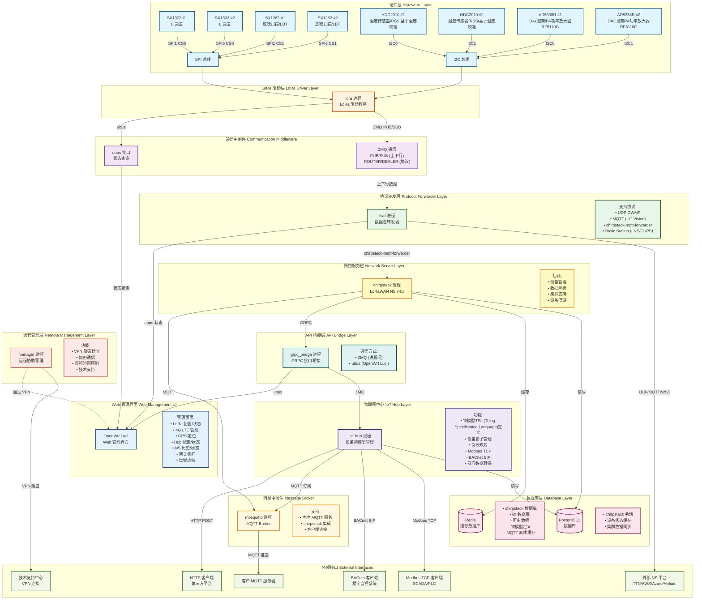
```mermaid
graph TB
    subgraph "硬件层 Hardware Layer"
        SX1302_1["SX1302 #1<br/>8 通道"]
        SX1302_2["SX1302 #2<br/>8 通道"]
        SX1262_1["SX1262 #1<br/>底噪扫描/LBT"]
        SX1262_2["SX1262 #2<br/>底噪扫描/LBT"]
        HDC2010_1["HDC2010 #1<br/>温度传感器/RSSI基于温度校准"]
        HDC2010_2["HDC2010 #2<br/>温度传感器/RSSI基于温度校准"]
        AD5338R_1["AD5338R #1<br/>DAC控制PA功率放大器RF5110G"]
        AD5338R_2["AD5338R #2<br/>DAC控制PA功率放大器RF5110G"]
        SPI["SPI 总线"]
        I2C["I2C 总线"]
    end

    subgraph "LoRa 驱动层 LoRa Driver Layer"
        LORA["lora 进程<br/>LoRa 驱动程序"]
    end

    subgraph "通信中间件 Communication Middleware"
        ZMQ_LORA["ZMQ 通信<br/>PUB/SUB (上下行)<br/>ROUTER/DEALER (协议)"]
        UBUS_LORA["ubus 接口<br/>状态查询"]
    end

    subgraph "协议转发层 Protocol Forwarder Layer"
        FWD["fwd 进程<br/>数据包转发器"]
        FWD_PROTOCOLS["支持协议:<br/>• UDP GWMP<br/>• MQTT (IoT Vision)<br/>• chirpstack-mqtt-forwarder<br/>• Basic Station (LNS/CUPS)"]
    end

    subgraph "网络服务层 Network Server Layer"
        CHIRPSTACK["chirpstack 进程<br/>LoRaWAN NS v4.x"]
        CHIRPSTACK_FEATURES["功能:<br/>• 设备管理<br/>• 数据解析<br/>• 集群支持<br/>• 设备漫游"]
    end

    subgraph "数据库层 Database Layer"
        POSTGRES[("PostgreSQL<br/>数据库")]
        POSTGRES_DBS["• chirpstack 数据库<br/>• iot 数据库<br/>- 历史数据<br/>- 物模型定义<br/>- MQTT 离线缓存"]
        REDIS[("Redis<br/>缓存数据库")]
        REDIS_USAGE["• chirpstack 会话<br/>• 设备状态缓存<br/>• 集群数据同步"]
    end

    subgraph "API 桥接层 API Bridge Layer"
        GRPC_BRIDGE["grpc_bridge 进程<br/>GRPC 接口桥接"]
        GRPC_INTERFACES["通信方式:<br/>• ZMQ (进程间)<br/>• ubus (OpenWrt Luci)"]
    end

    subgraph "物联网中心 IoT Hub Layer"
        IOT_HUB["iot_hub 进程<br/>设备物模型管理"]
        IOT_HUB_FEATURES["功能:<br/>• 物模型TSL (Thing Specification Language)定义<br/>• 设备影子管理<br/>• 协议映射<br/>- Modbus TCP<br/>- BACnet BIP<br/>• 双向数据转换"]
    end

    subgraph "消息中间件 Message Broker"
        MOSQUITTO["mosquitto 进程<br/>MQTT Broker"]
        MOSQUITTO_TOPICS["支持:<br/>• 本地 MQTT 服务<br/>• chirpstack 集成<br/>• 客户端连接"]
    end

    subgraph "远程管理层 Remote Management Layer"
        MANAGER["manager 进程<br/>远程协助管理"]
        MANAGER_FEATURES["功能:<br/>• VPN 隧道建立<br/>• 加密通信<br/>• 远程访问控制<br/>• 技术支持"]
    end

    subgraph "Web 管理界面 Web Management UI"
        LUCI["OpenWrt Luci<br/>Web 管理界面"]
        LUCI_PAGES["管理页面:<br/>• LoRa 配置/状态<br/>• 4G LTE 管理<br/>• GPS 定位<br/>• Hub 配置/状态<br/>• NS 历史/状态<br/>• 网关集群<br/>• 远程协助"]
    end

    subgraph "外部接口 External Interfaces"
        EXT_NS["外部 NS 平台<br/>TTN/AWS/Azure/Helium"]
        EXT_MQTT["客户 MQTT 服务器"]
        EXT_MODBUS["Modbus TCP 客户端<br/>SCADA/PLC"]
        EXT_BACNET["BACnet 客户端<br/>楼宇自控系统"]
        EXT_HTTP["HTTP 客户端<br/>第三方平台"]
        EXT_VPN["技术支持中心<br/>VPN 连接"]
    end

    %% 硬件连接
    SX1302_1 -->|SPI1 CS0| SPI
    SX1302_2 -->|SPI6 CS0| SPI
    SX1262_1 -->|SPI1 CS1| SPI
    SX1262_2 -->|SPI6 CS1| SPI
    HDC2010_1 -->|I2C0| I2C
    HDC2010_2 -->|I2C1| I2C
    AD5338R_1 -->|I2C0| I2C
    AD5338R_2 -->|I2C1| I2C
    SPI --> LORA
    I2C --> LORA

    %% LoRa 通信
    LORA -->|ZMQ PUB/SUB| ZMQ_LORA
    LORA -->|ubus| UBUS_LORA
    
    ZMQ_LORA -->|上下行数据| FWD


    %% 协议转发
    FWD -->|UDP/MQTT/WSS| EXT_NS
    FWD -->|chirpstack-mqtt-forwarder| CHIRPSTACK

    %% chirpstack 连接
    CHIRPSTACK -->|读写| POSTGRES
    CHIRPSTACK -->|缓存| REDIS
    CHIRPSTACK -->|GRPC| GRPC_BRIDGE
    CHIRPSTACK -->|MQTT| MOSQUITTO

    %% GRPC Bridge
    GRPC_BRIDGE -->|ZMQ| IOT_HUB
    GRPC_BRIDGE -->|ubus| LUCI

    %% IoT Hub
    IOT_HUB -->|读写| POSTGRES
    IOT_HUB -->|Modbus TCP| EXT_MODBUS
    IOT_HUB -->|BACnet BIP| EXT_BACNET
    IOT_HUB -->|MQTT 订阅| MOSQUITTO

    %% MQTT 推送
    MOSQUITTO -->|MQTT 推送| EXT_MQTT

    %% HTTP 推送
    IOT_HUB -->|HTTP POST| EXT_HTTP

    %% 远程管理
    MANAGER -->|VPN 隧道| EXT_VPN
    MANAGER -.->|通过 VPN| LUCI

    %% Web 管理
    UBUS_LORA -->|状态查询| LUCI
    FWD -->|ubus 状态| LUCI

    %% 样式定义
    classDef hardware fill:#e1f5ff,stroke:#01579b,stroke-width:2px
    classDef driver fill:#fff3e0,stroke:#e65100,stroke-width:2px
    classDef middleware fill:#f3e5f5,stroke:#4a148c,stroke-width:2px
    classDef protocol fill:#e8f5e9,stroke:#1b5e20,stroke-width:2px
    classDef server fill:#fff9c4,stroke:#f57f17,stroke-width:2px
    classDef database fill:#fce4ec,stroke:#880e4f,stroke-width:2px
    classDef api fill:#e0f2f1,stroke:#004d40,stroke-width:2px
    classDef hub fill:#ede7f6,stroke:#311b92,stroke-width:2px
    classDef broker fill:#fff8e1,stroke:#f57c00,stroke-width:2px
    classDef remote fill:#fbe9e7,stroke:#bf360c,stroke-width:2px
    classDef web fill:#e3f2fd,stroke:#0d47a1,stroke-width:2px
    classDef external fill:#f1f8e9,stroke:#33691e,stroke-width:2px

    class SX1302_1,SX1302_2,SX1262_1,SX1262_2,HDC2010_1,HDC2010_2,AD5338R_1,AD5338R_2,SPI,I2C hardware
    class LORA driver
    class ZMQ_LORA,UBUS_LORA middleware
    class FWD,FWD_PROTOCOLS protocol
    class CHIRPSTACK,CHIRPSTACK_FEATURES server
    class POSTGRES,POSTGRES_DBS,REDIS,REDIS_USAGE database
    class GRPC_BRIDGE,GRPC_INTERFACES api
    class IOT_HUB,IOT_HUB_FEATURES hub
    class MOSQUITTO,MOSQUITTO_TOPICS broker
    class MANAGER,MANAGER_FEATURES remote
    class LUCI,LUCI_PAGES web
    class EXT_NS,EXT_MQTT,EXT_MODBUS,EXT_BACNET,EXT_HTTP,EXT_VPN external
```

### System architecture description

#### 1. Hardware Layer

**Dual SX1302 RF Architecture**:
- Each SX1302 chip communicates via independent SPI (SPI1/SPI6)
- Each SX1302 is equipped with an SX1262 auxiliary chip, communicating via SPI chip select (CS0/CS1)
- Each SX1302 is equipped with an HDC2010 temperature sensor chip, LoRa's signal RSSI is based on real-time temperature calibration and communicates through I2C
- Each SX1302 is equipped with an AD5338R DAC chip, controlling the PA power chip RF5110G, with a maximum power of 27dbm, communicating through I2C
- SX1262 for noise floor scanning (all bands) and LBT functions (EU868, AS923, KR920 bands)
- Hardware supports 16 upstream channels and 2 downstream channels

#### 2. LoRa Driver Layer

**lora process functions**:
- Directly operate SX1302 and SX1262 hardware to handle LoRa physical layer communication
- Read and write SX1302/SX1262 registers through the SPI bus, configure radio frequency parameters, perform noise floor scanning and LBT detection
- Read and write HDC2010, AD5338R via I2C bus
- Provide two communication interfaces:
- **ubus interface**: for OpenWrt Luci page to query LoRa status (RSSI, SNR, packet statistics)
- **ZMQ interface**: high performance data channel

#### 3. Protocol Forwarder Layer

**fwd process function**:
- Subscribe to the upstream data of the lora process through ZMQ `PUB/SUB` and publish the downstream data
- Implement multiple LoRa protocol conversions and data packet forwarding:
- **UDP GWMP**: Semtech standard protocol, connecting external NSs such as TTN and lorawan-stack
- **MQTT**: Connect to platforms such as IoT Vision
- **chirpstack-mqtt-forwarder**: connect external or built-in chirpstack NS
- **Basic Station**:
- LNS mode: Connect chirpstack, Helium, Microsoft Azure via WebSocket (WSS)
- CUPS mode: Connect to AWS IoT Core via HTTPS and automatically obtain LNS configuration and certificates

#### 4. Network Server Layer

**chirpstack process functions**:
- Complete LoRaWAN web server (V4.x), built into the gateway
- Communicate with the lora process through ZMQ `ROUTER/DEALER` to implement the concentratord protocol
- Core functions:
- Device network access management (OTAA/ABP)
- LoRaWAN frame parsing and verification
- Device session management and data decryption
- Multi-gateway clustering support and device roaming
- Custom JavaScript decoder

#### 5. Database Layer

**PostgreSQL database**:
- **chirpstack database**: device information, application configuration, gateway registration, frame log
- **iot database**:
- Device history table: parsed device data, supports time range query and Excel export
- Thing model table: Thing model TSL (Thing Specification Language) definition, attributes, events, services
- Device shadow table: device latest status cache
- MQTT cache table: MQTT caches data when offline, and the network resumes subsequent transmissions.

**Redis cache**:
- chirpstack session data: DevAddr, SessionKeys, frame counter
- Device status cache: last online time, battery level, signal strength
- Cluster data synchronization: sharing device sessions between multiple gateways to achieve seamless roaming

---

## Log in to the gateway page

The gateway provides multiple login methods, and users can choose the appropriate connection method according to the actual network environment.

### 1. Connect via LAN port

This is the most commonly used initial configuration method and is suitable for quick local access.

**Operating steps:**
1. Use a network cable to connect the computer to the **LAN port** (100M network port) of the gateway
2. The computer will automatically obtain the IP address of the 192.168.3.x network segment from the gateway (the gateway has a built-in DHCP server)
3. Open the browser and access the gateway management address: `http://192.168.3.1`
4. If HTTPS has been configured, you can use: `https://192.168.3.1`

**Login information:**
- Username: `root`
-Default password: `WelcomeTo2018`

### 2. Connect via WiFi hotspot

The gateway will create a 5.8G WiFi AP hotspot by default when it is powered on (if you configure WiFi to connect to the router (STA client), there will be no hotspot (AP mode). You can only choose one of the WiFi AP mode and STA client mode of GW8000, which is different from the WiFi of GW1000 gateway), which facilitates wireless access configuration.

**Operating steps:**
1. After the gateway is powered on, wait for about 1-2 minutes for the startup to complete.
2. Find the hotspot in the WiFi list of your computer or mobile phone in the following format:
- Hotspot name: `WiFi-10_XXXXXX` (XXXXXX is the last 6 digits of the gateway ID)
- Example: `WiFi-10_A1B2C3`
3. Connect to the WiFi hotspot (no password required for first time connection, or use the default password)
4. After the connection is successful, visit the browser: `http://192.168.3.1`

**Login information:**
- Username: `root`
-Default password: `WelcomeTo2018`

> **Tip**: The gateway ID can be found on the device nameplate or packaging label.

### 3. Remote connection through WAN port

When the gateway is connected to the external network, it can be accessed remotely through the WAN port IP address.

**Prerequisite:**
- The gateway WAN port is connected to a router or switch
- The WAN IP address obtained by the known gateway (can be queried through the router DHCP client list, or viewed after logging in through the serial port/LAN port)

**Operating steps:**
1. Confirm the gateway WAN IP address (example: 192.168.31.205)
2. Make sure the computer and gateway are on the same network or can be accessed via routing
3. Browser access: `http://<WAN_IP>`
- Example: `http://192.168.31.205`

4. Enter your login credentials

**Login information:**
- Username: `root`
-Default password: `WelcomeTo2018`

After successful login, enter the homepage
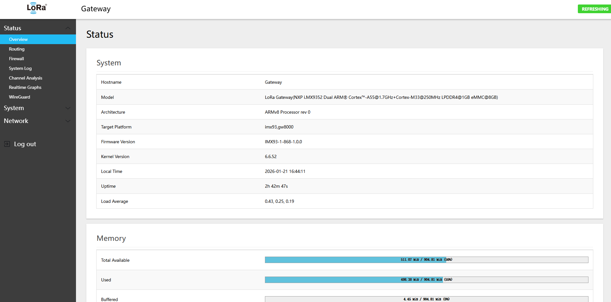

> **Security Tip**: The factory default uses the http protocol. If the customer changes to enable HTTPS access, the link needs to use https.

---

## WAN port static IP configuration

By default, the gateway WAN port is configured to automatically obtain an IP address through DHCP. In some scenarios (such as fixed IP deployment, port mapping, etc.), a static IP address needs to be configured.

**Operating steps:**

### 1. Enter the network interface configuration page
1. Log in to the gateway web management interface
2. Click on the top menu **Network** → **Interfaces**
3. Find the **WAN** interface in the interface list

### 2. Edit WAN interface
1. Click the **Edit** button to the right of the WAN interface
2. Enter the WAN interface configuration page
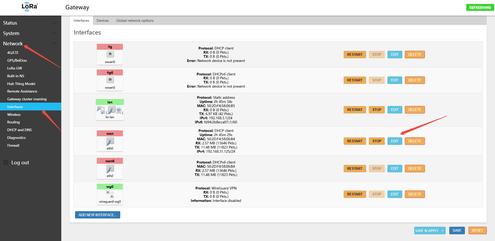
### 3. Modify protocol type
1. In the **Protocol** drop-down menu, change **DHCP client** to **Static address**
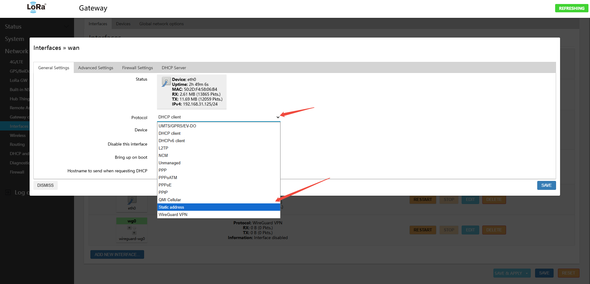
2. Switch protocol


### 4. Configure static IP parameters
Fill in the following parameters according to the network environment:

- **IPv4 address**: fixed IP address of the gateway (for example: 192.168.31.125, 192.168.31.205)
- **IPv4 netmask**: typically 255.255.255.0
- **IPv4 gateway**: IP address of the upper-level router (for example: 192.168.31.1)
- **Use custom DNS servers**: Recommended configuration
- DNS Server 1: 8.8.8.8 (Google DNS)
- DNS server 2: 114.114.114.114 (domestic DNS)
  
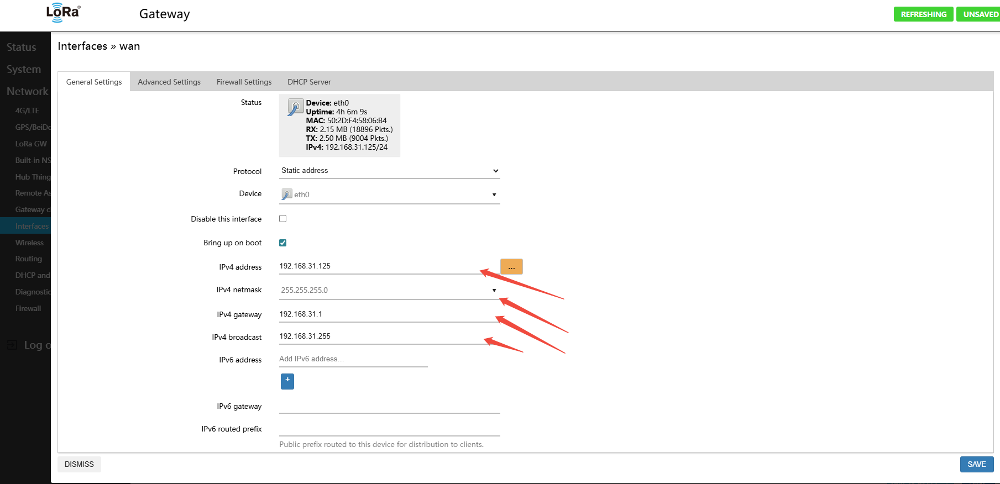

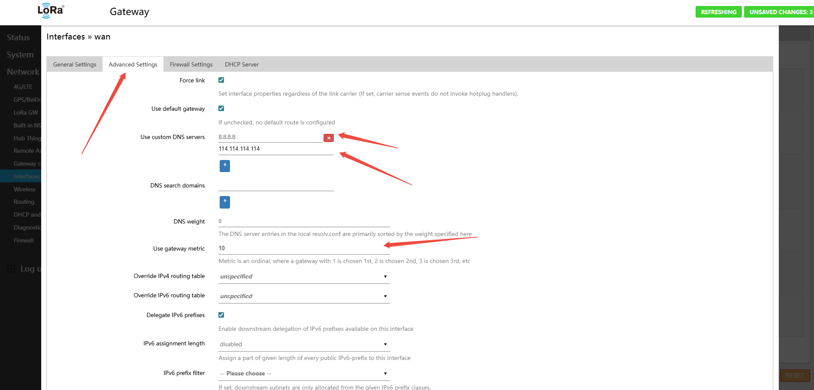


### 5. Save and apply configuration
1. Click the **Save** button at the bottom of the page
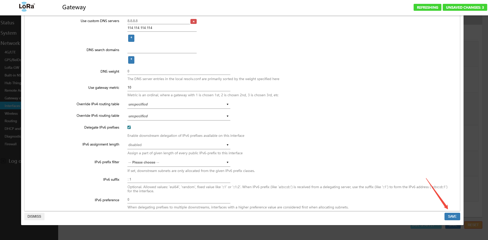

2. After returning to the interface list page, click the **Save & Apply** button
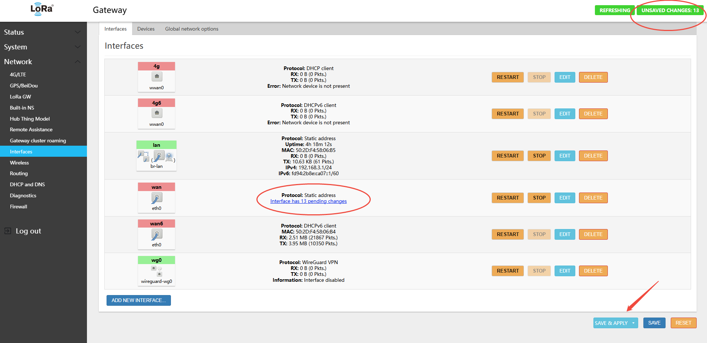

Select Force Apply
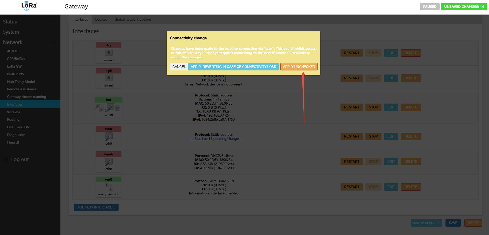

3. Wait for the configuration to take effect (about 10-60 seconds)
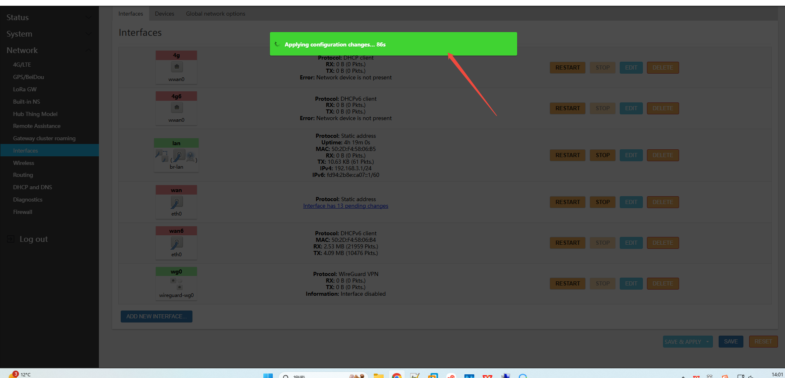
WAN port takes effect successfully
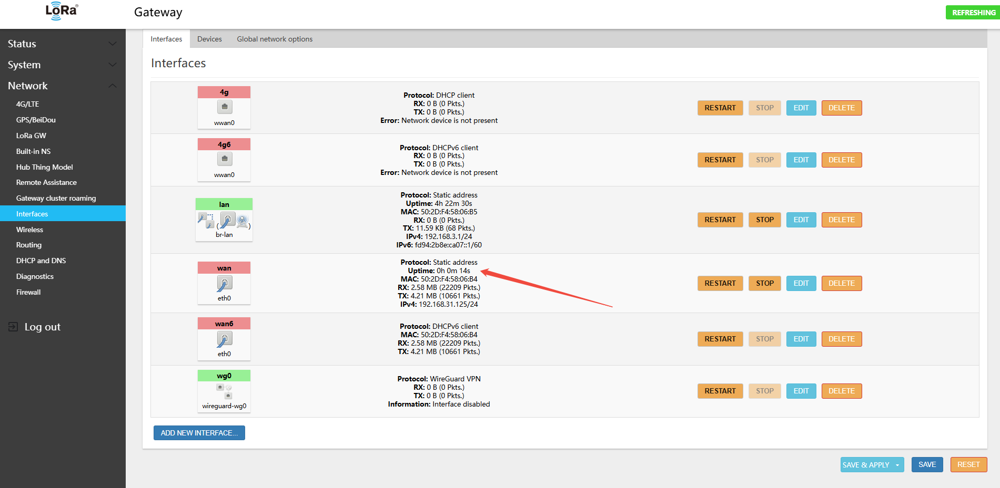

### 6. Verify configuration
1. Access the gateway using a new static IP address (for example: `http://192.168.31.205` `http://192.168.31.125`)

> **Note**:
> - Before configuring a static IP, please confirm that the IP address is not occupied by other devices
> - Make sure the IP address, subnet mask, gateway address matches the network environment
> - If the configuration is incorrect and the access is inaccessible, you can log in again through the LAN port or WiFi hotspot to make changes.

---

## Configure LoRa communication mode

The gateway supports a variety of LoRa communication protocols and data forwarding methods, and can flexibly connect to different network servers and IoT platforms. The various configuration methods are described in detail below.

### Connect to external NS

#### 1. UDP GWMP protocol to connect to external NS

UDP GWMP (Gateway Message Protocol) is a standard protocol defined by Semtech and is widely used to connect open source network servers such as TTN and chirpstack.

**Application scenarios**: Connecting to The Things Network (TTN), self-built chirpstack server, etc.

**Operating steps**:
1. Log in to the gateway interface, go to Network->LoRa Gateway, if you want to configure the second LoRa (16-channel version), go to Network->**16-channel expansion (16-channel expansion)**
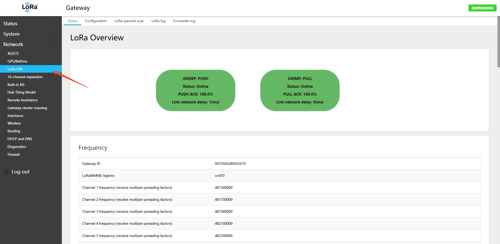

16 channels, you need to configure the second lora page: 16-channel expansion (16-channel expansion)


2. Navigate to **LoRa GW** → **Configuration**

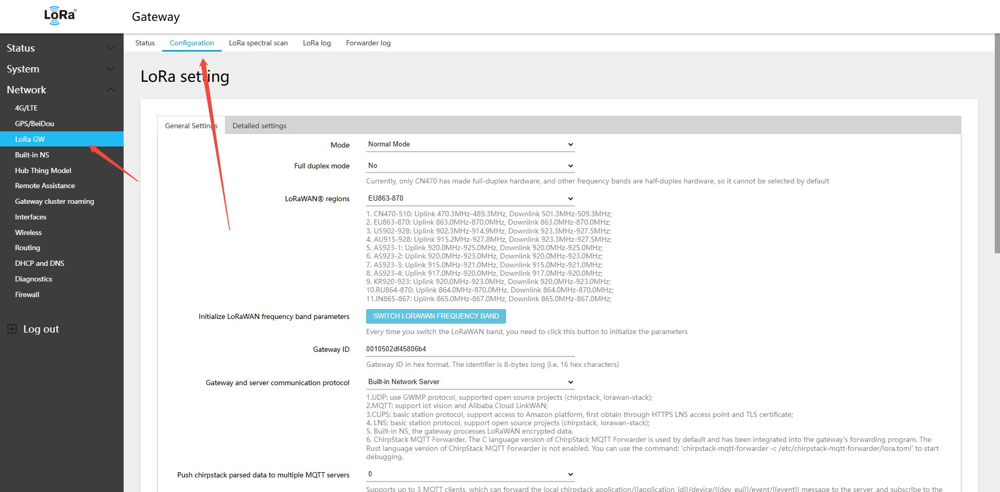

3. Switch the LoRaWAN frequency band to be used

Switching frequency bands will not change the default EUI of the gateway. If the parameters on the previous configuration page were filled in, you can also re-initialize the parameters of the frequency band by switching to another frequency band and then switching back.

The 470 version only supports the CN470 version. The 470 hardware does not need to switch frequency bands.
The 868 version can support EU868, RU864, and IN865 frequency band switching.
The 915 version can support US902-928, AU915-928, AS923-1, AS923-2, AS923-3, AS923-4, KR920

Now take EU868 and RU864 switching (common hardware, using different software parameters) as an example

We switch from EU868 to RU864, example

In the option **LoRaWAN® frequency band (LoRaWAN® regions)** drop down and select RU864
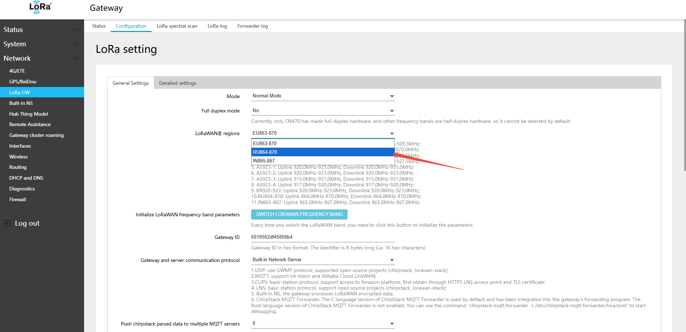

In the option **Initialize LoRaWAN frequency band parameters** click the button **SWITCH LORAWAN FREQUENCY BAND**
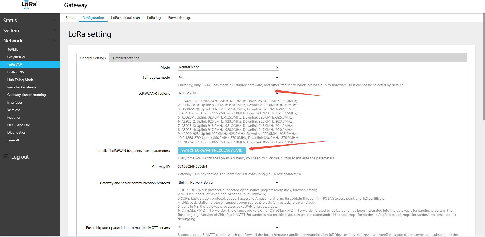

Wait for the parameters to be initialized. Unsaved configuration items will appear in the upper right corner, indicating that the parameters have been switched, but they have not taken effect temporarily.
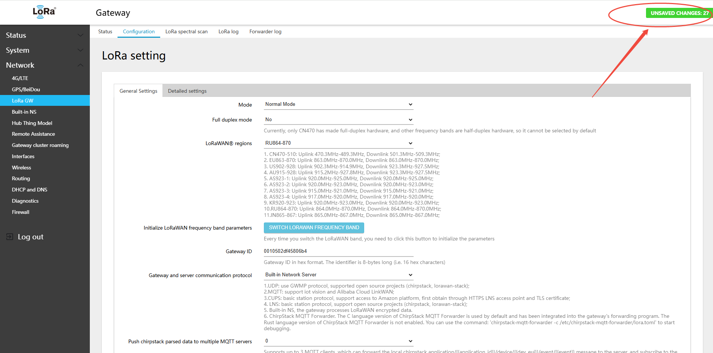

To take effect, scroll down to the lower right corner of the page. There will be a "Save and Apply" button, click it.
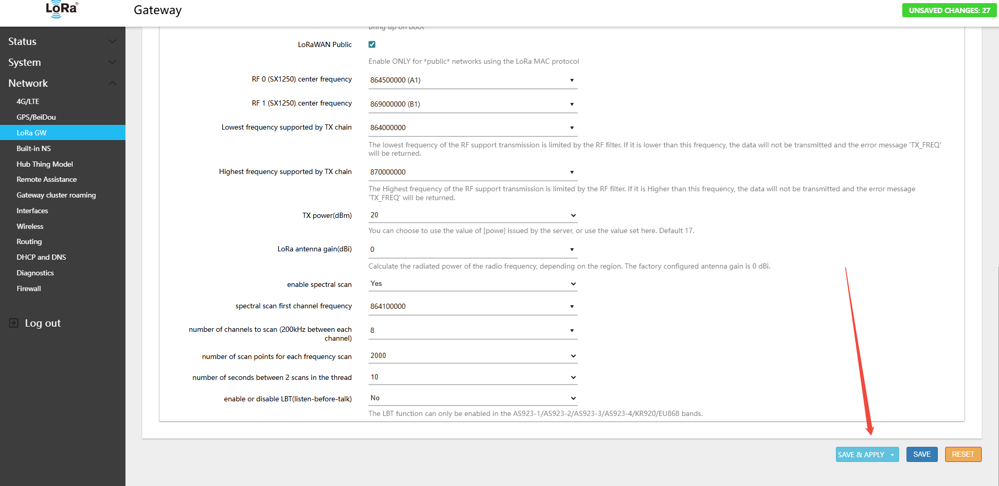

After clicking "Save and Apply", wait 10-20 seconds and return to the configuration page. You will see the currently effective frequency band and no unsaved parameters in the upper right corner.
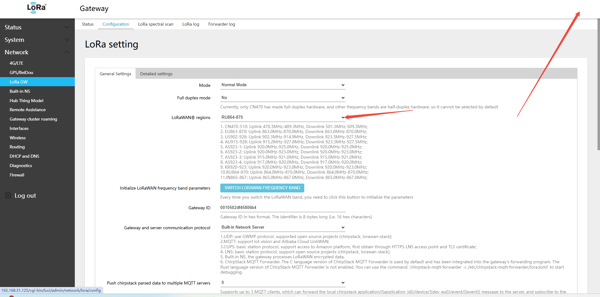


4. Take the example of connecting to the TTN (console.cloud.thethings.network) platform (you need to register your own platform login account)


Find "Register gateway" on the ttn platform


The input gateway ID input box appears on the ttn platform.

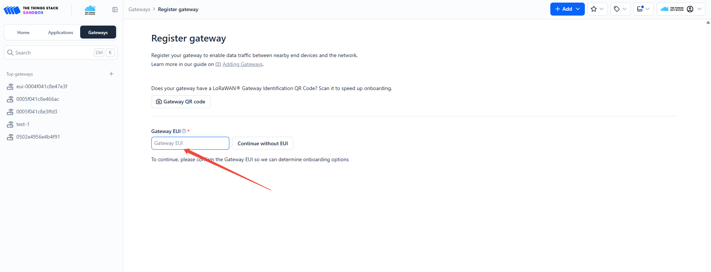

In another window of the browser, log in to the gateway page, find the ID of the lora gateway, and copy it


Paste the gateway ID on the ttn platform and click "Confirm"
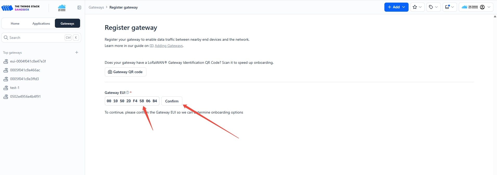


Use the gateway ID you just copied on the ttn platform, paste it into "Gateway ID", "Gateway name", select "frequency plan", fill it out and click "Register gateway"


Already registered to the ttn platform, you need to fill in the server address at the gateway.

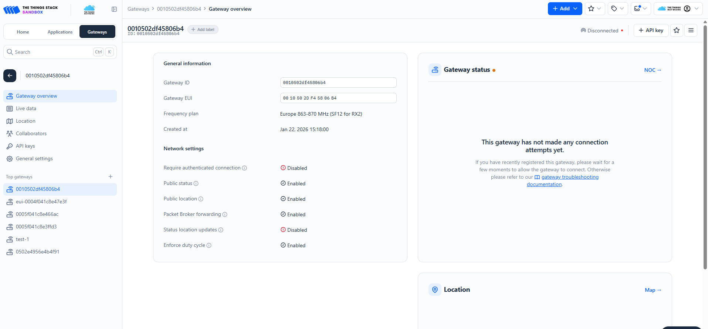


> **Note**:
> - Before configuring the UDP server address, please confirm the domain name address. We check the current domain name prefix assigned by ttn for our gateway, which is: au1

Therefore, you need to select the UDP protocol in the gateway, and the server selects the au1 domain name node of ttn.


- **Server Address**: The domain name or IP of the target NS (for example: `au1.cloud.thethings.network`)
- **Server Port Up**: Typically 1700
- **Server Port Down**: Typically 1700
   
Configure UDP mode on the gateway page to connect to the ttn platform
   
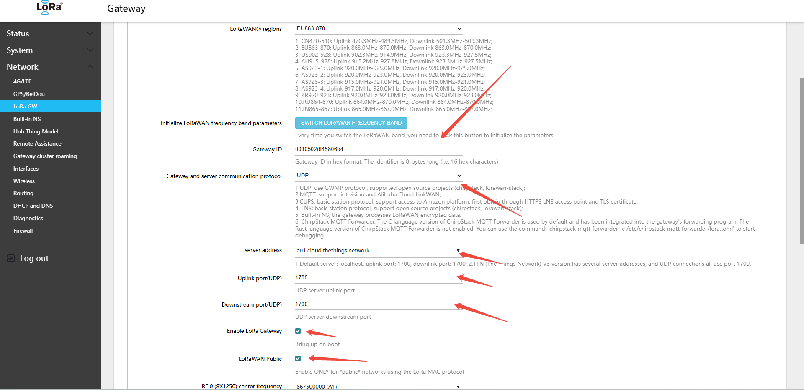
 
Click **Save & Apply**

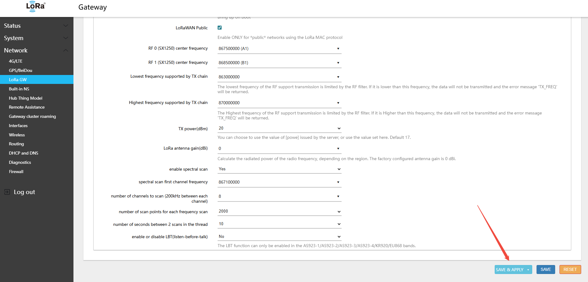

Wait 30-60 seconds and check the gateway status on the ttn platform. It is online.


 

#### 2. MQTT protocol to connect external NS

The MQTT protocol is suitable for scenarios that require a more flexible messaging mechanism, and supports connection to platforms such as IoT Vision.

**Application scenarios**: IoT Vision, custom MQTT Broker.

**Operating steps**:
1. Navigate to **LoRa** → **MQTT Forwarder**
2. Enable MQTT forwarding function
3. Configure MQTT Broker parameters:
- **Broker Address**: MQTT server address
- **Broker Port**: Typically 1883 (TCP) or 8883 (TLS)
- **Username**: Broker authentication username
- **Password**: Broker authentication password
- **Client ID**: unique identifier of the gateway
- **Topic Prefix**: message topic prefix
4. Configure TLS (optional):
- Enable **Use TLS**
- Upload CA certificate, client certificate and key
5. Click **Save & Apply**

---

#### 3. chirpstack-mqtt-forwarder protocol

chirpstack-mqtt-forwarder is the MQTT forwarding protocol officially provided by chirpstack. It uses Protobuf encoding and is more efficient.

**Application scenario**: Connect to chirpstack V4 network server.

**Operating steps**:
1. Navigate to **LoRa** → **chirpstack MQTT Forwarder**
2. Configure MQTT connection parameters:
- **MQTT Server**: chirpstack MQTT Broker address
- **MQTT Port**: 1883 or 8883
- **Topic Prefix**: usually `eu868`, `us915`, etc. (according to the frequency band)
- **Gateway ID**: The gateway ID registered in chirpstack
3. Configure JSON or Protobuf encoding method (Protobuf is recommended)
4. Click **Save & Apply**

---

#### 4. LNS protocol (Basic Station)

The LNS (LoRaWAN Network Server) protocol is based on WebSocket and supports connection to chirpstack, Helium, Microsoft Azure IoT and other platforms.

**Application scenarios**: chirpstack, Helium Network, Microsoft Azure IoT Central.

**Operating steps**:
1. Navigate to **LoRa** → **Basic Station**
2. Select **Mode** as `LNS`
3. Configure the LNS server:
- **LNS URI**: WebSocket address (for example: `wss://chirpstack.example.com:8887`)
- **Authentication Mode**: Select TLS Server & Client Authentication
- **Trust (Trust Certificate)**: Upload server CA certificate
- **Certificate**: Upload the gateway client certificate
- **Key (Private Key)**: Upload the gateway private key
4. Click **Save & Apply**

**Configuration example (chirpstack)**:
```
LNS URI: wss://chirpstack.example.com:8887
Authentication Mode: TLS Server & Client Authentication
Trust: 上传 ca.crt
Certificate: 上传 gateway.crt
Key: 上传 gateway.key
```

---

#### 5. CUPS protocol (Basic Station)

The CUPS (Configuration and Update Server) protocol is used to automatically obtain LNS configuration and certificates, and is commonly used in AWS IoT Core.

**Application scenario**: AWS IoT Core for LoRaWAN.

**Operating steps**:
1. Navigate to **LoRa** → **Basic Station**
2. Select **Mode** as `CUPS`
3. Configure the CUPS server:
- **CUPS URI**: HTTPS address (for example: `https://<account-id>.cups.lorawan.amazonaws.com:443`)
- **CUPS Trust**: Upload AWS CA certificate
- **CUPS Certificate**: Upload gateway certificate
- **CUPS Key**: Upload the gateway private key
4. Click **Save & Apply**
5. The gateway will automatically obtain the LNS configuration from the CUPS server

---

### Use built-in NS

#### 6. Configure the built-in NS to push data using MQTT

Built-in chirpstack can push parsed device data to the customer's MQTT server via MQTT.

**Operating steps**:
1. Enable built-in NS: On the **LoRa → Configuration** page, select the forwarding mode as **Built-in NS (chirpstack)**
2. Configure MQTT push: Enter the **Hub Config → IoT Hub Configuration** page
3. In the "MQTT Push" section, click "Add MQTT Client"
4. Fill in the MQTT client parameters:
- **MQTT Broker Address**: Customer's MQTT server address
- **MQTT Broker port**: 1883 (non-encrypted) or 8883 (TLS)
- **Username**: Username of the MQTT server
- **Password**: Password of the MQTT server
- **Client ID**: Custom ID
- **Publish topic template**: The topic of data push (supports variables, for example: `lorawan/data/${device_eui}`)
- **QoS Level**: 0, 1 or 2
5. Click "Save and Apply"

**Data format**:
```json
{
  "device_eui": "0102030405060708",
  "device_name": "temperature_sensor_01",
  "application_name": "smart_building",
  "timestamp": "2026-01-20T10:30:00Z",
  "data": {
    "temperature": 25.6,
    "humidity": 60.2,
    "battery": 3.7
  }
}
```

---

#### 7. Configure built-in NS to push data using HTTP

The built-in NS supports pushing device data to external web services through HTTP POST.

**Operating steps**:
1. Navigate to **LoRa** → **Built-in NS** → **Integration**
2. Click **Add Integration** → select **HTTP**
3. Configure HTTP push parameters:
- **Endpoint URL**: target API address
- **Headers**: Optional, add custom HTTP headers
- **Event Types**: Select the event type to push
4. Click **Submit**

---

#### 8. Configure the built-in NS to use Modbus TCP to obtain device data

The gateway's `iot_hub` process maps LoRaWAN device data to Modbus TCP registers.

**Operating steps**:
1. Enter the **Hub Config → IoT Hub Configuration** page
2. Enable Modbus TCP service
3. Configure service parameters:
- **Listening port**: Default 502 (can be modified)
- **Slave ID**: Default 1
4. Configure Modbus mapping for the device (details in subsequent chapters)
5. Click "Save and Apply"

For detailed usage instructions, please refer to: [Modbus TCP usage documentation](modbus-tcp.md)

---

#### 9. Configure built-in NS to use BACnet BIP to obtain device data

The gateway's `iot_hub` process maps LoRaWAN device data to BACnet objects.

**Operating steps**:
1. Enter the **Hub Config → IoT Hub Configuration** page
2. Enable BACnet BIP service
3. Configure BACnet device parameters:
- **Device Instance ID**: Default 100001
- **Device Name**: BACnet device name
- **Port**: Default 47808
4. Configure the BACnet object for the device (details in subsequent chapters)
5. Click "Save and Apply"

For detailed usage instructions, please refer to: [BACnet BIP usage documentation](bacnet.md)

---

## Built-in Chirpstack device management

The gateway has a built-in chirpstack V4.x network server, providing complete LoRaWAN device management functions.

### 1. Log in to the built-in Chirpstack

**Operating steps**:
1. Open the browser and visit: `http://192.168.3.1:8080` (LAN/WiFi access)
2. Or via WAN IP: `http://<WAN_IP>:8080`

**Default login credentials**:
- Username: `admin`
- Password: `admin`

> **Security Tip**: Please change the default password immediately after logging in for the first time.

---

### 2. Create/modify Device Profile (device configuration file)

Device Profile defines the LoRaWAN parameters and encoding and decoding rules of the device.

**Operating steps**:

#### 2.1 Create a new Device Profile
1. Click on the left menu **Device-profiles**
2. Click **Add device-profile**

#### 2.2 Configure basic information
- **Name**: Configuration file name (for example: `Temperature-Sensor-Class-A`)
- **Region**: Select the frequency band (CN470, EU868, US915, etc.)
- **MAC version**: LoRaWAN version supported by the device
- **Device supports OTAA**: Checked (recommended)

#### 2.3 Configure Codec (codec)
Select codec method:
- **None**: No codec (raw hex)
- **Cayenne LPP**: Use Cayenne special binary format
- **JavaScript**: Custom JavaScript decoding function

**JavaScript decoding function example**:
```javascript
function decodeUplink(input) {
  var bytes = input.bytes;
  var data = {};
  
  // 解析温度（2字节，有符号整数，精度0.01）
  data.temperature = ((bytes[0] << 8) | bytes[1]) / 100.0;
  
  // 解析湿度（2字节，无符号整数，精度0.01）
  data.humidity = ((bytes[2] << 8) | bytes[3]) / 100.0;
  
  return {
    data: data
  };
}
```

#### 2.4 Save configuration
Click the **Submit** button at the bottom of the page

---

### 3. Add a single LoRaWAN device

**Operating steps**:

#### 3.1 Enter application management
1. Click on the left menu **Applications**
2. If there is no application, create an application first
3. Enter the created application

#### 3.2 Add device
1. Click on the **Devices** tab
2. Click **Add device**

#### 3.3 Configure basic device information
- **Device name**: e.g. `Room-101-Temp-Sensor`
- **Device EUI**: 16-digit hexadecimal (example: `0102030405060708`)
- **Device-profile**: Select the previously created Device Profile

#### 3.4 Configure OTAA key
1. Click **Submit** to save the device
2. Enter the device details page and click the **Keys (OTAA)** tab
3. Configure **Application key**: AppKey of the device (32-digit hexadecimal)
4. Click **Submit**

---

### 4. Configure TSL (physical model) definition

TSL (Thing Specification Language, Thing Model) allows users to define attribute fields of devices.

**Operating steps**:

#### 4.1 Enter object model configuration
1. On the device details page, click the **TSL Model** tab
2. Click **Add Property**

#### 4.2 Add attribute fields
Configuration attribute parameters:
- **Property Name**: e.g. `temperature`
- **Display Name**: e.g. `Temperature`
- **Data Type**: int, float, string, bool, etc.
- **Unit**: `°C`, `%RH`, etc.
- **Access Mode**: Read, Write, Read/Write

**Example: Temperature and Humidity Sensor**

**Property 1: Temperature**
- Property Name: `temperature`
- Display Name: `Temperature`
- Data Type: `float`
- Unit: `°C`
- Access Mode: `Read`

**Property 2: Humidity**
- Property Name: `humidity`
- Display Name: `Humidity`
- Data Type: `float`
- Unit: `%RH`
- Access Mode: `Read`

#### 4.3 Saved object model
Click the **Save** button

---

### 5. Configure Modbus TCP and BACnet parameters

#### 5.1 Configure Modbus TCP parameters
1. On the device details page, click the **Modbus TCP** tab
2. Configuration parameters:
- **Enable**: checked
- **Slave ID**: 1-247, default 1
- **Starting Address**: e.g. 0
- **Register Mapping**: Configure the mapping of object model TSL (Thing Specification Language) attributes to Modbus registers
3. Click **Save**

#### 5.2 Configure BACnet parameters
1. On the device details page, click the **BACnet** tab
2. Configuration parameters:
- **Enable**: checked
- **Device Object ID**: Globally unique, such as 100002
- **Device Name**: BACnet device name
- **Object Mapping**: Configure the mapping of object model TSL (Thing Specification Language) attributes to BACnet objects
3. Click **Save**

---

### 6. View device data

**Check device status**:
- Enter the device details page
- View top device status: Last seen, Uplink frame counter, etc.

**View LoRaWAN frame data**:
- Click on the **LoRaWAN frames** tab
- View uplink and downlink frame details: timestamp, frequency, RSSI, SNR, raw payload

**View decoded device data**:
- Click on the **Device data** tab
- View the decoded JSON data and attribute values ​​displayed in the Thing Specification Language (TSL) of the object model

**View event log**:
- Click on the **Events** tab
- View network access events (join), uplink data (uplink), downlink confirmation (ack), etc.

---

## Data collection example

The gateway supports reading device data through Python 3.11 scripts. Examples of test scripts in various ways are provided below.

### 1. Modbus TCP read example

**Installation dependencies**:
```bash
pip install  pymodbus==3.6.9
```

**Script example** (`/root/python-SDK/modbus_tcp_read.py`):
```python
import argparse
import re
import struct
import sys
import logging

# --- Import Pymodbus (Compatible with v3.x and older) ---
try:
    from pymodbus.client import ModbusTcpClient
    from pymodbus.register_read_message import ReadHoldingRegistersRequest
except ImportError:
    try:
        from pymodbus.client.sync import ModbusTcpClient
        from pymodbus.register_read_message import ReadHoldingRegistersRequest
    except ImportError:
        print("Error: 'pymodbus' module not found. Please install: pip3 install pymodbus")
        sys.exit(1)

# --- Logging Config ---
logging.basicConfig()
log = logging.getLogger()
log.setLevel(logging.ERROR)

# --- Helper: Parse OpenWrt Config ---
def parse_uci_config(file_path):
    config = {'sensor_types': {}, 'attributes': {}, 'globals': {}}
    current_section_type = None
    current_section_name = None
    try:
        with open(file_path, 'r', encoding='utf-8', errors='ignore') as f:
            lines = f.readlines()
        for line in lines:
            line = line.strip()
            if not line or line.startswith('#'): continue
            
            config_match = re.match(r"config\s+(\w+)\s+'?([\w\-_]+)'?", line)
            if config_match:
                current_section_type = config_match.group(1)
                current_section_name = config_match.group(2)
                if current_section_type == 'sensor_type': 
                    config['sensor_types'][current_section_name] = {'attributes': []}
                elif current_section_type == 'attribute': 
                    config['attributes'][current_section_name] = {}
                elif current_section_type == 'global': 
                    config['globals'] = {}
                continue
            
            if not current_section_type: continue

            option_match = re.match(r"option\s+(\w+)\s+'([^']*)'", line)
            if option_match:
                key = option_match.group(1); value = option_match.group(2)
                if current_section_type == 'attribute': 
                    config['attributes'][current_section_name][key] = value
                elif current_section_type == 'global': 
                    config['globals'][key] = value
                continue

            list_match = re.match(r"list\s+attributes\s+'([^']*)'", line)
            if list_match:
                attr_name = list_match.group(1)
                if current_section_type == 'sensor_type': 
                    config['sensor_types'][current_section_name]['attributes'].append(attr_name)
                    
    except Exception as e:
        print(f"Error: Failed to parse config file - {e}"); sys.exit(1)
    return config

# --- Helper: Decode Data ---
def decode_raw_registers(registers, data_type, mapping_mode, scale):
    value = None
    scale = float(scale) if scale and float(scale) != 0 else 1.0
    try:
        # INT / UINT
        if data_type == 'int' or data_type == 'uint':
            raw_val = 0
            if len(registers) == 1:
                raw_val = registers[0]
                if data_type == 'int': # Signed 16-bit
                    raw_val = struct.unpack('>h', struct.pack('>H', raw_val))[0]
            elif len(registers) == 2:
                if 'little_endian' in mapping_mode: # Word swap
                    raw_val = (registers[1] << 16) | registers[0]
                else: # Big Endian
                    raw_val = (registers[0] << 16) | registers[1]
                if data_type == 'int': # Signed 32-bit
                    raw_val = struct.unpack('>i', struct.pack('>I', raw_val))[0]
            value = raw_val / scale

        # FLOAT
        elif data_type == 'float':
            if len(registers) == 1: # Scaled Integer representing Float
                raw_int = struct.unpack('>h', struct.pack('>H', registers[0]))[0]
                value = float(raw_int) / scale
            elif len(registers) == 2: # IEEE 754 Float
                combined = 0
                if 'little_endian' in mapping_mode: combined = (registers[1] << 16) | registers[0]
                else: combined = (registers[0] << 16) | registers[1]
                value = struct.unpack('>f', struct.pack('>I', combined))[0]
                if scale != 1.0: value = value / scale

        # BOOL
        elif data_type == 'bool':
            value = True if registers[0] > 0 else False

        # STRING
        elif data_type == 'string':
            byte_arr = bytearray()
            for reg in registers: byte_arr.extend(struct.pack('>H', reg))
            full_str = byte_arr.decode('utf-8', errors='ignore')
            value = full_str.split('\x00')[0]
            
        # TIMESTAMP
        elif data_type == 'timestamp':
            if len(registers) == 2:
                if 'little_endian' in mapping_mode: value = (registers[1] << 16) | registers[0]
                else: value = (registers[0] << 16) | registers[1]
                
    except Exception: return None
    return value

# --- Helper: Get Readable Format Name ---
def get_technical_info(data_type, count, mapping_mode, scale):
    """Generate engineering descriptions for Format and Order"""
    fmt_str = "Unknown"
    order_str = "Big-Endian" # Default Modbus
    
    # 1. Determine Format
    if data_type == 'int' or data_type == 'uint':
        prefix = "UInt" if data_type == 'uint' else "Int"
        if count == 1: fmt_str = f"{prefix}16"
        elif count == 2: fmt_str = f"{prefix}32"
        elif count == 4: fmt_str = f"{prefix}64"
    elif data_type == 'float':
        if count == 1: fmt_str = "Int16(S)" # Scaled Integer
        elif count == 2: fmt_str = "Float32"
    elif data_type == 'bool':
        fmt_str = "Bit/Bool"
    elif data_type == 'string':
        fmt_str = f"String({count*2}B)"
    elif data_type == 'timestamp':
        fmt_str = "UnixTime"

    # 2. Determine Order
    if mapping_mode == 'little_endian':
        order_str = "Little(Swap)" # DCBA
    elif mapping_mode == 'big_endian' or mapping_mode == 'single':
        order_str = "Big(ABCD)"
    elif mapping_mode == 'string':
        order_str = "ASCII"
    
    # 3. Format Scale
    scale_str = "x1"
    f_scale = float(scale)
    if f_scale != 1.0 and f_scale != 0:
        # If scale is 100, C code divides by 100.
        if f_scale >= 1:
            scale_str = f"/{int(f_scale)}" if f_scale.is_integer() else f"/{f_scale}"
        else:
            scale_str = f"x{1/f_scale}"

    return fmt_str, order_str, scale_str

# --- Main ---
def main():
    parser = argparse.ArgumentParser(description="IoT Hub Modbus Reader (Engineering View)")
    parser.add_argument('--ip', type=str, default='127.0.0.1', help='Device IP Address')
    parser.add_argument('--modbus-port', '--port', dest='port', type=int, default=502, help='Modbus Port')
    parser.add_argument('--slave', type=int, default=2, help='Slave ID')
    parser.add_argument('--config', type=str, default='/etc/config/iot_hub', help='Config file path')
    parser.add_argument('--type', type=str, default='temperature_humidity_sensor', help='Sensor Type')
    
    args = parser.parse_args()

    # 1. Parse Config
    config_data = parse_uci_config(args.config)
    
    if args.type not in config_data['sensor_types']:
        print(f"Error: Sensor type '{args.type}' not found in configuration.")
        sys.exit(1)

    sensor_attrs = config_data['sensor_types'][args.type]['attributes']
    print(f"Target: {args.ip}:{args.port} | Slave ID: {args.slave} | Sensor: {args.type}")
    print("=" * 145)
    
    # Header specifically designed for PLC/HMI engineers
    # FC: Function Code, Fmt: Data Type, Ord: Endianness, Cnt: Register Count, Scl: Scale Factor
    header = f"{'Attribute':<20} | {'Addr':<6} | {'FC':<3} | {'Format':<10} | {'Order':<12} | {'Cnt':<3} | {'Scale':<6} | {'Raw(Hex)':<15} | {'Value':<15} | {'Unit'}"
    print(header)
    print("-" * 145)

    # 2. Connect Client
    client = ModbusTcpClient(args.ip, port=args.port, timeout=3.0)
    if not client.connect():
        print(f"Connection Failed: Unable to connect to {args.ip}:{args.port}")
        sys.exit(1)

    try:
        for attr_name in sensor_attrs:
            if attr_name not in config_data['attributes']: continue
            attr_def = config_data['attributes'][attr_name]
            
            if attr_def.get('modbus_enable') != '1': continue
            
            # Filter for holding registers
            table_type = attr_def.get('modbus_table', 'holding')
            if table_type != 'holding': continue 
            
            fc = 3 # Read Holding Registers

            try:
                offset = int(attr_def.get('modbus_offset', 0))
                count = int(attr_def.get('modbus_register_count', 1))
                scale = float(attr_def.get('modbus_scale', 1.0))
                mapping_mode = attr_def.get('modbus_mapping_mode', 'single')
                data_type = attr_def.get('data_type', 'string')
                unit = attr_def.get('unit', '')
            except ValueError: continue

            # Get technical descriptions
            fmt_str, order_str, scale_str = get_technical_info(data_type, count, mapping_mode, scale)

            # 3. Build Request
            try:
                request = ReadHoldingRegistersRequest(offset, count, slave=args.slave)
            except TypeError:
                try:
                    request = ReadHoldingRegistersRequest(offset, count, unit=args.slave)
                except TypeError:
                     request = ReadHoldingRegistersRequest(offset, count)
                     if hasattr(request, 'slave_id'): request.slave_id = args.slave
                     if hasattr(request, 'unit_id'): request.unit_id = args.slave

            # 4. Execute Request
            rr = client.execute(request)

            # 5. Error Handling
            if rr.isError():
                error_msg = f"Err"
                if hasattr(rr, 'exception_code'):
                    if rr.exception_code == 2: error_msg = "IllegalAddr"
                    elif rr.exception_code == 3: error_msg = "IllegalVal"
                    elif rr.exception_code == 4: error_msg = "SlaveFail"
                    else: error_msg = f"ExCode({rr.exception_code})"
                
                print(f"{attr_name:<20} | {offset:<6} | {fc:02d}  | {fmt_str:<10} | {order_str:<12} | {count:<3} | {scale_str:<6} | {error_msg:<15} | {'N/A':<15} |")
                continue

            regs = rr.registers
            raw_hex = " ".join([f"{x:04X}" for x in regs[:2]]) 
            if len(regs) > 2: raw_hex += "..."

            # 6. Decode
            val = decode_raw_registers(regs, data_type, mapping_mode, scale)
            
            val_str = str(val) if val is not None else "Err"
            if isinstance(val, float): val_str = f"{val:.2f}"
            
            print(f"{attr_name:<20} | {offset:<6} | {fc:02d}  | {fmt_str:<10} | {order_str:<12} | {count:<3} | {scale_str:<6} | {raw_hex:<15} | {val_str:<15} | {unit}")

    finally:
        client.close()

if __name__ == "__main__":
    main()
```

**Run script**:
```bash
root@Gateway:~# python3 /root/python-SDK/modbus_tcp_read.py 
Target: 127.0.0.1:502 | Slave ID: 2 | Sensor: temperature_humidity_sensor
=================================================================================================================================================
Attribute            | Addr   | FC  | Format     | Order        | Cnt | Scale  | Raw(Hex)        | Value           | Unit
-------------------------------------------------------------------------------------------------------------------------------------------------
temperature          | 406    | 03  | Int16(S)   | Big(ABCD)    | 1   | /100   | 0A0A            | 25.70           | celsius
temperatureState     | 407    | 03  | Int16      | Big(ABCD)    | 1   | x1     | 0000            | 0.00            | none
humidity             | 408    | 03  | Int16(S)   | Big(ABCD)    | 1   | /100   | 1676            | 57.50           | percent
humidityState        | 409    | 03  | Int16      | Big(ABCD)    | 1   | x1     | 0000            | 0.00            | none
mainVersion          | 1032   | 03  | String(64B) | ASCII        | 32  | x1     | 312E 332E...    | 1.3.0a          | none
appVersion           | 1064   | 03  | String(64B) | ASCII        | 32  | x1     | 312E 302E...    | 1.0.0           | none
hardwareVersion      | 1096   | 03  | String(64B) | ASCII        | 32  | x1     | 312E 3228...    | 1.2(L)          | none
batteryVoltage       | 403    | 03  | Int16(S)   | Big(ABCD)    | 1   | /100   | 0169            | 3.61            | volt
batteryVoltageState  | 404    | 03  | Int16      | Big(ABCD)    | 1   | x1     | 0000            | 0.00            | none
online               | 200    | 03  | Bit/Bool   | Big(ABCD)    | 1   | x1     | 0001            | True            | none
tamper               | 405    | 03  | Int16      | Big(ABCD)    | 1   | x1     | 0001            | 1.00            | none
model                | 203    | 03  | String(64B) | ASCII        | 32  | x1     | 414E 2D33...    | AN-303          | none
rssi                 | 251    | 03  | Int16      | Big(ABCD)    | 1   | x1     | FFB6            | -74.00          | none
snr                  | 250    | 03  | Int16      | Big(ABCD)    | 1   | x1     | 000E            | 14.00           | none
root@Gateway:~# 

```

---

### 2. BACnet BIP reading example

**Installation dependencies**:
```bash
pip install  bacpypes==0.19.0
```

**Script example** (`/root/python-SDK/bacnet_read.py`):
```python
import argparse
import time
import threading
import sys
import re
import socket
import logging
#python3 /root/python-SDK/bacnet_read.py  --ip 192.168.31.205 --id 101 config --type temperature_humidity_sensor
#python3 /root/python-SDK/bacnet_read.py  --ip 192.168.31.205 --id 101 scan
# --- BACpypes Imports ---
try:
    from bacpypes.settings import settings
    from bacpypes.core import run, stop
    from bacpypes.pdu import Address
    from bacpypes.app import BIPSimpleApplication
    from bacpypes.local.device import LocalDeviceObject
    from bacpypes.apdu import ReadPropertyRequest, Error, AbortPDU, SimpleAckPDU
    from bacpypes.iocb import IOCB
    from bacpypes.object import get_datatype
    from bacpypes.primitivedata import Real, CharacterString, Enumerated, Boolean, Unsigned
    from bacpypes.constructeddata import Any
except ImportError:
    print("Error: 'bacpypes' library not found. Please install: pip3 install bacpypes")
    sys.exit(1)

# Suppress bacpypes logging
logging.getLogger('bacpypes').setLevel(logging.ERROR)

# --- Constants ---
DEVICE_SLOT_SIZE = 100  # Matches C code definition

# Map Config Type string to BACnet Object Type
TYPE_MAP = {
    'AI': 'analogInput',
    'AV': 'analogValue',
    'BI': 'binaryInput',
    'BV': 'binaryValue',
    'CV': 'characterstringValue',
    # Fallbacks
    'analogInput': 'analogInput',
    'binaryInput': 'binaryInput',
    'characterstringValue': 'characterstringValue'
}

SHORT_TYPE_MAP = {
    'analogInput': 'AI',
    'analogValue': 'AV',
    'binaryInput': 'BI',
    'binaryValue': 'BV',
    'characterstringValue': 'CV'
}

# --- Helper: Value Extractor (CRITICAL FIX) ---
def extract_value(val, datatype=None):
    """
    Safely extracts a readable string from any BACpypes object (Any, CharacterString, etc.)
    """
    if val is None:
        return ""
        
    # If it's an 'Any' object (which causes the <bacpypes...> output)
    if isinstance(val, Any):
        try:
            # Try to cast it to the expected datatype if provided
            if datatype:
                val = val.cast_out(datatype)
            else:
                # If no datatype, try CharacterString first (common for names/desc)
                try:
                    val = val.cast_out(CharacterString)
                except:
                    # Fallback to whatever is inside
                    pass
        except:
            pass

    # Process standard types
    if isinstance(val, float):
        return f"{val:.2f}"
    
    if isinstance(val, bool):
        return "Active(1)" if val else "Inactive(0)"
        
    if isinstance(val, int):
        # Heuristic: If it's 0 or 1 and looks like a binary input, handle outside. 
        # But generally return string.
        return str(val)

    if isinstance(val, CharacterString):
        return str(val.value)
        
    # Enumerated values (like Units) often convert to their string label
    return str(val)


# --- Helper: Config Parser ---
def parse_uci_config(file_path):
    config = {'sensor_types': {}, 'attributes': {}}
    current_section_type = None
    current_section_name = None
    
    try:
        with open(file_path, 'r', encoding='utf-8', errors='ignore') as f:
            lines = f.readlines()
            
        for line in lines:
            line = line.strip()
            if not line or line.startswith('#'): continue
            
            # Config line
            config_match = re.match(r"config\s+(\w+)\s+'?([\w\-_]+)'?", line)
            if config_match:
                current_section_type = config_match.group(1)
                current_section_name = config_match.group(2)
                
                if current_section_type == 'sensor_type':
                    config['sensor_types'][current_section_name] = {'attributes': []}
                elif current_section_type == 'attribute':
                    config['attributes'][current_section_name] = {}
                continue
            
            if not current_section_type: continue

            # Option line
            option_match = re.match(r"option\s+(\w+)\s+'([^']*)'", line)
            if option_match:
                key = option_match.group(1)
                value = option_match.group(2)
                
                if current_section_type == 'attribute':
                    config['attributes'][current_section_name][key] = value
                continue
            
            # List line
            list_match = re.match(r"list\s+attributes\s+'([^']*)'", line)
            if list_match:
                val = list_match.group(1)
                if current_section_type == 'sensor_type':
                    config['sensor_types'][current_section_name]['attributes'].append(val)
                    
    except Exception as e:
        print(f"Config Error: {e}")
        sys.exit(1)
        
    return config

# --- Helper: BACnet Client ---
class BACnetClient:
    def __init__(self, target_ip, target_port=47808):
        self.target_address = Address(f"{target_ip}:{target_port}")
        self.local_ip = "0.0.0.0"
        self.local_port = 47800 
        self.timeout = 2.0
        self.app = None
        self.thread = None

    def start(self):
        # Create a temporary local device
        local_device = LocalDeviceObject(
            objectName="PythonClient",
            objectIdentifier=59999,
            maxApduLengthAccepted=1476,
            segmentationSupported="segmentedBoth",
            vendorIdentifier=15
        )
        
        try:
            self.app = BIPSimpleApplication(local_device, f"{self.local_ip}:{self.local_port}")
        except Exception as e:
            print(f"Error binding to port {self.local_port}: {e}")
            sys.exit(1)

        # Run in thread
        self.thread = threading.Thread(target=run, daemon=True)
        self.thread.start()

    def stop(self):
        stop()

    def read_property(self, obj_type, obj_inst, prop_id):
        try:
            request = ReadPropertyRequest(
                destination=self.target_address,
                objectIdentifier=(obj_type, obj_inst),
                propertyIdentifier=prop_id
            )
            
            iocb = IOCB(request)
            iocb.timeout = self.timeout
            self.app.request_io(iocb)
            iocb.wait()

            if iocb.ioError or not iocb.ioResponse:
                return None
            
            apdu = iocb.ioResponse
            if isinstance(apdu, (Error, AbortPDU, SimpleAckPDU)):
                return None

            return apdu.propertyValue
        except:
            return None

    def get_formatted_value(self, obj_type, obj_inst):
        """Reads Value, Units, and Description with fixed decoding"""
        
        # 1. Present Value
        raw_val = self.read_property(obj_type, obj_inst, 'presentValue')
        val_str = "N/A"
        
        if raw_val is not None:
            # Determine expected datatype
            datatype = None
            if 'analog' in obj_type: datatype = Real
            elif 'binary' in obj_type: datatype = Enumerated
            elif 'characterstring' in obj_type: datatype = CharacterString
            
            # Use helper to extract
            val = extract_value(raw_val, datatype)
            
            # Post-processing
            if 'binary' in obj_type:
                # Often returned as '0' or '1' string from helper
                if val == '1' or val == 'Active(1)' or val == 'True':
                    val_str = "Active(1)"
                else:
                    val_str = "Inactive(0)"
            else:
                val_str = val

        # 2. Units (only for Analog)
        unit_str = ""
        if 'analog' in obj_type:
            raw_unit = self.read_property(obj_type, obj_inst, 'units')
            # Units are Enumerated, pass that type hint
            unit_str = extract_value(raw_unit, Enumerated)

        # 3. Description
        raw_desc = self.read_property(obj_type, obj_inst, 'description')
        desc_str = extract_value(raw_desc, CharacterString)

        return val_str, unit_str, desc_str

    def get_object_name(self, obj_type, obj_inst):
        raw = self.read_property(obj_type, obj_inst, 'objectName')
        return extract_value(raw, CharacterString)

# --- Main Logic ---

def print_header():
    print("-" * 140)
    print(f"{'Type':<4} | {'Instance':<8} | {'Object Name':<35} | {'Value':<15} | {'Unit':<15} | {'Description'}")
    print("-" * 140)

def run_config_mode(args, client):
    config = parse_uci_config(args.config)
    
    if args.sensor_type not in config['sensor_types']:
        print(f"Error: Sensor type '{args.sensor_type}' not found in {args.config}")
        return

    print(f"[*] MODE: Config-Based Read")
    print(f"[*] Target Device ID (BIP ID): {args.id}")
    print(f"[*] Sensor Type: {args.sensor_type}")
    print(f"[*] Base Instance: {args.id * DEVICE_SLOT_SIZE}")
    print_header()

    sensor_attrs = config['sensor_types'][args.sensor_type]['attributes']
    base_instance = args.id * DEVICE_SLOT_SIZE

    for attr_name in sensor_attrs:
        if attr_name not in config['attributes']: continue
        attr_def = config['attributes'][attr_name]

        if attr_def.get('bacnet_enable') != '1': continue

        conf_obj_type = attr_def.get('bacnet_object_type', 'AI') 
        offset_str = attr_def.get('bacnet_instance_offset')
        
        if offset_str is None: continue
        
        offset = int(offset_str)
        instance = base_instance + offset
        
        obj_type_str = TYPE_MAP.get(conf_obj_type, 'analogInput')
        
        name = client.get_object_name(obj_type_str, instance)
        
        # In config mode, we try to read even if name is empty (device might be offline but configured)
        val, unit, desc = client.get_formatted_value(obj_type_str, instance)
        short_type = SHORT_TYPE_MAP.get(obj_type_str, conf_obj_type)
        
        # Clean up output if name failed (e.g. read error)
        if not name: name = "<Read Error>"
        
        print(f"{short_type:<4} | {instance:<8} | {name:<35} | {val:<15} | {unit:<15} | {desc}")


def run_scan_mode(args, client):
    base_instance = args.id * DEVICE_SLOT_SIZE
    end_instance = base_instance + DEVICE_SLOT_SIZE 

    print(f"[*] MODE: Auto-Scan Range")
    print(f"[*] Target Device ID (BIP ID): {args.id}")
    print(f"[*] Scanning Instance Range: {base_instance} - {end_instance - 1}")
    print_header()

    scan_types = ['analogInput', 'binaryInput', 'characterstringValue']
    
    found_count = 0
    
    for instance in range(base_instance, end_instance):
        found_at_this_index = False
        
        for obj_type in scan_types:
            name = client.get_object_name(obj_type, instance)
            
            # Filter out empty or error names
            if name and name != "" and not name.startswith("<bacpypes"):
                val, unit, desc = client.get_formatted_value(obj_type, instance)
                short_type = SHORT_TYPE_MAP.get(obj_type, "??")
                
                print(f"{short_type:<4} | {instance:<8} | {name:<35} | {val:<15} | {unit:<15} | {desc}")
                found_count += 1
                found_at_this_index = True
                break 
        
        # Small sleep only if nothing found to speed up
        if not found_at_this_index:
             # time.sleep(0.002)
             pass

    if found_count == 0:
        print(f"No objects found in range {base_instance}-{end_instance-1}. Check Device ID or Network.")

def main():
    parser = argparse.ArgumentParser(description="BACnet/IP Tool for IoT Hub")
    parser.add_argument('--ip', type=str, default='127.0.0.1', help='Gateway IP Address')
    parser.add_argument('--port', type=int, default=47808, help='BACnet Server Port')
    parser.add_argument('--id', type=int, default='101', help='BACnet Device ID (BIP ID)')
    parser.add_argument('--config', type=str, default='/etc/config/iot_hub', help='Path to UCI config file')
    
    subparsers = parser.add_subparsers(dest='mode', required=True, help='Operation Mode')

    parser_conf = subparsers.add_parser('config', help='Read specific attributes defined in config')
    parser_conf.add_argument('--type', dest='sensor_type', default='temperature_humidity_sensor', help='Sensor Type')

    parser_scan = subparsers.add_parser('scan', help='Scan all objects in the device slot range')

    args = parser.parse_args()

    client = BACnetClient(args.ip, args.port)
    client.start()
    time.sleep(0.5)

    try:
        if args.mode == 'config':
            run_config_mode(args, client)
        elif args.mode == 'scan':
            run_scan_mode(args, client)
    except KeyboardInterrupt:
        print("\nInterrupted.")
    finally:
        client.stop()

if __name__ == "__main__":
    main()
```

**Run script**:
```bash
root@Gateway:~# python3 /root/python-SDK/bacnet_read.py  --ip 192.168.31.205 --id 101 scan
/usr/lib/python3.11/site-packages/bacpypes/core.py:114: UserWarning: no signal handlers for child threads
  warnings.warn("no signal handlers for child threads")
[*] MODE: Auto-Scan Range
[*] Target Device ID (BIP ID): 101
[*] Scanning Instance Range: 10100 - 10199
--------------------------------------------------------------------------------------------------------------------------------------------
Type | Instance | Object Name                         | Value           | Unit            | Description
--------------------------------------------------------------------------------------------------------------------------------------------
BI   | 10101    | ffffff200000b703.online             | Active(1)       |                 | Online Status
CV   | 10102    | ffffff200000b703.mainVersion        | 1.3.0a          |                 | Firmware Main Version
CV   | 10103    | ffffff200000b703.appVersion         | 1.0.0           |                 | Firmware Application Version
CV   | 10104    | ffffff200000b703.hardwareVersion    | 1.2(L)          |                 | Hardware Version
CV   | 10106    | ffffff200000b703.model              | AN-303          |                 | Device Model
AI   | 10108    | ffffff200000b703.rssi               | -71.00          | 95              | RSSI (dBm)
AI   | 10109    | ffffff200000b703.snr                | 13.00           | 95              | SNR (dB)
AI   | 10110    | ffffff200000b703.batteryVoltage     | 3.61            | 5               | Battery Voltage
AI   | 10111    | ffffff200000b703.batteryVoltageState | 0.00            | 95              | Battery State
BI   | 10112    | ffffff200000b703.tamper             | Inactive(0)     |                 | Tamper Detection
AI   | 10113    | ffffff200000b703.temperature        | 25.70           | 62              | Temperature
AI   | 10114    | ffffff200000b703.temperatureState   | 0.00            | 95              | Temperature State
AI   | 10115    | ffffff200000b703.humidity           | 57.50           | 98              | Humidity
AI   | 10116    | ffffff200000b703.humidityState      | 0.00            | 95              | Humidity State
root@Gateway:~# 

```

---

### 3. HTTP API reading example

**About rawData field**:

Like the MQTT message, the JSON data pushed by HTTP also contains the **`rawData` field**, which provides the original Payload data in hexadecimal format for direct viewing and debugging.

**Script example** (`/root/python-SDK/http_event_listener.py`):
```python
from http.server import HTTPServer, BaseHTTPRequestHandler
from urllib.parse import urlparse, parse_qs
import json
import base64
import binascii

from chirpstack_api import integration
from google.protobuf.json_format import Parse


class Handler(BaseHTTPRequestHandler):
    # True -  JSON marshaler
    # False - Protobuf marshaler (binary)
    json = True

    def do_POST(self):
        self.send_response(200)
        self.end_headers()
        query_args = parse_qs(urlparse(self.path).query)

        content_len = int(self.headers.get('Content-Length', 0))
        body = self.rfile.read(content_len)

        # 首先打印原始HTTP请求信息
        print(f"\n{'='*80}")
        print(f"Received HTTP POST request:")
        print(f"  Path: {self.path}")
        print(f"  Event: {query_args.get('event', ['unknown'])[0]}")
        print(f"  Content-Length: {content_len}")
        print(f"  Headers: {dict(self.headers.items())}")

        # 打印原始JSON数据
        try:
            raw_json = body.decode('utf-8')
            print(f"\nRaw JSON data received:")
            print(f"{'-'*40}")
            print(raw_json)
            print(f"{'-'*40}")
            
            # 格式化打印JSON
            parsed_json = json.loads(raw_json)
            print(f"\nFormatted JSON data:")
            print(json.dumps(parsed_json, indent=2, ensure_ascii=False))
        except Exception as e:
            print(f"Error parsing JSON: {e}")
            print(f"Raw body (hex): {body.hex()}")

        if query_args["event"][0] == "up":
            self.up(body)

        elif query_args["event"][0] == "join":
            self.join(body)

        else:
            print(f"Handler for event {query_args['event'][0]} is not implemented")

    def up(self, body):
        try:
            # 1. 先解析为字典查看结构
            data_dict = json.loads(body.decode('utf-8'))
            
            print(f"\n{'='*80}")
            print("Processing Uplink Event:")
            print(f"  Device EUI: {data_dict.get('deviceInfo', {}).get('devEui', 'unknown')}")
            print(f"  Device Name: {data_dict.get('deviceInfo', {}).get('deviceName', 'unknown')}")
            print(f"  FCnt: {data_dict.get('fCnt', 'unknown')}")
            print(f"  FPort: {data_dict.get('fPort', 'unknown')}")
            
            # 2. 检查字段
            print(f"\nField Analysis:")
            print(f"  Has 'data' field: {'data' in data_dict}")
            print(f"  Has 'rawData' field: {'rawData' in data_dict}")
            
            if 'data' in data_dict:
                print(f"  'data' field value: {data_dict['data']}")
                try:
                    # 尝试解码base64的data字段
                    decoded_data = base64.b64decode(data_dict['data'])
                    print(f"  Decoded 'data' (hex): {decoded_data.hex()}")
                    print(f"  Decoded 'data' (bytes): {decoded_data}")
                except:
                    print(f"  'data' field is not base64 encoded")
            
            if 'rawData' in data_dict:
                print(f"  'rawData' field value: {data_dict['rawData']}")
                print(f"  'rawData' length: {len(data_dict['rawData'])}")
            
            # 3. 检查object字段
            if 'object' in data_dict:
                print(f"\nDecoded Object Fields:")
                for key, value in data_dict['object'].items():
                    print(f"  {key}: {value}")
            
            # 4. 尝试解析为Protobuf
            print(f"\nTrying to parse with Protobuf...")
            try:
                # 创建一个新的字典，不包含rawData字段
                proto_dict = data_dict.copy()
                if 'rawData' in proto_dict:
                    # 如果需要，可以将rawData转换为data字段
                    # 但根据你的错误，Protobuf期望的是data字段，而不是rawData
                    del proto_dict['rawData']
                
                # 使用ignore_unknown_fields=True忽略未知字段
                up = Parse(json.dumps(proto_dict), integration.UplinkEvent(), ignore_unknown_fields=True)
                print(f"  Successfully parsed Protobuf message")
                print(f"  Device EUI from Protobuf: {up.device_info.dev_eui}")
                if up.data:
                    print(f"  Data from Protobuf (hex): {up.data.hex()}")
                else:
                    print(f"  No data field in Protobuf message")
            except Exception as e:
                print(f"  Error parsing with Protobuf: {e}")
            
            # 5. 处理rxInfo
            if 'rxInfo' in data_dict:
                print(f"\nReceived by {len(data_dict['rxInfo'])} gateway(s):")
                for i, rx in enumerate(data_dict['rxInfo']):
                    print(f"  Gateway {i+1}: {rx.get('gatewayId', 'unknown')} - RSSI: {rx.get('rssi', 'unknown')}, SNR: {rx.get('snr', 'unknown')}")
            
            print(f"{'='*80}\n")
            
        except Exception as e:
            print(f"\nError processing uplink: {e}")
            import traceback
            traceback.print_exc()

    def join(self, body):
        try:
            data_dict = json.loads(body.decode('utf-8'))
            
            print(f"\n{'='*80}")
            print("Processing Join Event:")
            print(f"  Device EUI: {data_dict.get('deviceInfo', {}).get('devEui', 'unknown')}")
            print(f"  Device Name: {data_dict.get('deviceInfo', {}).get('deviceName', 'unknown')}")
            print(f"  DevAddr: {data_dict.get('devAddr', 'unknown')}")
            print(f"  Application: {data_dict.get('deviceInfo', {}).get('applicationName', 'unknown')}")
            
            # 尝试解析为Protobuf
            proto_dict = data_dict.copy()
            join = Parse(json.dumps(proto_dict), integration.JoinEvent(), ignore_unknown_fields=True)
            print(f"\nSuccessfully parsed Protobuf join message")
            print(f"  Device EUI from Protobuf: {join.device_info.dev_eui}")
            print(f"  DevAddr from Protobuf: {join.dev_addr}")
            
            print(f"{'='*80}\n")
            
        except Exception as e:
            print(f"\nError processing join: {e}")
            import traceback
            traceback.print_exc()

    def unmarshal(self, body, pl):
        if self.json:
            return Parse(body, pl, ignore_unknown_fields=True)
        
        pl.ParseFromString(body)
        return pl

    def log_message(self, format, *args):
        """重写日志方法，减少默认日志输出"""
        # 你可以取消下面的注释来查看HTTP访问日志
        # print(f"HTTP: {format % args}")
        pass


if __name__ == "__main__":
    httpd = HTTPServer(('0.0.0.0', 8001), Handler)
    print("=" * 80)
    print("ChirpStack v4 HTTP Event Listener")
    print("Listening on port 8001")
    print("Ready to receive events...")
    print("=" * 80)
    httpd.serve_forever()
```

**Run script**:
```bash
root@Gateway:~# python3 /root/python-SDK/http_event_listener.py 
================================================================================
ChirpStack v4 HTTP Event Listener
Listening on port 8001
Ready to receive events...
================================================================================

================================================================================
Received HTTP POST request:
  Path: /data?event=up
  Event: up
  Content-Length: 1334
  Headers: {'content-type': 'application/json', 'accept': '*/*', 'host': '192.168.31.205:8001', 'content-length': '1334'}

Raw JSON data received:
----------------------------------------
{"deduplicationId":"5d9a3908-c0d9-4feb-bf6d-a61ca48b9ebf","time":"2026-01-20T08:47:43.457927819+00:00","deviceInfo":{"tenantId":"af1374c6-87f5-4986-93cd-57857e412930","tenantName":"ChirpStack","applicationId":"3ef9e6b9-ec54-4eda-86b8-a5fb46899f39","applicationName":"all_sensor","deviceProfileId":"758152b6-0462-4467-b1c7-9d7dfdbdd753","deviceProfileName":"AN-303_CN470_OTAA_ClassA","deviceName":"ffffff200000b703","devEui":"ffffff200000b703","deviceClassEnabled":"CLASS_A","tags":{}},"devAddr":"3610bd78","adr":true,"dr":5,"fCnt":18230,"fPort":210,"confirmed":true,"data":"AAEDBA4VfQB3ARAKCBICPwMB","rawData":"000103040E157D007701100A0812023F0301","object":{"batteryVoltage":3.605,"humidity":57.5,"tamper":1.0,"batteryVoltageState":0.0,"temperature":25.68,"tamperEvent":1.0,"model":"AN-303"},"rxInfo":[{"gatewayId":"0010502df4563610","uplinkId":139693,"nsTime":"2026-01-20T08:47:43.311799857+00:00","rssi":-60,"snr":14.0,"channel":3,"location":{},"context":"ZNkuEA==","crcStatus":"CRC_OK"},{"gatewayId":"0011502df4563610","uplinkId":144484,"nsTime":"2026-01-20T08:47:43.316547901+00:00","rssi":-66,"snr":13.5,"channel":3,"location":{},"context":"4xwvEA==","crcStatus":"CRC_OK"}],"txInfo":{"frequency":482100000,"modulation":{"lora":{"bandwidth":125000,"spreadingFactor":7,"codeRate":"CR_4_5","preamble":8}}},"regionConfigId":"cn470"}
----------------------------------------

Formatted JSON data:
{
  "deduplicationId": "5d9a3908-c0d9-4feb-bf6d-a61ca48b9ebf",
  "time": "2026-01-20T08:47:43.457927819+00:00",
  "deviceInfo": {
    "tenantId": "af1374c6-87f5-4986-93cd-57857e412930",
    "tenantName": "ChirpStack",
    "applicationId": "3ef9e6b9-ec54-4eda-86b8-a5fb46899f39",
    "applicationName": "all_sensor",
    "deviceProfileId": "758152b6-0462-4467-b1c7-9d7dfdbdd753",
    "deviceProfileName": "AN-303_CN470_OTAA_ClassA",
    "deviceName": "ffffff200000b703",
    "devEui": "ffffff200000b703",
    "deviceClassEnabled": "CLASS_A",
    "tags": {}
  },
  "devAddr": "3610bd78",
  "adr": true,
  "dr": 5,
  "fCnt": 18230,
  "fPort": 210,
  "confirmed": true,
  "data": "AAEDBA4VfQB3ARAKCBICPwMB",
  "rawData": "000103040E157D007701100A0812023F0301",
  "object": {
    "batteryVoltage": 3.605,
    "humidity": 57.5,
    "tamper": 1.0,
    "batteryVoltageState": 0.0,
    "temperature": 25.68,
    "tamperEvent": 1.0,
    "model": "AN-303"
  },
  "rxInfo": [
    {
      "gatewayId": "0010502df4563610",
      "uplinkId": 139693,
      "nsTime": "2026-01-20T08:47:43.311799857+00:00",
      "rssi": -60,
      "snr": 14.0,
      "channel": 3,
      "location": {},
      "context": "ZNkuEA==",
      "crcStatus": "CRC_OK"
    },
    {
      "gatewayId": "0011502df4563610",
      "uplinkId": 144484,
      "nsTime": "2026-01-20T08:47:43.316547901+00:00",
      "rssi": -66,
      "snr": 13.5,
      "channel": 3,
      "location": {},
      "context": "4xwvEA==",
      "crcStatus": "CRC_OK"
    }
  ],
  "txInfo": {
    "frequency": 482100000,
    "modulation": {
      "lora": {
        "bandwidth": 125000,
        "spreadingFactor": 7,
        "codeRate": "CR_4_5",
        "preamble": 8
      }
    }
  },
  "regionConfigId": "cn470"
}

================================================================================
Processing Uplink Event:
  Device EUI: ffffff200000b703
  Device Name: ffffff200000b703
  FCnt: 18230
  FPort: 210

Field Analysis:
  Has 'data' field: True
  Has 'rawData' field: True
  'data' field value: AAEDBA4VfQB3ARAKCBICPwMB
  Decoded 'data' (hex): 000103040e157d007701100a0812023f0301
  Decoded 'data' (bytes): b'\x00\x01\x03\x04\x0e\x15}\x00w\x01\x10\n\x08\x12\x02?\x03\x01'
  'rawData' field value: 000103040E157D007701100A0812023F0301
  'rawData' length: 36

Decoded Object Fields:
  batteryVoltage: 3.605
  humidity: 57.5
  tamper: 1.0
  batteryVoltageState: 0.0
  temperature: 25.68
  tamperEvent: 1.0
  model: AN-303

Trying to parse with Protobuf...
  Successfully parsed Protobuf message
  Device EUI from Protobuf: ffffff200000b703
  Data from Protobuf (hex): 000103040e157d007701100a0812023f0301

Received by 2 gateway(s):
  Gateway 1: 0010502df4563610 - RSSI: -60, SNR: 14.0
  Gateway 2: 0011502df4563610 - RSSI: -66, SNR: 13.5
================================================================================
```

---

### 4. MQTT subscription reading example

**About rawData field**:

The IMX93-GW8016 gateway optimizes ChirpStack and adds the **`rawData` field** to the MQTT message. This field directly displays the original data of LoRaWAN Payload in the form of **16 hexadecimal string**, which is convenient for customers to visually view binary data without Base64 decoding of the `data` field.

**contrast**:
- **`data` field**: Base64 encoding format, such as `AAEDBA4VfQB3ARAKCBICPwMB`
- **`rawData` field**: hexadecimal string format, for example `000103040E157D007701100A0812023F0301`

**Advantages**:
- Convenient for technicians to quickly view raw data
- No additional decoding steps required
- Supports copying and pasting directly into debugging tools

**Installation dependencies**:
```bash
pip install paho-mqtt
```

**Script example** (`/root/python-SDK/mqtt_event_listener.py`):
```python
# ASCII-only ChirpStack v4 MQTT Event Listener
# All printed output and comments use ASCII characters only.

import paho.mqtt.client as mqtt
import json
import base64
import binascii
from datetime import datetime

def on_connect(client, userdata, flags, rc):
    if rc == 0:
        print("Connected to MQTT broker successfully")
        # Subscribe to application/device events
        client.subscribe("application/+/device/+/event/+")
        client.subscribe("application/+/device/+/event/up")
        client.subscribe("application/+/device/+/event/join")
        client.subscribe("application/+/device/+/event/ack")
        client.subscribe("application/+/device/+/event/error")
        print("Subscribed to topics:")
        print("  - application/+/device/+/event/+")
        print("  - application/+/device/+/event/up")
        print("  - application/+/device/+/event/join")
    else:
        print("Connection failed with code {}".format(rc))

def on_disconnect(client, userdata, rc):
    if rc != 0:
        print("Unexpected disconnection from MQTT broker. Reconnecting...")

def decode_base64_to_hex(base64_str):
    # Decode a base64 string to a hexadecimal string
    try:
        decoded_bytes = base64.b64decode(base64_str)
        return decoded_bytes.hex()
    except:
        return None

def decode_hex_to_ascii(hex_str):
    # Decode a hex string to ASCII text if possible
    try:
        bytes_obj = binascii.unhexlify(hex_str)
        text = bytes_obj.decode('ascii', errors='ignore')
        if any(c.isprintable() for c in text.strip()):
            return text.strip()
    except:
        pass
    return None

def process_uplink_event(topic, payload_dict):
    # Handle uplink events
    print("\n" + "="*80)
    print("UPLINK EVENT RECEIVED")
    print("="*80)
    
    # Basic information
    device_info = payload_dict.get('deviceInfo', {})
    print("Basic Information:")
    print("  Device EUI:      {}".format(device_info.get('devEui', 'N/A')))
    print("  Device Name:     {}".format(device_info.get('deviceName', 'N/A')))
    print("  Application:     {}".format(device_info.get('applicationName', 'N/A')))
    print("  Device Profile:  {}".format(device_info.get('deviceProfileName', 'N/A')))
    
    # Transmission details
    print("\nTransmission Details:")
    print("  Time:            {}".format(payload_dict.get('time', 'N/A')))
    print("  DevAddr:         {}".format(payload_dict.get('devAddr', 'N/A')))
    print("  FCnt:            {}".format(payload_dict.get('fCnt', 'N/A')))
    print("  FPort:           {}".format(payload_dict.get('fPort', 'N/A')))
    print("  Data Rate (DR):  {}".format(payload_dict.get('dr', 'N/A')))
    print("  ADR Enabled:     {}".format(payload_dict.get('adr', 'N/A')))
    print("  Confirmed:       {}".format(payload_dict.get('confirmed', 'N/A')))
    
    # Data analysis
    print("\nData Analysis:")
    
    # data field (base64)
    data_base64 = payload_dict.get('data')
    if data_base64:
        print("  'data' (base64): {}".format(data_base64))
        data_hex = decode_base64_to_hex(data_base64)
        if data_hex:
            print("  'data' decoded (hex): {}".format(data_hex))
            data_ascii = decode_hex_to_ascii(data_hex)
            if data_ascii:
                print("  'data' as text: '{}'".format(data_ascii))
    
    # rawData field (hex)
    raw_data = payload_dict.get('rawData')
    if raw_data:
        print("  'rawData' (hex): {}".format(raw_data))
        raw_data_ascii = decode_hex_to_ascii(raw_data)
        if raw_data_ascii:
            print("  'rawData' as text: '{}'".format(raw_data_ascii))
    
    # Decoded object field
    object_data = payload_dict.get('object')
    if object_data:
        print("\nDecoded Sensor Data:")
        for key, value in object_data.items():
            print("  {:25} {}".format(key, value))
    
    # Received gateway information
    rx_info = payload_dict.get('rxInfo', [])
    if rx_info:
        print("\nReceived by {} gateway(s):".format(len(rx_info)))
        for i, rx in enumerate(rx_info):
            gateway_id = rx.get('gatewayId', 'Unknown')
            rssi = rx.get('rssi', 'N/A')
            snr = rx.get('snr', 'N/A')
            channel = rx.get('channel', 'N/A')
            print("  Gateway {}: {}".format(i+1, gateway_id))
            print("    RSSI: {} dBm, SNR: {} dB, Channel: {}".format(rssi, snr, channel))
    
    # Transmission info
    tx_info = payload_dict.get('txInfo', {})
    if tx_info:
        print("\nTransmission Info:")
        print("  Frequency: {} Hz".format(tx_info.get('frequency', 'N/A')))
        modulation = tx_info.get('modulation', {})
        if 'lora' in modulation:
            lora = modulation['lora']
            print("  LoRa Modulation:")
            print("    Bandwidth:     {} Hz".format(lora.get('bandwidth', 'N/A')))
            print("    Spreading:     SF{}".format(lora.get('spreadingFactor', 'N/A')))
            print("    Code Rate:     {}".format(lora.get('codeRate', 'N/A')))
    
    print("\nAdditional Info:")
    print("  Deduplication ID: {}".format(payload_dict.get('deduplicationId', 'N/A')))
    print("  Region Config ID: {}".format(payload_dict.get('regionConfigId', 'N/A')))
    
    print("="*80)

def process_join_event(topic, payload_dict):
    # Handle device join events
    print("\n" + "="*80)
    print("JOIN EVENT RECEIVED")
    print("="*80)
    
    device_info = payload_dict.get('deviceInfo', {})
    print("Device Information:")
    print("  Device EUI:      {}".format(device_info.get('devEui', 'N/A')))
    print("  Device Name:     {}".format(device_info.get('deviceName', 'N/A')))
    print("  Application:     {}".format(device_info.get('applicationName', 'N/A')))
    print("  Tenant:          {}".format(device_info.get('tenantName', 'N/A')))
    
    print("\nJoin Details:")
    print("  Time:            {}".format(payload_dict.get('time', 'N/A')))
    print("  DevAddr:         {}".format(payload_dict.get('devAddr', 'N/A')))
    
    # Device capabilities
    dev_class = device_info.get('deviceClassEnabled', 'N/A')
    print("  Device Class:    {}".format(dev_class))
    
    # Tags if present
    tags = device_info.get('tags', {})
    if tags:
        print("\nDevice Tags:")
        for key, value in tags.items():
            print("  {}: {}".format(key, value))
    
    print("="*80)

def process_ack_event(topic, payload_dict):
    # Handle ACK events
    print("\n" + "="*80)
    print("ACKNOWLEDGEMENT RECEIVED")
    print("="*80)
    
    device_info = payload_dict.get('deviceInfo', {})
    print("Device: {} ({})".format(device_info.get('devEui', 'N/A'), device_info.get('deviceName', 'N/A')))
    print("Details:")
    print("  Time:    {}".format(payload_dict.get('time', 'N/A')))
    print("  FCnt:    {}".format(payload_dict.get('fCnt', 'N/A')))
    print("  Acknowledged: True")
    print("="*80)

def process_error_event(topic, payload_dict):
    # Handle error events
    print("\n" + "="*80)
    print("ERROR EVENT RECEIVED")
    print("="*80)
    
    device_info = payload_dict.get('deviceInfo', {})
    print("Device: {} ({})".format(device_info.get('devEui', 'N/A'), device_info.get('deviceName', 'N/A')))
    print("Error Details:")
    print("  Time:    {}".format(payload_dict.get('time', 'N/A')))
    print("  Type:    {}".format(payload_dict.get('type', 'N/A')))
    print("  Error:   {}".format(payload_dict.get('error', 'N/A')))
    print("  FCnt:    {}".format(payload_dict.get('fCnt', 'N/A')))
    print("="*80)

def on_message(client, userdata, msg):
    try:
        # Decode message
        payload = msg.payload.decode('utf-8')
        payload_dict = json.loads(payload)
        
        # Current time
        current_time = datetime.now().strftime("%Y-%m-%d %H:%M:%S")
        
        # Parse topic
        topic_parts = msg.topic.split('/')
        if len(topic_parts) >= 6:
            application_id = topic_parts[1]
            device_id = topic_parts[3]
            event_type = topic_parts[5]
            
            print("\nMessage received at {}".format(current_time))
            print("  Topic: {}".format(msg.topic))
            print("  Application: {}".format(application_id))
            print("  Device: {}".format(device_id))
            print("  Event: {}".format(event_type))
            print("  QoS: {}".format(msg.qos))
            print("  Retain: {}".format(msg.retain))
        else:
            print("\nMessage received at {}".format(current_time))
            print("  Topic: {}".format(msg.topic))
        
        # Dispatch based on event type
        if "event/up" in msg.topic:
            process_uplink_event(msg.topic, payload_dict)
        elif "event/join" in msg.topic:
            process_join_event(msg.topic, payload_dict)
        elif "event/ack" in msg.topic:
            process_ack_event(msg.topic, payload_dict)
        elif "event/error" in msg.topic:
            process_error_event(msg.topic, payload_dict)
        else:
            # Unknown event type, print raw JSON with ASCII escaping
            print("\nUnknown event type, raw payload:")
            print(json.dumps(payload_dict, indent=2, ensure_ascii=True))
            
    except json.JSONDecodeError as e:
        print("\nJSON Decode Error: {}".format(e))
        print("Raw payload (first 500 bytes): {}".format(msg.payload[:500]))
    except UnicodeDecodeError as e:
        print("\nUnicode Decode Error: {}".format(e))
        print("Raw payload (hex): {}...".format(msg.payload.hex()[:100]))
    except Exception as e:
        print("\nError processing message: {}".format(e))
        import traceback
        traceback.print_exc()

def main():
    # MQTT client configuration
    client_id = "chirpstack-listener-{}".format(datetime.now().strftime('%Y%m%d%H%M%S'))
    client = mqtt.Client(client_id=client_id, protocol=mqtt.MQTTv311)
    
    # Set username and password
    client.username_pw_set("gateway", "WelcomeTo2018")
    
    # Set callbacks
    client.on_connect = on_connect
    client.on_message = on_message
    client.on_disconnect = on_disconnect
    
    # Reconnect options
    client.reconnect_delay_set(min_delay=1, max_delay=120)
    
    print("="*80)
    print("ChirpStack v4 MQTT Event Listener")
    print("="*80)
    print("Client ID: {}".format(client_id))
    print("Broker: localhost:1883")
    print("Username: gateway")
    print("Starting connection...")
    
    try:
        # Connect to MQTT broker
        client.connect("localhost", 1883, 60)
        
        # Start loop
        print("\nStarting MQTT loop...")
        print("Press Ctrl+C to stop\n")
        
        client.loop_forever()
        
    except KeyboardInterrupt:
        print("\n\nReceived interrupt signal. Disconnecting...")
        client.disconnect()
        print("Disconnected from MQTT broker")
    except Exception as e:
        print("\nFailed to connect to MQTT broker: {}".format(e))

if __name__ == "__main__":
    main()
```

**Run script**:
```bash
root@Gateway:~# python3 /root/python-SDK/mqtt_event_listener.py 
================================================================================
ChirpStack v4 MQTT Event Listener
================================================================================
Client ID: chirpstack-listener-20260120164944
Broker: localhost:1883
Username: gateway
Starting connection...

Starting MQTT loop...
Press Ctrl+C to stop

Connected to MQTT broker successfully
Subscribed to topics:
  - application/+/device/+/event/+
  - application/+/device/+/event/up
  - application/+/device/+/event/join

Message received at 2026-01-20 16:49:49
  Topic: application/3ef9e6b9-ec54-4eda-86b8-a5fb46899f39/device/ffffff200000b703/event/up
  Application: 3ef9e6b9-ec54-4eda-86b8-a5fb46899f39
  Device: ffffff200000b703
  Event: up
  QoS: 0
  Retain: 0

================================================================================
UPLINK EVENT RECEIVED
================================================================================
Basic Information:
  Device EUI:      ffffff200000b703
  Device Name:     ffffff200000b703
  Application:     all_sensor
  Device Profile:  AN-303_CN470_OTAA_ClassA

Transmission Details:
  Time:            2026-01-20T08:49:49.304038281+00:00
  DevAddr:         3610bd78
  FCnt:            18252
  FPort:           210
  Data Rate (DR):  5
  ADR Enabled:     True
  Confirmed:       True

Data Analysis:
  'data' (base64): AAEDBA4VfQB3ARAKCBICPwMB
  'data' decoded (hex): 000103040e157d007701100a0812023f0301
  'data' as text: '}w                                                                                                                                                                                                    ?'
  'rawData' (hex): 000103040E157D007701100A0812023F0301
  'rawData' as text: '}w                                                                                                                                                                                                 ?'

Decoded Sensor Data:
  humidity                  57.5
  tamper                    1.0
  batteryVoltage            3.605
  tamperEvent               1.0
  model                     AN-303
  batteryVoltageState       0.0
  temperature               25.68

Received by 2 gateway(s):
  Gateway 1: 0011502df4563610
    RSSI: -69 dBm, SNR: 13.75 dB, Channel: 6
  Gateway 2: 0010502df4563610
    RSSI: -53 dBm, SNR: 14.0 dB, Channel: 6

Transmission Info:
  Frequency: 482700000 Hz
  LoRa Modulation:
    Bandwidth:     125000 Hz
    Spreading:     SF7
    Code Rate:     CR_4_5

Additional Info:
  Deduplication ID: 7cae43e7-01a3-4d7a-bbfa-dd1a3ff4723a
  Region Config ID: cn470
================================================================================

```

---

### 5. ZMQ reading example

**Installation dependencies**:
```bash
pip3 install pyzmq
```

**Script example** (`/root/python-SDK/zmq_get_hub_command.py`):
```python
import zmq
import json
import time

def send_zmq_command_robust(method, params):
    context = zmq.Context()
    socket = context.socket(zmq.DEALER)
    socket.connect("tcp://localhost:5003")
    socket.setsockopt(zmq.RCVTIMEO, 5000)
    socket.setsockopt(zmq.LINGER, 0)
    
    # Convert params to JSON string
    params_str = json.dumps(params)
    
    print(f"Sending command: {method}")
    print(f"Params: {params_str}")
    
    try:
        # Send multipart message following C code format
        # Part 1: Empty delimiter frame
        socket.send(b"", zmq.SNDMORE)
        # Part 2: Method name
        socket.send_string(method, zmq.SNDMORE)
        # Part 3: Parameters (JSON string)
        socket.send_string(params_str, 0)  # 0 means this is the last part
        
        print("Message sent successfully, waiting for response...")
        
        # Receive multipart response
        parts = []
        while True:
            try:
                part = socket.recv()
                parts.append(part)
                # Check if there are more parts
                more = socket.getsockopt(zmq.RCVMORE)
                if not more:
                    break
            except zmq.Again:
                print("Timeout while receiving response parts")
                return {"error": "Timeout while receiving response"}
        
        print(f"Received {len(parts)} part(s)")
        for i, part in enumerate(parts):
            print(f"Part {i}: {part} (length: {len(part)})")
        
        # According to C code, should have at least two parts: empty frame + data frame
        if len(parts) < 2:
            return {"error": f"Incomplete response: expected 2 parts, got {len(parts)}"}
        
        # First part should be empty frame
        empty_frame = parts[0]
        if empty_frame != b"":
            print(f"Warning: First frame is not empty: {empty_frame}")
        
        # Second part is data frame
        data_frame = parts[1]
        
        try:
            # Try to decode as JSON
            response_str = data_frame.decode('utf-8')
            response = json.loads(response_str)
            return response
        except json.JSONDecodeError as e:
            print(f"JSON decode error: {e}")
            return {"error": "Invalid JSON response", "raw_response": data_frame.decode('utf-8', errors='replace')}
        except UnicodeDecodeError:
            return {"error": "Response is not valid UTF-8", "raw_response_hex": data_frame.hex()}
            
    except zmq.Again:
        print("Timeout: No response received from server")
        return {"error": "Timeout - no response from server"}
    except Exception as e:
        print(f"Unexpected error: {e}")
        return {"error": f"Unexpected error: {str(e)}"}
    finally:
        socket.close()
        context.term()

if __name__ == "__main__":
    command = "getStatus"
    params = {
        "devEui": "ffffff200000b703"
    }
    
    result = send_zmq_command_robust(command, params)
    print("\nFinal Response:")
    print(json.dumps(result, indent=2))

```

**Run script**:
```bash
root@Gateway:~# python3 /root/python-SDK/zmq_get_hub_command.py 
Sending command: getStatus
Params: {"devEui": "ffffff200000b703"}
Message sent successfully, waiting for response...
Received 2 part(s)
Part 0: b'' (length: 0)
Part 1: b'{"success":true,"result":{"devEui":"ffffff200000b703","version":"20260101","time":"2026-01-20 16:51:24","params":{"temperature":25.700000762939453,"humidity":57.5,"mainVersion":"1.3.0a","appVersion":"1.0.0","hardwareVersion":"1.2(L)","batteryVoltage":3.6099998950958252,"batteryVoltageState":0,"tamper":1,"model":"AN-303"},"rxParams":{"gatewayId":"0011502df4563610","spreadingFactor":7,"bandwidth":125000,"frequency":482700000,"rssi":-78,"snr":13},"fCnt":18268,"fPort":210,"confirmed":true,"size":18,"rawData":"000103040E157D007701100A0812023F0301"},"id":"req_1768899084_59"}' (length: 575)

Final Response:
{
  "success": true,
  "result": {
    "devEui": "ffffff200000b703",
    "version": "20260101",
    "time": "2026-01-20 16:51:24",
    "params": {
      "temperature": 25.700000762939453,
      "humidity": 57.5,
      "mainVersion": "1.3.0a",
      "appVersion": "1.0.0",
      "hardwareVersion": "1.2(L)",
      "batteryVoltage": 3.609999895095825,
      "batteryVoltageState": 0,
      "tamper": 1,
      "model": "AN-303"
    },
    "rxParams": {
      "gatewayId": "0011502df4563610",
      "spreadingFactor": 7,
      "bandwidth": 125000,
      "frequency": 482700000,
      "rssi": -78,
      "snr": 13
    },
    "fCnt": 18268,
    "fPort": 210,
    "confirmed": true,
    "size": 18,
    "rawData": "000103040E157D007701100A0812023F0301"
  },
  "id": "req_1768899084_59"
}
root@Gateway:~#
```

---

## Advanced Web Management Functions

The gateway is based on the OpenWrt-24.10 system and provides a powerful Web management interface, covering all-round functional modules such as LoRa network management, device monitoring, data processing, and remote operation and maintenance.

### 1. 4G LTE network management

**Functional location**: `www/4g lte` directory

**Core Features**:
- **Real-time status monitoring**: Displays 4G module status, signal strength (RSSI, SINR), network type (LTE/3G/2G), operator information
- **Connection Management**: Supports APN, authentication type (PAP/CHAP/None), username/password configuration
- **Intelligent protocol selection**: Supports IPv4/IPv6 dual stack and can automatically switch according to the network environment
- **Network Diagnosis**: Real-time display of connection status, IP address, DNS server, and data traffic statistics

**Technical Advantages**:
- Full Netcom support, compatible with domestic and foreign mainstream operators
- Automatic reconnection mechanism to automatically restore the connection when the network is abnormal


---

### 2. Gateway cluster management

**Functional location**: `www/gateway cluster` directory

**Core Features**:
- **Cluster Configuration**: Supports multi-gateway networking to achieve load balancing and device roaming
- **Session Sync**: LoRaWAN device session keys are automatically synchronized within the cluster
- **Cluster Status Monitoring**: View the status of each gateway, number of online devices, and load distribution in the cluster in real time
- **Redundant Backup**: Automatic switching between active and standby gateways to ensure high service availability

**Technical Advantages**:
- **Zero-configuration roaming**: When the device moves within the coverage of the gateway, there is no need to re-enter the network
- **Session Key Sharing**: Session key synchronization based on Redis or database
- **Load Balancing**: Intelligent distribution of device connections to avoid single point overload
- **Self-healing**: Automatically switch to the backup gateway when the gateway fails

---

### 3. GPS/Beidou multi-mode positioning

**Functional location**: `www/gps` directory

**Core Features**:
- **Multi-system positioning**: Supports joint positioning of GPS, Beidou, Galileo, and GLONASS multiple systems
- **Real-time location display**: The web interface displays latitude and longitude, altitude, positioning accuracy, and number of satellites in real time
- **Trajectory Record**: Supports location history and can export trajectory data
- **Time Synchronization**: GPS timing, providing high-precision time reference for LoRaWAN downlink

**Technical Advantages**:
- **High-precision positioning**: multi-system joint positioning, with an accuracy of up to 2.5 meters (CEP)
- **Fast Cold Start**: First fix time < 30 seconds
- **Global Coverage**: Support positioning anywhere in the world
- **Timing Accuracy**: GPS timing accuracy < 1 microsecond

---

### 4. IoT Hub object model (TSL)

**Functional location**: `www/hub config` directory

**Core Features**:
- **Thing Model Definition**: Based on the Thing Model TSL (Thing Specification Language) standard, freely define sensor attributes, events, and services
- **Attribute Management**: Supports multiple data types (integer, floating point, string, Boolean, etc.)
- **Protocol Mapping**: Thing model TSL (Thing Specification Language) attributes are automatically mapped to Modbus registers and BACnet objects
- **Device Templates**: Predefined common sensor templates to quickly add devices

**Technical Advantages**:
- **Unified Data Model**: defined once, reused across multiple protocols
- **Flexible expansion**: Support custom attribute fields
- **Semantic description**: clear attribute names, units, and descriptions
- **Zero Code Configuration**: Configure via web interface, no programming required

---

### 5. Hub historical data query and export

**Functional location**: `www/hub history` directory

**Core Features**:
- **Time range query**: Supports querying device historical data by time period
- **Multi-dimensional filtering**: filter by device EUI, device name, application ID, data type
- **Data Visualization**: time series chart display, supports multi-device data comparison
- **Excel Export**: Export historical data to Excel table with one click

**Technical Advantages**:
- **Efficient Query**: Supports fast retrieval of tens of millions of data
- **Flexible Export**: Excel format has strong compatibility
- **Data Integrity**: Contains original LoRaWAN frames and parsed business data
- **Offline Analysis**: Support offline analysis after data download

---

### 6. Hub real-time status monitoring

**Functional location**: `www/hub status` directory

**Core Features**:
- **Device Online Status**: Display the online/offline status of all devices in real time
- **Real-time data display**: Based on the object model definition, the device attribute values ​​are displayed in real time
- **Data Refresh**: Supports automatic refresh (5 seconds/10 seconds/30 seconds configurable)
- **Threshold Alarm**: Set the attribute threshold, highlight and push the alarm when it exceeds the limit

**Technical Advantages**:
- **Lightweight real-time push**: latency < 3 seconds
- **Large scale device support**: Single gateway supports displaying 1000+ device status
- **Visual Dashboard**: Visually display device health status
- **Mobile Adaptation**: Responsive design, supports mobile phone and tablet access

---

### 7. LoRa Gateway Configuration Center

**Functional location**: `www/lora config` directory

**Core Features**:
- **Multi-protocol switching**: UDP GWMP, MQTT, chirpstack-mqtt-forwarder, Basic Station LNS/CUPS
- **Frequency band and channel configuration**: Supports global frequency bands such as CN470, EU868, US915, and AS923
- **Full-duplex/Half-duplex switching**: CN470 band supports full-duplex mode configuration
- **LBT configuration**: EU868, AS923, KR920 frequency bands support LBT function
- **Certificate Management**: Upload/Manage TLS Certificates

**Technical Advantages**:
- **Zero Code Switching**: Switch protocols with one click through the web interface
- **Strong protocol compatibility**: Supports all mainstream LoRaWAN protocols and cloud platforms
- **Flexible deployment**: The same gateway can run dual protocols at the same time
- **Security Hardening**: Support TLS two-way authentication

---

### 8. LoRa Noise Scan (Spectrum Scan)

**Functional location**: `www/lora scan` directory

**Core Features**:
- **Spectrum Scan**: Scan the RF signal strength (RSSI) within the LoRa operating frequency band
- **Interference Detection**: Identify co-channel interference sources
- **Channel Quality Assessment**: Evaluate the noise level of each channel
- **Live Charts**: Spectral waterfall chart or histogram display

**Technical Advantages**:
- **SX1302 hardware support**: Utilize SX1262 auxiliary chip to achieve high-sensitivity scanning
- **Quick Scan**: Full band scan time < 10 seconds
- **Precise Positioning**: Frequency resolution 125kHz
- **Auto Optimization**: Automatically recommend channel configurations based on scan results

---

### 9. LoRa gateway status monitoring

**Functional location**: `www/lora status` directory

**Core Features**:
- **RF Status**: Real-time display of the working status, frequency, spreading factor, and bandwidth of two LoRa modules
- **Uplink and downlink statistics**: number of received packets, number of lost packets, CRC errors, transmission success rate
- **Signal quality analysis**: RSSI, SNR distribution diagram
- **Gateway performance indicators**: CPU usage, memory usage, network traffic

**Technical Advantages**:
- **High real-time**: data refresh interval 5 seconds
- **Multi-dimensional analysis**: Comprehensive monitoring from the RF layer, protocol layer, and system layer
- **Abnormal Alarm**: Automatic alarm when the packet loss rate and CRC error rate exceed the threshold
- **Performance Benchmark**: Provides network health score

---

### 10. Built-in NS historical data management

**Functional location**: `www/ns history` directory

**Core Features**:
- **Complete History**: Record network access, uplink, downlink, and confirmation events of all LoRaWAN devices
- **Multi-condition filtering**: filter by device EUI, event type, time range
- **View detailed information**: LoRaWAN frame details, original Payload, decoded JSON data
- **Excel Export**: Export filter results to Excel table

**Technical Advantages**:
- **Data Integrity**: Each frame of data is completely saved
- **Quick Search**: Based on database index, supports second-level query
- **Audit Friendly**: Meet data compliance requirements
- **Fault Analysis**: Analyze equipment abnormalities through historical records

---

### 11. Built-in NS real-time status and batch management

**Functional location**: `www/ns status` directory

**Core Features**:
- **Real-time data display**: Displays the latest uplink data of all online devices
- **Batch Device Management**:
- **Batch Delete**: Select multiple devices to delete with one click
- **Excel batch import**: Upload Excel files to add devices in batches
- **Device Export**: Export the current device list to Excel
- **chirpstack quick access**: jump to chirpstack web interface with one click

**Technical Advantages**:
- **Efficient batch operation**: Excel import function supports adding hundreds of devices at one time
- **Zero-downtime migration**: Device data export/import for easy gateway replacement
- **Strong real-time performance**: WebSocket push, device data delay < 2 seconds
- **Easy to use**: no chirpstack login required

---

### 12. Secure remote assistance

**Functional location**: `www/remote assist` directory

**Core Features**:
- **Encrypted VPN Tunnel**: based on WireGuard or OpenVPN technology
- **On-demand activation**: Users can activate remote assistance with one click through the web interface
- **Session Management**: Display remote assistance status and connection duration
- **Auto Disconnect**: Automatically disconnect the VPN after the assistance is completed
- **Access Control**: Only access to gateway configuration and logs
- **Audit Log**: records all remote assistance sessions

**Technical Advantages**:
- **High Security**: End-to-end encryption (AES-256), two-way authentication
- **No additional software required**: No reliance on third-party tools such as TeamViewer
- **Direct Access**: Technical support can directly access the gateway SSH, web interface
- **Privacy Protection**: Technical support cannot view the business data of LoRaWAN devices

---

## FUOTA firmware over-the-air upgrade

The IMX93-GW8016 gateway supports the **FUOTA (Firmware Update Over-The-Air) firmware over-the-air upgrade** function, which can realize remote firmware updates of LoRaWAN devices and complete device software upgrades and maintenance without on-site operations.

### FUOTA technical principle

FUOTA is based on LoRa Alliance's **"LoRaWAN Fragmented Data Block Transport Specification"** protocol and uses **LDPC (Low Density Parity Check) forward error correction algorithm** to achieve reliable large data block transmission in the low-rate, unstable wireless environment of LoRaWAN.

#### Core technical features

1. **Forward Error Correction Coding**: Data redundancy coding is implemented through the LDPC algorithm, and the complete firmware can be restored even if some data packets are lost.
2. **Fragmented transmission**: Divide the firmware file into fixed-size data blocks (Fragments) and deliver them one by one
3. **No retransmission mechanism**: Ideally, only one-way downstream communication is relied upon to complete transmission, reducing network load.
4. **High Fault Tolerance**: Supports 20-30% packet loss rate and can still successfully restore firmware

### FUOTA architecture diagram

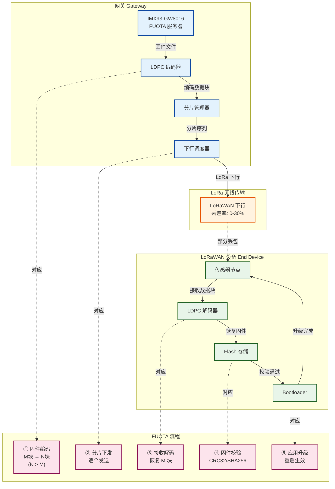
```mermaid
graph TB
    subgraph "网关 Gateway"
        GW["IMX93-GW8016<br/>FUOTA 服务器"]
        ENCODER["LDPC 编码器"]
        FRAGMENT["分片管理器"]
        SCHEDULER["下行调度器"]
    end

    subgraph "LoRa 无线传输"
        AIR["LoRaWAN 下行<br/>丢包率: 0-30%"]
    end

    subgraph "LoRaWAN 设备 End Device"
        DEV["传感器节点"]
        DECODER["LDPC 解码器"]
        STORAGE["Flash 存储"]
        BOOTLOADER["Bootloader"]
    end

    subgraph "FUOTA 流程"
        FLOW1["① 固件编码<br/>M块 → N块<br/>(N > M)"]
        FLOW2["② 分片下发<br/>逐个发送"]
        FLOW3["③ 接收解码<br/>恢复 M 块"]
        FLOW4["④ 固件校验<br/>CRC32/SHA256"]
        FLOW5["⑤ 应用升级<br/>重启生效"]
    end

    %% 编码流程
    GW -->|固件文件| ENCODER
    ENCODER -->|编码数据块| FRAGMENT
    FRAGMENT -->|分片序列| SCHEDULER
    SCHEDULER -->|LoRa 下行| AIR

    %% 无线传输
    AIR -.->|部分丢包| DEV

    %% 解码流程
    DEV -->|接收数据块| DECODER
    DECODER -->|恢复固件| STORAGE
    STORAGE -->|校验通过| BOOTLOADER
    BOOTLOADER -->|升级完成| DEV

    %% 流程标注
    ENCODER -.->|对应| FLOW1
    SCHEDULER -.->|对应| FLOW2
    DECODER -.->|对应| FLOW3
    STORAGE -.->|对应| FLOW4
    BOOTLOADER -.->|对应| FLOW5

    %% 样式
    classDef gateway fill:#e3f2fd,stroke:#0d47a1,stroke-width:2px
    classDef device fill:#e8f5e9,stroke:#1b5e20,stroke-width:2px
    classDef air fill:#fff3e0,stroke:#e65100,stroke-width:2px
    classDef flow fill:#fce4ec,stroke:#880e4f,stroke-width:2px

    class GW,ENCODER,FRAGMENT,SCHEDULER gateway
    class DEV,DECODER,STORAGE,BOOTLOADER device
    class AIR air
    class FLOW1,FLOW2,FLOW3,FLOW4,FLOW5 flow
```

### LDPC algorithm principle

#### 1. Encoding process (Encode)

**step**:
1. Divide the firmware file into **M data blocks** of equal length, each block contains `FragSize` bytes
- Original data matrix: `[B1, B2, B3, ..., Bm]`
2. Generate **N-M redundant data blocks** through the LDPC algorithm (N > M)
- Redundant data: `[Bm+1, Bm+2, ..., BN]`
3. Each redundant block `Bx` is generated by the **XOR operation** of the original data block:
- `Bx = Cx1·B1 ⊕ Cx2·B2 ⊕ ... ⊕ Cxm·Bm`
- where `Cx` is a pseudo-random boolean vector generated by the `matrix_line(x-m, M)` function

**Example**:
- Firmware size: 50 KB, slice size: 200 bytes
- Raw data blocks: M = 256 blocks
- Encoded data blocks: N = 320 blocks (redundancy 25%)
- Theoretical tolerable packet loss: 64 blocks (20%)

#### 2. Decoding process (Decode)

The gateway uses **Algorithm 2 (Semtech optimized implementation)**, which has lower memory usage than protocol standard algorithm 1:

**Algorithm 1 (Protocol Standard)**:
- Memory usage: `M × M + 2 × M`
- Applicable scenarios: universal, no memory limit

**Algorithm 2 (Semtech implementation)**:
- Memory usage: `T × T + 2 × T + 2 × M`
- where `T` is the maximum number of packet losses allowed (T ≤ M)
- Advantages: Optimized for low packet loss rate scenarios, significantly reducing memory requirements

**Decoding steps**:
1. The device receives the data block and records the packet loss bitmap
2. After receiving the encoded data block, try to recover the lost original data block
3. When the number of valid data blocks received is ≥ M, start decoding
4. Recover all original data blocks through matrix operations (Gaussian elimination)
5. Perform CRC32/SHA256 verification on the recovered firmware
6. After passing the verification, write to the Flash storage and restart the upgrade.

### FUOTA operation process

#### 1. Gateway side configuration

1. Log in to the gateway web interface and enter the **FUOTA Management** page
2. Upload the firmware file to be upgraded (.bin format)
3. Configure FUOTA parameters:
- **Slice size**: 48-200 bytes recommended (depending on device Flash page size)
- **Redundancy rate**: 20-30% recommended (increase when packet loss rate is high)
- **Multicast Group**: Select target device group
4. Start the FUOTA task, and the gateway starts to deliver data blocks

#### 2. Device side preparation

- The device needs to support LoRaWAN Fragmented Data Block Transport (port 201)
- Device firmware needs to integrate the LDPC decoding library
- The device needs to reserve enough Flash space (at least 2 times the firmware size)

#### 3. Upgrade monitoring

View live via web interface:
- Number of fragments sent/total number of fragments
- Reception progress of each device
- Decoding success/failure status
- Estimated completion time

### Technical advantages

1. **High reliability**: LDPC forward error correction, adaptable to LoRaWAN high packet loss environment
2. **Low network load**: No need for uplink confirmation, reducing air interface time
3. **Batch Upgrade**: Supports multicast and can upgrade hundreds of devices at the same time
4. **Breakpoint Resume**: The device can continue to receive remaining fragments after power off and restart.
5. **Strong compatibility**: Based on LoRa Alliance standard protocol, adaptable to a variety of devices

### Supported device types

The IMX93-GW8016 gateway is perfectly adapted to **LoRaWAN device products developed by Shenzhen Weichuan Technology** (such as the Sensor Box series) and supports FUOTA for the following devices:

- Temperature and humidity sensor
-Door sensor
- Water immersion sensor
- Multifunctional sensor box
- Industrial grade I/O controller

### Code implementation

The gateway side FUOTA service code is located at:
- GitHub: [https://github.com/guo652917087/Online-Documents/tree/main/code](https://github.com/guo652917087/Online-Documents/tree/main/code)

### Application scenarios

1. **Remote Firmware Repair**: Repair device bugs without on-site operations
2. **Function Upgrade**: Add new functions or protocol support
3. **Security Patches**: Quickly fix security vulnerabilities
4. **Large-scale deployment**: Batch upgrade hundreds of distributed devices

---

## Gateway cluster management

IMX93-GW8016 supports **distributed LoRaWAN edge cluster**. Multiple gateways form a self-managed cluster through the MQTT protocol to achieve device roaming and high-availability deployment.

### Cluster architecture diagram

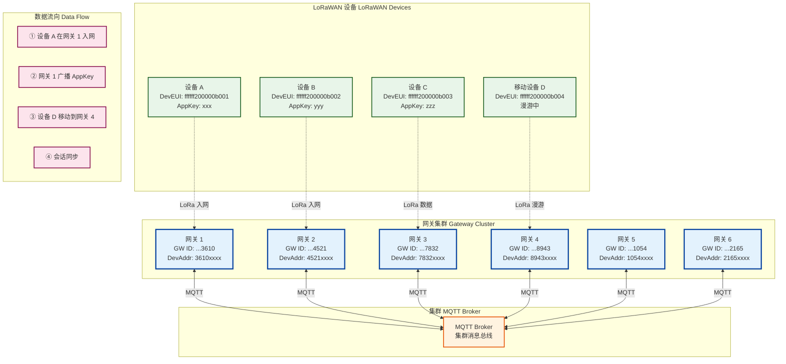
```mermaid
graph TB
    subgraph "LoRaWAN 设备 LoRaWAN Devices"
        DEV1["设备 A<br/>DevEUI: ffffff200000b001<br/>AppKey: xxx"]
        DEV2["设备 B<br/>DevEUI: ffffff200000b002<br/>AppKey: yyy"]
        DEV3["设备 C<br/>DevEUI: ffffff200000b003<br/>AppKey: zzz"]
        DEV4["移动设备 D<br/>DevEUI: ffffff200000b004<br/>漫游中"]
    end

    subgraph "网关集群 Gateway Cluster"
        GW1["网关 1<br/>GW ID: ...3610<br/>DevAddr: 3610xxxx"]
        GW2["网关 2<br/>GW ID: ...4521<br/>DevAddr: 4521xxxx"]
        GW3["网关 3<br/>GW ID: ...7832<br/>DevAddr: 7832xxxx"]
        GW4["网关 4<br/>GW ID: ...8943<br/>DevAddr: 8943xxxx"]
        GW5["网关 5<br/>GW ID: ...1054<br/>DevAddr: 1054xxxx"]
        GW6["网关 6<br/>GW ID: ...2165<br/>DevAddr: 2165xxxx"]
    end

    subgraph "集群 MQTT Broker"
        MQTT_CLUSTER["MQTT Broker<br/>集群消息总线"]
    end

    subgraph "数据流向 Data Flow"
        FLOW1["① 设备 A 在网关 1 入网"]
        FLOW2["② 网关 1 广播 AppKey"]
        FLOW3["③ 设备 D 移动到网关 4"]
        FLOW4["④ 会话同步"]
    end

    %% 设备到网关连接
    DEV1 -.->|LoRa 入网| GW1
    DEV2 -.->|LoRa 入网| GW2
    DEV3 -.->|LoRa 数据| GW3
    DEV4 -.->|LoRa 漫游| GW4

    %% 网关到 MQTT 连接
    GW1 <-->|MQTT| MQTT_CLUSTER
    GW2 <-->|MQTT| MQTT_CLUSTER
    GW3 <-->|MQTT| MQTT_CLUSTER
    GW4 <-->|MQTT| MQTT_CLUSTER
    GW5 <-->|MQTT| MQTT_CLUSTER
    GW6 <-->|MQTT| MQTT_CLUSTER

    %% 样式
    classDef device fill:#e8f5e9,stroke:#1b5e20,stroke-width:2px
    classDef gateway fill:#e3f2fd,stroke:#0d47a1,stroke-width:3px
    classDef mqtt fill:#fff3e0,stroke:#e65100,stroke-width:2px
    classDef flow fill:#fce4ec,stroke:#880e4f,stroke-width:2px

    class DEV1,DEV2,DEV3,DEV4 device
    class GW1,GW2,GW3,GW4,GW5,GW6 gateway
    class MQTT_CLUSTER mqtt
    class FLOW1,FLOW2,FLOW3,FLOW4 flow
```

### How the cluster works

#### 1. Key push (broadcaster)
**FEATURE**: Securely broadcast local device credentials (AppKey) to the cluster network.

**Workflow**:
1. The device joins the network on gateway 1 (OTAA Join Request)
2. Gateway 1 authenticates AppKey and assigns DevAddr (format: `3610xxxx`)
3. Gateway 1 publishes the AppKey to the MQTT topic
4. Other gateways subscribe to the topic, receive and store the AppKey
5. When the device moves to other gateways, any gateway can handle its network access request

---

#### 2. Key synchronization (learner)
**Function**: Automatically learn device credentials shared by other gateways.

**Workflow**:
1. The gateway subscribes to the MQTT topic
2. Receive AppKey broadcast by other gateways
3. Store AppKey into local chirpstack database
4. When the device sends a Join Request, this gateway can directly verify

**Advantages**:
- The device can access the network at any gateway
- Reduce manual configuration workload
- After the device changes location, there is no need to reconnect to the network

---

#### 3. Session synchronization (roaming)
**FEATURE**: Real-time synchronization of active session state (DevAddr, session keys, frame counters).

**Workflow**:
1. The device completes network access at gateway 1 and obtains DevAddr and session key.
2. Gateway 1 publishes session information to the MQTT topic
3. Other gateways subscribe to the topic, receive and store session information
4. Device moves to gateway 4
5. Gateway 4 receives the device’s upstream data and decrypts it using the synchronized session key.
6. Gateway 4 validates frame counters to prevent replay attacks

**Advantages**:
- **Seamless Roaming**: Devices move between gateways without data interruption
- **Prevent duplicate processing**: remove duplicates through FCnt
- **High Availability**: If one gateway fails, the device automatically switches

---

### DevAddr differentiation mechanism

When each gateway is assigned a network access address (DevAddr), it uses the last two digits of the gateway ID as an identifier.

**DevAddr format** (32-bit):
- Bits 31-25: Network ID (7 bits)
- Bits 24-16: Gateway ID identification (8 bits)
- Bit 15-0: Device serial number (16 bits)

**Example**:
- Gateway 1 ID: `0010502df4563610`, last 2 digits: `10`
- Assign DevAddr: `3610bd78`
- Gateway 2 ID: `0010502df45806b4`, last 2 digits: `21`
- Assign DevAddr: `06b407e4`

**Advantages**:
- Use DevAddr to quickly identify the gateway through which the device initially accesses the network.
- Facilitates troubleshooting and network optimization
-Support multiple gateways to work together

---

### Remote assistance architecture diagram

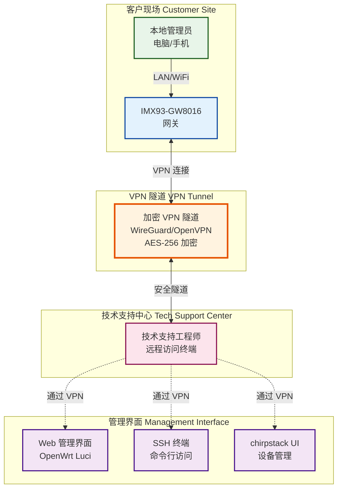
```mermaid
graph TB
    subgraph "客户现场 Customer Site"
        GW["IMX93-GW8016<br/>网关"]
        LOCAL["本地管理员<br/>电脑/手机"]
    end

    subgraph "VPN 隧道 VPN Tunnel"
        VPN["加密 VPN 隧道<br/>WireGuard/OpenVPN<br/>AES-256 加密"]
    end

    subgraph "技术支持中心 Tech Support Center"
        SUPPORT["技术支持工程师<br/>远程访问终端"]
    end

    subgraph "管理界面 Management Interface"
        WEB["Web 管理界面<br/>OpenWrt Luci"]
        SSH["SSH 终端<br/>命令行访问"]
        CHIRPSTACK_UI["chirpstack UI<br/>设备管理"]
    end

    %% 连接关系
    LOCAL -->|LAN/WiFi| GW
    GW <-->|VPN 连接| VPN
    VPN <-->|安全隧道| SUPPORT
    SUPPORT -.->|通过 VPN| WEB
    SUPPORT -.->|通过 VPN| SSH
    SUPPORT -.->|通过 VPN| CHIRPSTACK_UI

    %% 样式
    classDef gateway fill:#e3f2fd,stroke:#0d47a1,stroke-width:2px
    classDef user fill:#e8f5e9,stroke:#1b5e20,stroke-width:2px
    classDef vpn fill:#fff3e0,stroke:#e65100,stroke-width:3px
    classDef support fill:#fce4ec,stroke:#880e4f,stroke-width:2px
    classDef ui fill:#f3e5f5,stroke:#4a148c,stroke-width:2px

    class GW gateway
    class LOCAL user
    class VPN vpn
    class SUPPORT support
    class WEB,SSH,CHIRPSTACK_UI ui
```

---

## Product competitiveness summary

Based on the above functional analysis, the IMX93-GW8016 gateway has significant competitive advantages in the following aspects:

### 1. Technology leadership
- **Dual SX1302 Architecture**: 16-channel capacity, twice the industry’s 8-channel gateway
- **NXP i.MX93 processor + NPU**: supports edge AI applications
- **Full-duplex support**: CN470 band full-duplex mode, receiving sensitivity up to -138 dBm
- **Half-duplex support**: EU868/US915/AS923 band half-duplex mode, receiving sensitivity up to -142 dBm

### 2. Ease of use
- **Zero Code Configuration**: All features are configured through the web interface
- **Batch device management**: Excel import/export, supports large-scale deployment
- **One-click protocol switching**: Supports 10+ LoRa protocols
- **Thing Model (TSL)**: Unified data model to simplify system integration

### 3. Openness and compatibility
- **Multi-protocol support**: UDP GWMP, MQTT, Basic Station, chirpstack-mqtt-forwarder
- **Multi-cloud platform connection**: TTN, AWS, Azure, Helium, Alibaba Cloud, privatized chirpstack
- **Multiple industrial protocols**: Modbus TCP, BACnet BIP, HTTP, MQTT
- **Python 3.11 support**: Users can write custom scripts

### 4. Operation and maintenance capabilities
- **Comprehensive monitoring**: 4G status, GPS positioning, LoRa status, device status, system performance
- **Historical Data Traceability**: Completely records all LoRaWAN frames, supports Excel export and offline analysis
- **Spectrum Scan**: LBT and noise floor scanning to optimize channel configuration
- **Cluster Management**: Supports multi-gateway clustering, device roaming, session synchronization, and high-availability deployment
- **Offline data caching**: Automatically cache data when the network is interrupted, automatically resume transmission after recovery, and zero data loss
- **Complete data traceability**: Supports querying historical data by time period and latest number of items
- **FUOTA support**: remote firmware upgrade, no on-site operation required, supports batch upgrade

### 5. Service capabilities
- **Secure Remote Assistance**: VPN-based remote technical support, no third-party tools required
- **Complete documentation system**: Chinese and English bilingual documentation, API documentation, Python sample code
- **Open Source Community Support**: Based on the OpenWrt system, compatible with community packages and extensions
- **Technical Support Response**: Provide professional technical support and quickly respond to customer needs

### 6. Cost advantage
- **Built-in NS**: No need to purchase cloud platform services, reducing operating costs
- **Edge Computing**: Local processing of data, reducing cloud traffic costs
- **Long life design**: industrial-grade hardware + watchdog + power-down alarm, reducing maintenance costs
- **Integrated Solution**: Integrate multiple protocols and functions to reduce additional hardware investment

### 7. Technical comparison with peer products

IMX93-GW8016 has the following significant advantages compared to other LoRaWAN gateways on the market:

| Functional features | IMX93-GW8016 | General competitive product gateway |
|---------|-------------|------------|
| **LoRa Channel Count** | 16 Uplink / 2 Downlink | 8 Uplink / 1 Downlink |
| **Built-in NS** | ✅ ChirpStack V4.x fully functional (regularly updated to the latest version) | ⚠️ Old version with no or limited functionality |
| **LBT Support** | ✅ EU868/AS923/KR920 hardware level support | ❌ Most not supported or software emulated |
| **Historical Data Query** | ✅ Query by time period/number of items, Excel export | ❌ Most of them are not supported |
| **Offline data caching** | ✅ Automatically resume downloading after network recovery | ❌ Data loss |
| **FUOTA Firmware Upgrade** | ✅ Supports LDPC algorithm, 20-30% packet loss tolerance | ❌ Most do not support |
| **Modbus TCP** | ✅ Full mapping supported | ❌ Not supported |
| **BACnet BIP** | ✅ Full mapping supported | ❌ Not supported |
| **IoT Hub object model** | ✅ Freely define TSL object model | ❌ Unsupported or fixed model |
| **Cluster Management** | ✅ Decentralized edge cluster, device roaming | ⚠️ Rely on centralized cloud |
| **Remote Assistance** | ✅ Encrypted VPN, no third-party tools required | ⚠️ Relies on tools like TeamViewer |
| **Python Script** | ✅ Python 3.11 fully supported | ❌ Not supported |
| **Node-RED** | ✅ Integrated Node-RED (via ChirpStack) | ❌ Not supported |
| **ChirpStack REST API** | ✅ Complete API interface | ⚠️ Limited functionality |
| **Data Format** | ✅ Base64 + Hex (rawData field) | ⚠️ Base64 only |
| **Processor** | NXP i.MX93 Triple Core + NPU | Single core or low-end processor |
| **Memory/Storage** | 2GB RAM / 32GB eMMC | 512MB RAM / 8GB Flash |

**Summary of Core Competitive Advantages**:

1. **Full stack ChirpStack**: Provides complete ChirpStack V4.x functions, not a emasculated or old version
2. **LBT hardware support**: Meet strict regulatory requirements and improve spectrum utilization efficiency
3. **Zero data loss**: offline caching + automatic resumption mechanism
4. **Remote operation and maintenance**: FUOTA + VPN remote assistance to reduce operation and maintenance costs
5. **Industrial protocol integration**: Modbus TCP + BACnet BIP, seamlessly connect to existing systems
6. **Edge Computing**: Decentralized clusters, no need to rely on the cloud
7. **Development friendly**: Python script + Node-RED + REST API

---

## Summarize

The IMX93-GW8016 gateway provides a complete LoRaWAN network solution, from device access, data collection to multi-protocol forwarding, to meet the needs of various IoT applications. Through the detailed instructions in this document, users can:

1. Understand the product advantages and hardware version selection of gateways
2. Master the gateway login and basic network configuration
3. Configure LoRa communication protocol to connect to various network servers and cloud platforms
4. Use built-in chirpstack for device management and data viewing
5. Integrate into existing systems through Modbus TCP, BACnet, HTTP, MQTT and other protocols
6. Use Python scripts to implement secondary development and data processing
7. Understand system architecture and cluster working principles
8. Utilize various functions of the web interface for operation, maintenance and management

---

## Technical Support

If you have any technical questions or require further support, please contact:

**Shenzhen Weichuan Technology Co., Ltd.**
**Shenzhen Winext Technology Co., Ltd.**

- Official website: [www.winext.cn](https://www.winext.cn)
- Technical support email: marketing@winext.cn
- Sales consultation: marketing@winext.cn
- Tel: +86-0755-23990916

---

**Copyright © 2026 Shenzhen Weichuan Technology Co., Ltd.**
**All Rights Reserved © 2026 Shenzhen Winext Technology Co., Ltd.**

