# IMX93-GW8016 16通道LoRaWAN网关用户手册

**深圳市唯传科技有限公司**  
**Shenzhen Winext Technology Co., Ltd.**


> **提供定制服务**：
> - 提供中性的网关软件，免费支持
> - 可以提供定制需求，对接第三方的传感器设备，需另外付费
> - 可以提供网关的SSH账号密码，需购买网关数量大于10台以上
> - 可以提供网关的在线中英页面文档(ubuntu-24安装包)给客户自行部署，需另外付费，买断制收费(购买安装部署以后，唯传公司不会继续帮忙更新在线文档)：美金 `$8,888`‌;订阅式制收费(会更新维护唯传公司的最新产品库和配套的在线文档)：美金 `$12,888`‌;
> - 可以提供LoRaWAN传感器终端的在线中英页面文档(ubuntu-24安装包)给客户自行部署，需另外付费，买断制收费(购买安装部署以后，唯传公司不会继续帮忙更新在线文档)：美金 `$6,888`‌;订阅式制收费(会更新维护唯传公司的最新产品库和配套的在线文档)：美金 `$9,888`‌;

---

## 目录

1. [产品介绍](#产品介绍)
	- [1.1 产品优势](#产品优势)
	- [1.2 NXP网关参数对比](#nxp网关参数对比)
	- [1.3 硬件版本说明](#硬件版本说明)
		- [1.3.1 网关内部硬件接口概况](#网关内部硬件接口概况)
		- [1.3.2 CN470 全双工版本](#cn470-全双工版本)
		- [1.3.3 EU868 LBT 版本](#868-lbt-版本)
		- [1.3.4 US915/AS923 LBT 版本](#915-lbt-版本)
	- [1.4 软件功能特性](#软件功能特性)
	- [1.5 系统架构](#系统架构)
	- [1.6 产品竞争力总结](#产品竞争力总结)	

2. [烧录固件](#烧录固件)
	- [2.1 工厂方式一，使用Micro USB烧录固件](#usb烧录固件)
	- [2.2 工厂方式二，使用TF烧录固件](#tf烧录固件)
	- [2.3 用户使用网关页面烧录固件](#网关页面烧录固件)
	
3. [网关页面操作指引](#网关页面操作指引)
	- [3.1 登录网关页面](#登录网关页面)
		- [3.1.1 使用LAN口网线登录网关页面](#使用lan登录网关页面)
		- [3.1.2 使用WiFi登录网关页面](#使用wifi登录网关页面)
		- [3.1.3 使用WAN口网线/PoE交换机登录网关页面](#使用wan登录网关页面)
	- [3.2 网关上网方式](#网关上网方式)
		- [3.2.1 使用WAN口DHCP方式连接](#使用wan口dhcp方式连接)
		- [3.2.2 配置WAN口为静态IP](#配置wan口为静态ip)
		- [3.2.3 使用4G LTE方式连接](#使用4g-lte方式连接)
		- [3.2.4 使用2.4G WiFi方式连接路由器](#使用2_4g-wifi方式连接路由器)
		- [3.2.5 使用5.8G WiFi方式连接路由器](#使用5_8g-wifi方式连接路由器)
	- [3.3 配置LoRa网关频段以及频点](#配置lora网关频段以及频点)
		- [3.3.1 470全双工硬件配置CN470频段以及频点说明](#cn470频段以及频点说明)
		- [3.3.2 868半双工硬件切换EU868/RU864/IN865频段以及配置频点说明](#868半双工硬件切换频段说明)
			- [3.3.2.1 868硬件版本切换EU868频段](#868硬件版本切换EU868频段)
			- [3.3.2.2 868硬件版本切换RU864频段](#868硬件版本切换RU864频段)
			- [3.3.2.3 868硬件版本切换IN865频段](#868硬件版本切换IN865频段)
		- [3.3.3 915半双工硬件切换US915/AU915/AS923-1/AS923-2/AS923-3/AS923-4/KR920频段以及配置频点说明](#915半双工硬件切换频段说明)
			- [3.3.3.1 915硬件版本切换US915频段](#915硬件版本切换US915频段)
			- [3.3.3.2 915硬件版本切换AU915频段](#915硬件版本切换AU915频段)
			- [3.3.3.3 915硬件版本切换AS923-1频段](#915硬件版本切换AS923-1频段)
			- [3.3.3.4 915硬件版本切换AS923-2频段](#915硬件版本切换AS923-2频段)
			- [3.3.3.5 915硬件版本切换AS923-3频段](#915硬件版本切换AS923-3频段)
			- [3.3.3.6 915硬件版本切换AS923-4频段](#915硬件版本切换AS923-4频段)
			- [3.3.3.7 915硬件版本切换KR920频段](#915硬件版本切换KR920频段)
	- [3.4 配置LoRa网关连接外部NS服务器](#配置lora网关连接外部ns服务器)
		- [3.4.1 使用UDP方式](#使用udp方式)
			- [3.4.1.1 使用UDP方式连接自建的chirpstack平台](#使用udp方式连接chirpstack)
			- [3.4.1.2 使用UDP方式连接TTN平台](#使用udp方式连接ttn)
		- [3.4.2 使用MQTT GWMP方式](#使用mqtt-gwmp方式)
			- [3.4.2.1 使用MQTT GWMP方式连接公有云IoT Vision](#使用mqtt-gwmp方式连接公有云iot)
			- [3.4.2.2 使用MQTT GWMP方式连接私有部署IoT Vision](#使用mqtt-gwmp方式连接私有iot)
		- [3.4.3 使用 ChirpStack MQTT Forwarder方式](#使用chirpstack-mqtt-forwarder方式)
			- [3.4.3.1 使用ChirpStack MQTT Forwarder方式连接自建的chirpstack平台](#使用chirpstack-mqtt-forwarder方式连接chirpstack)
		- [3.4.4 使用 Basic station CUPS方式](#使用basic-station-cups方式)
			- [3.4.4.1 使用Basic station CUPS方式连接亚马逊平台](#使用basic-station-cups方式连接亚马逊平台)	
		- [3.4.5 使用 Basic station LNS方式](#使用basic-station-lns方式)
			- [3.4.5.1 使用Basic station LNS方式连接TTN平台](#使用basic-station-lns方式连接ttn平台)	
			- [3.4.5.2 使用Basic station LNS方式连接chirpstack](#使用basic-station-lns方式连接chirpstack平台)	
			- [3.4.5.3 使用Basic station LNS方式连接helium平台](#使用basic-station-lns方式连接helium平台)	
			
	- [3.5 配置16通道网关频段以及频点](#配置16通道网关频段以及频点)
		- [3.5.1 470全双工硬件配置CN470频段以及频点说明](#配置16通道网关cn470频段以及频点说明)
		- [3.5.2 868半双工硬件切换EU868/RU864/IN865频段以及配置频点说明](#配置16通道网关868半双工硬件切换频段说明)
		- [3.5.3 915半双工硬件切换US915/AU915/AS923-1/AS923-2/AS923-3/AS923-4/KR920频段以及配置频点说明](#配置16通道网关915半双工硬件切换频段说明)
	- [3.6 配置16通道网关连接外部NS服务器](#配置16通道网关连接外部ns服务器)
		- [3.6.1 配置16通道网关使用UDP方式](#配置16通道网关使用udp方式)
			- [3.6.1.1 使用UDP方式连接自建的chirpstack平台](#配置16通道网关使用udp方式连接chirpstack)
			- [3.6.1.2 使用UDP方式连接TTN平台](#配置16通道网关使用udp方式连接ttn)
		- [3.6.2 配置16通道网关使用MQTT GWMP方式](#配置16通道网关使用mqtt-gwmp方式)
			- [3.6.2.1 使用MQTT GWMP方式连接公有云IoT Vision](#配置16通道网关使用mqtt-gwmp方式连接公有云iot)
			- [3.6.2.2 使用MQTT GWMP方式连接私有部署IoT Vision](#配置16通道网关使用mqtt-gwmp方式连接私有iot)
		- [3.6.3 配置16通道网关使用 ChirpStack MQTT Forwarder方式](#配置16通道网关使用chirpstack-mqtt-forwarder方式)
			- [3.6.3.1 使用ChirpStack MQTT Forwarder方式连接自建的chirpstack平台](#配置16通道网关使用chirpstack-mqtt-forwarder方式连接chirpstack)
		- [3.6.4 配置16通道网关使用 Basic station CUPS方式](#配置16通道网关使用basic-station-cups方式)
			- [3.6.4.1 使用Basic station CUPS方式连接亚马逊平台](#配置16通道网关使用basic-station-cups方式连接亚马逊平台)	
		- [3.6.5 配置16通道网关使用 Basic station LNS方式](#配置16通道网关使用basic-station-lns方式)
			- [3.6.5.1 使用Basic station LNS方式连接TTN平台](#配置16通道网关使用basic-station-lns方式连接ttn平台)	
			- [3.6.5.2 使用Basic station LNS方式连接chirpstack](#配置16通道网关使用basic-station-lns方式连接chirpstack平台)	
			- [3.6.5.3 使用Basic station LNS方式连接helium平台](#配置16通道网关使用basic-station-lns方式连接helium平台)	

	- [3.7 使用内置NS服务器](#使用内置ns服务器)
		- [3.7.1 切换内置模式](#切换内置模式)
		- [3.7.2 添加唯传自研的LoRaWAN传感器到内置chirpstack服务器](#添加唯传自研的lorawan传感器到内置chirpstack服务器)
		- [3.7.3 添加第三方的LoRaWAN设备到内置chirpstack服务器](#添加第三方的lorawan设备到内置chirpstack服务器)		
		- [3.7.4 删除内置NS的设备](#删除内置ns的设备)
		- [3.7.5 使用excel表格批量添加设备](#使用excel表格批量添加设备)
		- [3.7.6 导出所有设备到excel表格](#导出所有设备到excel表格)
		- [3.7.7 使用ChirpStack REST API接口](#使用chirpstack-rest-api接口)		
		- [3.7.8 使用Node-RED界面](#使用node-red界面)	
		- [3.7.9 查询设备历史数据](#查询设备历史数据)		
			- [3.7.9.1 按照最新条数查询设备历史数据](#按照最新条数查询设备历史数据)
			- [3.7.9.2 按照时间段查询设备历史数据](#按照时间段查询设备历史数据)	
		- [3.7.10 使用MQTT推送chirpstack的实时消息到客户的MQTT服务器](#使用mqtt推送chirpstack的实时消息到客户的mqtt服务器)	
		- [3.7.11 使用HTTP推送chirpstack的实时消息到客户的HTTP服务器](#使用http推送chirpstack的实时消息到客户的http服务器)	
		
	- [3.8 使用Hub物模型](#使用hub物模型)
		- [3.8.1 设置设备的传感器物模型](#设置设备的传感器物模型)
		- [3.8.2 查看设备的物模型实时数据](#查看设备的物模型实时数据)
		- [3.8.3 查看设备的物模型历史数据](#查看设备的物模型历史数据)
			- [3.8.3.1 根据最新条数查询设备的物模型历史数据](#根据最新条数查询设备的物模型历史数据)	
			- [3.8.3.2 根据时间段查询设备的物模型历史数据](#根据时间段查询设备的物模型历史数据)	
		- [3.8.4 使用Modbus Tcp获取设备数据](#使用modbus-tcp获取设备数据)			
			- [3.8.4.1 设置设备支持Modbus Tcp映射](#设置设备支持modbus-tcp映射)
			- [3.8.4.2 通过modbus poll工具获取设备实时数据](#通过modbus-poll工具获取设备实时数据)		
			- [3.8.4.3 通过python3脚本使用modbus tcp方式获取设备实时数据](#通过python3脚本使用modbus-tcp方式获取设备实时数据)
		- [3.8.5 使用BACnet BIP获取设备数据](#使用bacnet-bip获取设备数据)
			- [3.8.5.1 设置设备支持BACnet BIP映射](#设置设备支持bacnet-bip映射)
			- [3.8.5.2 通过Yabe工具获取设备实时数据](#通过yabe工具获取设备实时数据)		
			- [3.8.5.3 通过python3脚本使用BACnet BIP方式获取设备实时数据](#通过python3脚本使用bacnet-bip方式获取设备实时数据)	
		- [3.8.6 使用Hub的HTTP接口](#使用hub的http接口)	
			- [3.8.6.1 通过Hub的HTTP接口获取设备实时数据](#通过hub的http接口获取设备实时数据)		
			- [3.8.6.2 通过Hub的HTTP接口获取设备列表](#通过hub的http接口获取设备列表)
			- [3.8.6.3 通过Hub的HTTP接口获取设备历史数据](#通过hub的http接口获取设备历史数据)
			
	- [3.9 使用网关的内置NS集群和设备漫游](#使用网关的内置ns集群和设备漫游)
		- [3.9.1 网关集群能力介绍](#网关集群能力介绍)
		- [3.9.2 网关集群框架](#网关集群框架)
		- [3.9.3 设置集群服务器](#设置集群服务器)
		- [3.9.4 查看连接到集群服务器的状态](#查看连接到集群服务器的状态)	
		
	- [3.10 网关使用FUOTA给设备做固件空中升级](#网关使用fuota给设备做固件空中升级)
		- [3.10.1 FUOTA固件空中升级介绍](#fuota固件空中升级介绍)
		- [3.10.2 FUOTA固件空中升级框架流程](#fuota固件空中升级框架流程)

	- [3.11 网关远程运维和技术支持](#网关远程运维和技术支持)
		- [3.11.1 网关远程运维介绍](#网关远程运维介绍)
		- [3.11.2 网关远程运维框架流程](#网关远程运维框架流程)
		- [3.11.3 请求远程协助](#请求远程协助)		
		
	- [3.12 查看网关定位GPS/BeiDou情况](#查看网关定位gpsbeidou情况)
	- [3.13 唯传自研产品获得数据示例](#唯传自研产品获得数据示例)
		- [3.13.1 温湿度传感器AN-303数据示例](#温湿度传感器an-303数据示例)
		
4. [LoRaWAN网关灵敏度测试数据](#lorawan网关灵敏度测试数据)
	- [4.1 470全双工灵敏度测试](#470全双工灵敏度测试)
		- [4.1.1 矢量信号源使用BW125 SF12测试灵敏度](#矢量信号源使用bw125-sf12测试灵敏度-470)
		- [4.1.2 矢量信号源使用BW125 SF11测试灵敏度](#矢量信号源使用bw125-sf11测试灵敏度-470)	
		- [4.1.3 矢量信号源使用BW125 SF10测试灵敏度](#矢量信号源使用bw125-sf10测试灵敏度-470)	
		- [4.1.4 矢量信号源使用BW125 SF9测试灵敏度](#矢量信号源使用bw125-sf9测试灵敏度-470)	
		- [4.1.5 矢量信号源使用BW125 SF8测试灵敏度](#矢量信号源使用bw125-sf8测试灵敏度-470)	
		- [4.1.6 矢量信号源使用BW125 SF7测试灵敏度](#矢量信号源使用bw125-sf7测试灵敏度-470)
		- [4.1.7 矢量信号源使用BW125 SF6测试灵敏度](#矢量信号源使用bw125-sf6测试灵敏度-470)
		- [4.1.8 矢量信号源使用BW125 SF5测试灵敏度](#矢量信号源使用bw125-sf5测试灵敏度-470)
	
	- [4.2 868半双工灵敏度测试](#868半双工灵敏度测试)
		- [4.2.1 矢量信号源使用BW125 SF12测试灵敏度](#矢量信号源使用bw125-sf12测试灵敏度-868)
		- [4.2.2 矢量信号源使用BW125 SF11测试灵敏度](#矢量信号源使用bw125-sf11测试灵敏度-868)	
		- [4.2.3 矢量信号源使用BW125 SF10测试灵敏度](#矢量信号源使用bw125-sf10测试灵敏度-868)	
		- [4.2.4 矢量信号源使用BW125 SF9测试灵敏度](#矢量信号源使用bw125-sf9测试灵敏度-868)	
		- [4.2.5 矢量信号源使用BW125 SF8测试灵敏度](#矢量信号源使用bw125-sf8测试灵敏度-868)	
		- [4.2.6 矢量信号源使用BW125 SF7测试灵敏度](#矢量信号源使用bw125-sf7测试灵敏度-868)
		- [4.2.7 矢量信号源使用BW125 SF6测试灵敏度](#矢量信号源使用bw125-sf6测试灵敏度-868)
		- [4.2.8 矢量信号源使用BW125 SF5测试灵敏度](#矢量信号源使用bw125-sf5测试灵敏度-868)
	
	- [4.3 915半双工灵敏度测试](#915半双工灵敏度测试)
		- [4.3.1 矢量信号源使用BW125 SF12测试灵敏度](#矢量信号源使用bw125-sf12测试灵敏度-915)
		- [4.3.2 矢量信号源使用BW125 SF11测试灵敏度](#矢量信号源使用bw125-sf11测试灵敏度-915)	
		- [4.3.3 矢量信号源使用BW125 SF10测试灵敏度](#矢量信号源使用bw125-sf10测试灵敏度-915)	
		- [4.3.4 矢量信号源使用BW125 SF9测试灵敏度](#矢量信号源使用bw125-sf9测试灵敏度-915)	
		- [4.3.5 矢量信号源使用BW125 SF8测试灵敏度](#矢量信号源使用bw125-sf8测试灵敏度-915)	
		- [4.3.6 矢量信号源使用BW125 SF7测试灵敏度](#矢量信号源使用bw125-sf7测试灵敏度-915)
		- [4.3.7 矢量信号源使用BW125 SF6测试灵敏度](#矢量信号源使用bw125-sf6测试灵敏度-915)
		- [4.3.8 矢量信号源使用BW125 SF5测试灵敏度](#矢量信号源使用bw125-sf5测试灵敏度-915)
	
5. [LoRaWAN网关发射功率测试数据](#lorawan网关发射功率测试数据)
	- [5.1 470全双工最大发射功率测试](#470全双工最大发射功率测试)
	- [5.2 868半双工最大发射功率测试](#868半双工最大发射功率测试)
	- [5.3 915半双工最大发射功率测试](#915半双工最大发射功率测试)

6. [网关户外施工安装注意事项](#网关户外施工安装注意事项)

	
---

## 产品介绍

IMX93-GW8016 是一款专业的工业级 LoRaWAN 边缘网关产品，可室外安装，采用高性能 NXP i.MX93 2个大核处理器+1个低功耗CPU，集成双 SX1302 射频芯片，提供 16 个 LoRa 上行通道和 2 个下行通道。该网关专为大规模物联网部署设计，内置 chirpstack V4.16.0(定期会同步到最新版本) 网络服务器，支持多种通信协议和数据转发方式，可满足智慧城市、智慧农业、工业物联网等多种应用场景需求。

产品采用全工业级设计，支持 IP67 防护等级，工作温度范围 -40℃ 至 +75℃，配备多种网络连接方式（4G LTE、WiFi、以太网），支持 PoE 供电，可实现快速部署和远程管理。

---

## 产品优势

IMX93-GW8016 网关具有以下核心优势：

### 1. 高性能处理器平台
- 采用工业级 NXP i.MX93 3个处理器（双核Cortex-A55 @ 1.7GHz + 低功耗单核Cortex-M33 @ 250MHz）
- 集成 NPU 神经处理单元，提供 0.5 TOPS 算力，支持边缘 AI 应用
- 2GB LPDDR4 内存 + 32GB eMMC 存储，确保系统流畅运行

### 2. 双倍 LoRa 通道容量
- 16 个上行通道 + 2 个下行通道，是 GW8000（8通道）的两倍容量
- 支持更多并发设备接入，降低丢包率，提升网络效率
- 双 SX1302 射频架构，接收灵敏度达 -142 dBm

### 3. 多样化连接方式
- 4G LTE 全网通（支持国内外多频段）
- 双频 WiFi（2.4G/5.8G，2×2 MIMO）
- 双网口（WAN 千兆 + LAN 百兆）


### 4. 内置网络服务器
- 预装 chirpstack V4.16.0 网络服务器，支持本地设备管理
- 无需外部云平台即可完成 LoRaWAN 设备接入和数据采集
- 定期更新至 chirpstack 最新版本

### 5. 丰富的协议支持
- LoRa 协议：UDP GWMP、MQTT、Basic Station（LNS/CUPS）、chirpstack-mqtt-forwarder
- 数据转发协议：MQTT v3.1.1、HTTP、Modbus TCP、BACnet BIP
- 支持连接外部 NS（TTN、chirpstack、Helium、Microsoft、AWS 等）

### 6. 工业级可靠性
- IP67 防护等级，适应恶劣户外环境
- 工作温度 -40℃ 至 +75℃，湿度 5%~95% RH
- 外置 TI 工业级硬件看门狗，确保系统稳定运行
- 内置 低功耗高精度NXP的RTC芯片 + 备用电池CR2032，支持脱网授时
- 内置 ublox-10系列的GPS/北斗/Galileo/GLONASS 多模定位模块，支持GPS/北斗精准授时
- 掉电后有超级电容供电，可以及时保存eMMC数据，防止意外断电引起的文件、数据库损坏，并触发掉电告警，及时通知异常状态

### 7. 灵活部署与管理
- 支持 PoE（IEEE 802.3at/af）供电，简化安装布线
- 提供墙面和抱杆安装套件
- 支持太阳能UPS套件供电

### 8. 支持定制开发能力
- Python 3.11 脚本支持，可编写自定义数据处理逻辑
- IoT Hub 支持 物模型TSL (Thing Specification Language)定义，灵活配置设备状态属性
- 支持集群管理和设备漫游功能
- 支持客户自行编写js解析脚本
- OpenWrt 系统架构，支持中英文页面显示

### 9. LBT（Listen-Before-Talk）频谱监听技术
- **监管合规性**：满足欧洲（EU868）、亚洲（AS923、KR920）等地区的频谱共享监管要求
- **智能避让机制**：设备在发送前先监听信道 RSSI，检测是否有其他设备正在使用，避免信号碰撞
- **提升网络效率**：在高密度部署环境下，显著减少数据包冲突和重传，提升网络吞吐量
- **超越 ALOHA 协议**：相比传统的随机接入方式，LBT 使网络性能提升 30-50%
- **硬件级支持**：SX1302 + SX1262 硬件实现，响应速度快、比SX1301方案功耗低
- **适用频段**：AS923-1/AS923-2/AS923-3/AS923-4、KR920、EU868 全面支持，RU864、IN865 同样适用
- **注意事项**：US915、AU915 频段因下行使用 BW500KHz 带宽，而 LBT 仅支持 BW125KHz，故不支持 LBT 功能

### 10. 完善的数据追溯能力
- **实时数据查询**：通过 HTTP API 实时获取 ChirpStack 标准协议数据和物模型（Hub）解析后的数据
- **历史数据检索**：支持按最新条数和时间段两种方式查询历史数据，满足不同场景需求
- **多维度数据记录**：记录 LoRaWAN 帧详情、原始 Payload（Base64 + Hex）、解码后的 JSON 数据
- **Excel 数据导出**：一键导出历史数据为 Excel 表格，便于离线分析和审计
- **离线数据缓存**：网络中断时自动缓存数据，网络恢复后自动续传，确保数据不丢失
- **数据完整性**：每一帧 LoRaWAN 数据完整保存，包括上行、下行、入网、确认等所有事件
- **快速检索**：基于 PostgreSQL 数据库索引，支持秒级查询大量历史数据
- **应用场景**：故障分析、设备调试、数据审计、合规性检查等

### 11. FUOTA 固件远程升级能力
- **无需现场操作**：通过 LoRaWAN 网络远程升级设备固件，节省人力和时间成本
- **LDPC 前向纠错**：采用先进的 LDPC 算法，容忍 20-30% 的丢包率
- **批量升级**：支持多播模式，可同时升级数百个设备
- **标准协议**：基于 LoRa Alliance 标准，与公司多种 LoRaWAN 设备配套使用
- **应用场景**：Bug 修复、功能升级、安全补丁、大规模设备维护

### 12. 可以远程管理
- 支持 VPN 授权，建立加密隧道，可以远程访问网关，便于远程维护和技术支持
- 支持网关无人值守也可以远程访问网关luci页面、内置的chirpstack页面、ChirpStack REST API页面、Node-RED页面
---

## NXP网关参数对比

| 参数项 | LoRa 16 通道版本 | LoRa 8 通道版本 |
| ------ | ---------------- | --------------- |
| 型号   | GW8016 | GW8000 |
| CPU | NXP i.MX93 2个大核处理器+1个低功耗CPU | NXP i.MX93 2个大核处理器+1个低功耗CPU |
| 芯片架构 | Dual ARM® Cortex™-A55 内核 + Cortex-M33 内核，i.MX93 主频高达 1.7GHz、Cortex®-M33 主频 250 MHz | Dual ARM® Cortex™-A55 内核 + Cortex-M33 内核，i.MX93 主频高达 1.7GHz、Cortex®-M33 主频 250 MHz |
| NPU | 神经处理器单元：最多提供 0.5 TOPS | 神经处理器单元：最多提供 0.5 TOPS |
| RAM | 2 GB LPDDR4 | 1 GB LPDDR4 |
| Flash | eMMC 32 GB | eMMC 8 GB |
| 电源（PoE） | 提供标准 PoE 供电，支持 IEEE 802.3at/af | 提供标准 PoE 供电，支持 IEEE 802.3at/af |
| 电源（DC） | DC 12~24 V/2A | DC 12~24 V/2A |
| 软件系统 | openwrt-24.10 | openwrt-24.10 |
| Linux 内核 | linux-6.6.52 | linux-6.6.52 |
| LoRa 主芯片 | SX1302 (可定制SX1303带LoRa定位功能) | SX1302 (可定制SX1303带LoRa定位功能) |
| LoRa 工作频段 | CN470-510 / EU863-870 / US902-928 / AS923-1 / AS923-2 / AS923-3 / AS923-4 / AU915-928 / KR920-923 / RU864-870 / IN865-867 | 同左 |
| LoRa 通信速率 | 292 bps ~ 5.4 kbps，LoRaWAN支持扩频因子 SF7~SF12，私有支持SF5/SF6 | 同左 |
| LoRa 发射功率 | 提供 10 / 14 / 16 / 17 / 20 / 23 / 25 / 27 dBm 档位 | 同左 |
| LoRa 全双工支持频段 | CN470-510 | CN470-510 |
| LoRa 接收灵敏度 | -143 dBm @ SF12（半双工） / -141 dBm @ SF12（全双工） | 同左 |
| LoRa 底噪扫描 | 支持 | 支持 |
| LoRa 天线 | 2 根 5 dBi 玻璃钢天线 | 1 根 5 dBi 玻璃钢天线 |
| LoRa 天线类型 | 全向 | 全向 |
| LoRa LBT | 支持 | 支持 |
| LoRa 通道 | 上行 16 通道 / 下行 2 通道 | 上行 8 通道 / 下行 1 通道 |
| 户外定位 | GPS、北斗、Galileo、GLONASS 多模合一 | 同左 |
| 网关授时 | 内置 RTC 芯片，备用纽扣电池，提供脱网授时；GPS；网络 NTP 同步 | 同左 |
| 掉电告警 | 有专用超级电容提供掉电后告警 | 有专用超级电容提供掉电后告警 |
| 硬件看门狗 | 外置 TI 工业级看门狗 | 外置 TI 工业级看门狗 |
| Wi-Fi | 2.4G / 5.8G 默认 AP 模式，2×2 MIMO，也支持切换 STA 连接路由器 | 同左 |
| BT | BLE 5.0 预留APP配置场景 | BLE 5.0 预留APP配置场景 |
| 天线接口 | 5 个 | 4 个 |
| RJ45 网口 | 两个网口：WAN 口千兆（支持 PoE）、LAN 口百兆 | 同左 |
| IP 防护 | IP67 | IP67 |
| 工作温度 | -40℃ ～ +75℃ | -40℃ ～ +75℃ |
| 工作湿度 | 5% ~ 95% RH 无冷凝 | 5% ~ 95% RH 无冷凝 |
| 安装方式 | 提供安装套件，支持挂墙、抱杆，天线支持馈线安装 | 同左 |
| 尺寸 | 288 mm × 215 mm × 59 mm（网关）<br>486 mm × 400 mm × 150 mm（包装） | 同左 |

---

## 硬件版本说明

IMX93-GW8016 网关系列提供 3 个硬件版本，分别针对不同频段和地区需求：

### 网关内部硬件接口概况

- 系统内
  - **WAN**：支持千兆速率、支持48V PoE供电，连网功能，默认DHCP客户端，接广域网，连服务器
  - **LAN**：默认DHCP服务器，会分配192.168.60.x的IP给电脑，接电脑配置使用
  - **DC**：12V到24V/2A供电，极限电压：9V~28V
  - **软件恢复出厂设置按键(Factory Reset Button)**：恢复出厂设置按钮，长按时间超过6秒钟，系统灯会闪烁，松开后，系统进入恢复出厂设置；短按系统触发重启
  - **硬件CPU复位按键(CPU Reset Button)**:对应system reset丝印的按钮，按一次就会cpu硬件复位

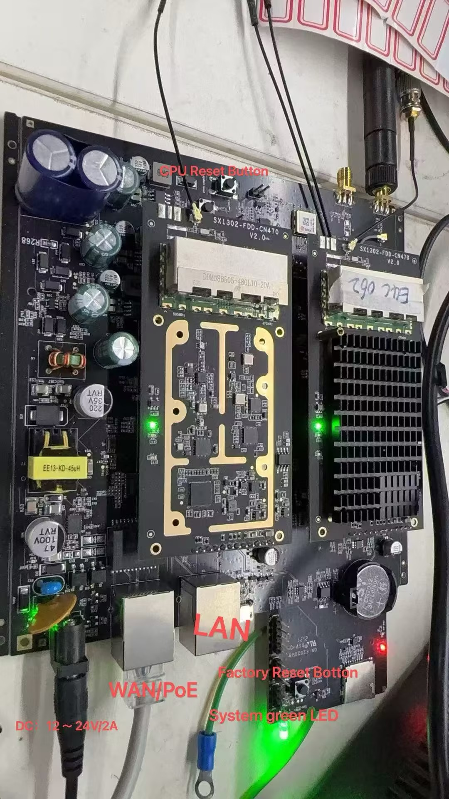

---

### cn470-全双工版本

**适用地区**：中国大陆

**射频架构**：
- 基于官方的参考设计：SX1302CFD490GW1_e537v03a
- 集成两个 SX1302 射频板，每块采用官方 SX1302 + 2×SX1255 + SX1262 全双工参考设计
- 工作模式：全双工模式，使用双工器实现收发分离

**频段范围**：
- 接收频点范围：470MHz ~ 490MHz
- 发射频点范围：500MHz ~ 510MHz

**LBT 功能**：
- 不启用 LBT,LoRa LBT（Listen Before Talk）是 LoRa/LoRaWAN 网络中的一项关键机制，它允许设备在传输之前通过监听干扰（RSSI）来检查通信信道是否畅通（不繁忙），从而防止冲突，提高密集环境中的效率，并满足（如日本/韩国）频谱共享的监管要求，从而将网络性能提升到超越基本 ALOHA 的水平
- 在CN470频段 SX1262 仅用于底噪扫描

**协议兼容性**：
- 支持 LoRaWAN V1.0.3 标准定义的 CN470 频点
- 不支持 V1.0.4 频点（V1.0.4 频点由阿里巴巴修改）

---

### 868-lbt-版本

**适用地区**：欧盟、俄罗斯、印度等地区

**射频架构**：
- 基于官方的参考设计：SX1302CSS868GW1_e539v03a
- 集成两个 SX1302 射频板，每块采用官方 SX1302 + 2×SX1250 + SX1262 LBT 参考设计
- 工作模式：半双工模式，支持完整 LBT 功能

**LBT 功能**：
- 在 EU868 频段启用全部 LBT（Listen Before Talk） 功能，同时保留底噪扫描能力

**频段切换**：
- EU863-870（欧洲）
- RU864-870（俄罗斯）
- IN865-867（印度）

---

### 915-lbt-版本

**适用地区**：美国、澳大利亚、日本、韩国、东南亚、南美洲等地区

**射频架构**：
- 基于官方的参考设计：SX1302CSS915GW1_e539v03a
- 集成两个 SX1302 射频板，每块采用官方 SX1302 + 2×SX1250 + SX1262 LBT 参考设计
- 工作模式：半双工模式，支持完整 LBT 功能

**LBT 功能**：
- 在 AS923 和 KR920 频段启用全部 LBT （Listen Before Talk）功能，保留底噪扫描能力

**频段切换**：
- US902-928（美国）
- AU915-928（澳大利亚、南美洲）
- AS923-1（日本、新加坡等）
- AS923-2（越南）
- AS923-3（印度尼西亚）
- AS923-4（以色列）
- KR920-923（韩国）

---

## 软件功能特性

网关软件系统采用 OpenWrt-24.10，内核基于 NXP 官方分支 linux-6.6.52。系统支持丰富的协议和功能模块：

### LoRa 网络协议支持
- **chirpstack V4.x**：内置完整的 chirpstack 网络服务器，定期更新至最新版本，支持本地设备管理
- **UDP GWMP 协议**：连接外部网络服务器（如 TTN、chirpstack、lorawan-stack 等开源项目）
- **MQTT 协议**：支持 chirpstack-mqtt-forwarder 协议，兼容 IoT Vision 
- **Basic Station 协议**：
  - **LNS 模式**：支持连接 chirpstack、Helium、Microsoft Azure IoT 等平台
  - **CUPS 模式**：支持 AWS IoT Core for LoRaWAN，通过 HTTPS 自动获取 LNS 接入点和 TLS 证书

### 内置chirpstack-v4.16.0 
- **内置 NS 解析与数据推送**：chirpstack 内置网络服务器支持多种 **推送方式(integrations)** 设备数据
  - MQTT v3.1.1 推送与订阅
  - HTTP 推送
  - AWS SNS
  - Azure Service-Bus
  - Blynk
  - GCP Pub/Sub
  - IFTTT
  - InfluxDB
  - myDevices
  - Pilot Things
  - ThingsBoard
  
  
### Hub物模型汇聚和多种协议映射
- **IoT Hub 管理物模型和LoRaWAN低速低功耗设备与TCP/IP高速快速获取建立映射关系**
  - HTTP GET 查询实时数据和历史数据
  - Modbus TCP 协议（支持配置端口和从站 ID）
  - BACnet BIP 协议（基于 UDP，支持配置设备对象 ID）

  
### 定制开发与扩展
- **网关界面中性不带唯传公司logo**：支持中性的中英文界面，会有chirpstack开源项目的特有英文界面
- **Python 3.11**：支持编写自定义数据处理的python3脚本，实现复杂业务逻辑
- **ubus（OpenWrt）**：系统级消息总线，便于进程间通信和系统集成
- **zmq**：消息队列，提供chirpstack和hub的实时数据通信接口
- **js解析payload**：支持自行编写js解析LoRaWAN的payload数据
- **Node-Red**：支持使用node页面编写自定义数据处理的node.js脚本
- **IoT Hub**：支持 TSL（Thing Specification Language，物模型）定义，灵活配置设备属性字段


### 易于维护
- **支持excel表格批量操作**：支持excel表格导入和导出设备、导出历史数据
- **集群管理**：支持多网关集群部署和设备漫游功能
- **安全远程访问**：内置 VPN 支持，便于远程技术支持和维护
- **设备远程FUOTA**：远程升级LoRaWAN设备，仅限于唯传公司的LoRaWAN Class C 设备

---

## 系统架构

IMX93-GW8016 网关采用模块化软件架构设计，各组件通过标准化接口（ubus、ZMQ、GRPC）进行通信，实现了高内聚、低耦合的系统设计。以下是完整的系统架构图：

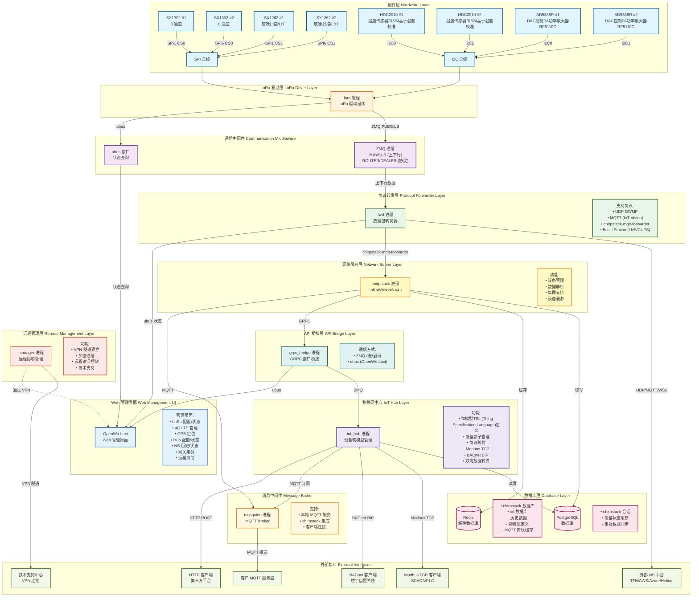
```mermaid
graph TB
    subgraph "硬件层 Hardware Layer"
        SX1302_1["SX1302 #1<br/>8 通道"]
        SX1302_2["SX1302 #2<br/>8 通道"]
        SX1262_1["SX1262 #1<br/>底噪扫描/LBT"]
        SX1262_2["SX1262 #2<br/>底噪扫描/LBT"]
        HDC2010_1["HDC2010 #1<br/>温度传感器/RSSI基于温度校准"]
        HDC2010_2["HDC2010 #2<br/>温度传感器/RSSI基于温度校准"]
        AD5338R_1["AD5338R #1<br/>DAC控制PA功率放大器RF5110G"]
        AD5338R_2["AD5338R #2<br/>DAC控制PA功率放大器RF5110G"]
        SPI["SPI 总线"]
        I2C["I2C 总线"]
    end

    subgraph "LoRa 驱动层 LoRa Driver Layer"
        LORA["lora 进程<br/>LoRa 驱动程序"]
    end

    subgraph "通信中间件 Communication Middleware"
        ZMQ_LORA["ZMQ 通信<br/>PUB/SUB (上下行)<br/>ROUTER/DEALER (协议)"]
        UBUS_LORA["ubus 接口<br/>状态查询"]
    end

    subgraph "协议转发层 Protocol Forwarder Layer"
        FWD["fwd 进程<br/>数据包转发器"]
        FWD_PROTOCOLS["支持协议:<br/>• UDP GWMP<br/>• MQTT (IoT Vision)<br/>• chirpstack-mqtt-forwarder<br/>• Basic Station (LNS/CUPS)"]
    end

    subgraph "网络服务层 Network Server Layer"
        CHIRPSTACK["chirpstack 进程<br/>LoRaWAN NS v4.x"]
        CHIRPSTACK_FEATURES["功能:<br/>• 设备管理<br/>• 数据解析<br/>• 集群支持<br/>• 设备漫游"]
    end

    subgraph "数据库层 Database Layer"
        POSTGRES[("PostgreSQL<br/>数据库")]
        POSTGRES_DBS["• chirpstack 数据库<br/>• iot 数据库<br/>- 历史数据<br/>- 物模型定义<br/>- MQTT 离线缓存"]
        REDIS[("Redis<br/>缓存数据库")]
        REDIS_USAGE["• chirpstack 会话<br/>• 设备状态缓存<br/>• 集群数据同步"]
    end

    subgraph "API 桥接层 API Bridge Layer"
        GRPC_BRIDGE["grpc_bridge 进程<br/>GRPC 接口桥接"]
        GRPC_INTERFACES["通信方式:<br/>• ZMQ (进程间)<br/>• ubus (OpenWrt Luci)"]
    end

    subgraph "物联网中心 IoT Hub Layer"
        IOT_HUB["iot_hub 进程<br/>设备物模型管理"]
        IOT_HUB_FEATURES["功能:<br/>• 物模型TSL (Thing Specification Language)定义<br/>• 设备影子管理<br/>• 协议映射<br/>- Modbus TCP<br/>- BACnet BIP<br/>• 双向数据转换"]
    end

    subgraph "消息中间件 Message Broker"
        MOSQUITTO["mosquitto 进程<br/>MQTT Broker"]
        MOSQUITTO_TOPICS["支持:<br/>• 本地 MQTT 服务<br/>• chirpstack 集成<br/>• 客户端连接"]
    end

    subgraph "远程管理层 Remote Management Layer"
        MANAGER["manager 进程<br/>远程协助管理"]
        MANAGER_FEATURES["功能:<br/>• VPN 隧道建立<br/>• 加密通信<br/>• 远程访问控制<br/>• 技术支持"]
    end

    subgraph "Web 管理界面 Web Management UI"
        LUCI["OpenWrt Luci<br/>Web 管理界面"]
        LUCI_PAGES["管理页面:<br/>• LoRa 配置/状态<br/>• 4G LTE 管理<br/>• GPS 定位<br/>• Hub 配置/状态<br/>• NS 历史/状态<br/>• 网关集群<br/>• 远程协助"]
    end

    subgraph "外部接口 External Interfaces"
        EXT_NS["外部 NS 平台<br/>TTN/AWS/Azure/Helium"]
        EXT_MQTT["客户 MQTT 服务器"]
        EXT_MODBUS["Modbus TCP 客户端<br/>SCADA/PLC"]
        EXT_BACNET["BACnet 客户端<br/>楼宇自控系统"]
        EXT_HTTP["HTTP 客户端<br/>第三方平台"]
        EXT_VPN["技术支持中心<br/>VPN 连接"]
    end

    %% 硬件连接
    SX1302_1 -->|SPI1 CS0| SPI
    SX1302_2 -->|SPI6 CS0| SPI
    SX1262_1 -->|SPI1 CS1| SPI
    SX1262_2 -->|SPI6 CS1| SPI
    HDC2010_1 -->|I2C0| I2C
    HDC2010_2 -->|I2C1| I2C
    AD5338R_1 -->|I2C0| I2C
    AD5338R_2 -->|I2C1| I2C
    SPI --> LORA
    I2C --> LORA

    %% LoRa 通信
    LORA -->|ZMQ PUB/SUB| ZMQ_LORA
    LORA -->|ubus| UBUS_LORA
    
    ZMQ_LORA -->|上下行数据| FWD


    %% 协议转发
    FWD -->|UDP/MQTT/WSS| EXT_NS
    FWD -->|chirpstack-mqtt-forwarder| CHIRPSTACK

    %% chirpstack 连接
    CHIRPSTACK -->|读写| POSTGRES
    CHIRPSTACK -->|缓存| REDIS
    CHIRPSTACK -->|GRPC| GRPC_BRIDGE
    CHIRPSTACK -->|MQTT| MOSQUITTO

    %% GRPC Bridge
    GRPC_BRIDGE -->|ZMQ| IOT_HUB
    GRPC_BRIDGE -->|ubus| LUCI

    %% IoT Hub
    IOT_HUB -->|读写| POSTGRES
    IOT_HUB -->|Modbus TCP| EXT_MODBUS
    IOT_HUB -->|BACnet BIP| EXT_BACNET
    IOT_HUB -->|MQTT 订阅| MOSQUITTO

    %% MQTT 推送
    MOSQUITTO -->|MQTT 推送| EXT_MQTT

    %% HTTP 推送
    IOT_HUB -->|HTTP POST| EXT_HTTP

    %% 远程管理
    MANAGER -->|VPN 隧道| EXT_VPN
    MANAGER -.->|通过 VPN| LUCI

    %% Web 管理
    UBUS_LORA -->|状态查询| LUCI
    FWD -->|ubus 状态| LUCI

    %% 样式定义
    classDef hardware fill:#e1f5ff,stroke:#01579b,stroke-width:2px
    classDef driver fill:#fff3e0,stroke:#e65100,stroke-width:2px
    classDef middleware fill:#f3e5f5,stroke:#4a148c,stroke-width:2px
    classDef protocol fill:#e8f5e9,stroke:#1b5e20,stroke-width:2px
    classDef server fill:#fff9c4,stroke:#f57f17,stroke-width:2px
    classDef database fill:#fce4ec,stroke:#880e4f,stroke-width:2px
    classDef api fill:#e0f2f1,stroke:#004d40,stroke-width:2px
    classDef hub fill:#ede7f6,stroke:#311b92,stroke-width:2px
    classDef broker fill:#fff8e1,stroke:#f57c00,stroke-width:2px
    classDef remote fill:#fbe9e7,stroke:#bf360c,stroke-width:2px
    classDef web fill:#e3f2fd,stroke:#0d47a1,stroke-width:2px
    classDef external fill:#f1f8e9,stroke:#33691e,stroke-width:2px

    class SX1302_1,SX1302_2,SX1262_1,SX1262_2,HDC2010_1,HDC2010_2,AD5338R_1,AD5338R_2,SPI,I2C hardware
    class LORA driver
    class ZMQ_LORA,UBUS_LORA middleware
    class FWD,FWD_PROTOCOLS protocol
    class CHIRPSTACK,CHIRPSTACK_FEATURES server
    class POSTGRES,POSTGRES_DBS,REDIS,REDIS_USAGE database
    class GRPC_BRIDGE,GRPC_INTERFACES api
    class IOT_HUB,IOT_HUB_FEATURES hub
    class MOSQUITTO,MOSQUITTO_TOPICS broker
    class MANAGER,MANAGER_FEATURES remote
    class LUCI,LUCI_PAGES web
    class EXT_NS,EXT_MQTT,EXT_MODBUS,EXT_BACNET,EXT_HTTP,EXT_VPN external
```

### 系统架构说明

#### 1. 硬件层（Hardware Layer）

**双 SX1302 射频架构**：
- 每个 SX1302 芯片通过独立的 SPI （SPI1/SPI6）进行通信
- 每个 SX1302 配备一个 SX1262 辅助芯片，通过 SPI片选(CS0/CS1)通信
- 每个 SX1302 配备一个 HDC2010温度传感器芯片，LoRa的信号RSSI基于实时温度校准，通过 I2C 通信
- 每个 SX1302 配备一个 AD5338R DAC芯片，控制PA功率芯片RF5110G，功率最高27dbm,通过 I2C 通信
- SX1262 用于底噪扫描（全频段）和 LBT 功能（EU868、AS923、KR920 频段）
- 硬件支持 16 个上行通道和 2 个下行通道

#### 2. LoRa 驱动层（LoRa Driver Layer）

**lora 进程功能**：
- 直接操作 SX1302 和 SX1262 硬件，处理 LoRa 物理层通信
- 通过 SPI 总线读写 SX1302/SX1262 寄存器，配置射频参数,进行底噪扫描和 LBT 检测
- 通过 I2C 总线读写 HDC2010、AD5338R
- 提供两种通信接口：
  - **ubus 接口**：供 OpenWrt Luci 页面查询 LoRa 状态（RSSI、SNR、数据包统计）
  - **ZMQ 接口**：高性能数据通道

#### 3. 协议转发层（Protocol Forwarder Layer）

**fwd 进程功能**：
- 通过 ZMQ `PUB/SUB` 订阅 lora 进程的上行数据，发布下行数据
- 实现多种 LoRa 协议转换和数据包转发：
  - **UDP GWMP**：Semtech 标准协议，连接 TTN、lorawan-stack 等外部 NS
  - **MQTT**：连接 IoT Vision 等平台
  - **chirpstack-mqtt-forwarder**：连接外部或内置 chirpstack NS
  - **Basic Station**：
    - LNS 模式：通过 WebSocket (WSS) 连接 chirpstack、Helium、Microsoft Azure
    - CUPS 模式：通过 HTTPS 连接 AWS IoT Core，自动获取 LNS 配置和证书

#### 4. 网络服务层（Network Server Layer）

**chirpstack 进程功能**：
- 完整的 LoRaWAN 网络服务器（当前版本chirpstack-V4.16.0），内置在网关中
- 通过 ZMQ `ROUTER/DEALER` 与 fwd 进程通信，实现 chirpstack-mqtt-forwarder 协议
- 核心功能：
  - 设备入网管理（OTAA/ABP）
  - LoRaWAN 帧解析和验证
  - 设备会话管理和数据解密
  - 多网关集群支持和设备漫游
  - 自定义 JavaScript 解码器

#### 5. 数据库层（Database Layer）

**PostgreSQL 数据库**：
- **chirpstack 数据库**：设备信息、应用配置、网关注册、chirpstack 会话数据
- **iot 数据库**：
  - 设备历史表：解析后的设备数据，支持时间范围查询和 Excel 导出
  - 物模型表：物模型TSL (Thing Specification Language) 定义，属性、事件、服务
  - 设备影子表：设备最新状态缓存
  - MQTT 缓存表：MQTT 离线时缓存数据，网络恢复后续传

**Redis 缓存**：
- 设备状态缓存：最后上线时间、电池电量、信号强度


---
## 产品竞争力总结

基于以上功能分析，IMX93-GW8016 网关在以下方面具有显著竞争优势：

### 1. 技术领先性
- **双 SX1302 架构**：16 通道容量，是业界 8 通道网关的两倍
- **NXP i.MX93 处理器 + NPU**：支持边缘 AI 应用
- **全双工支持**：CN470 频段全双工模式，接收灵敏度达 -141 dBm
- **半双工支持**：EU868/US915/AS923 频段半双工模式，接收灵敏度达 -142 dBm

### 2. 易用性
- **零代码配置**：所有功能通过 Web 界面配置
- **批量设备管理**：Excel 导入/导出，支持大规模部署
- **一键协议切换**：支持 10+ 种 LoRa 协议
- **物模型（TSL）**：统一数据模型，简化系统集成

### 3. 开放性与兼容性
- **多协议支持**：UDP GWMP、MQTT、Basic Station、chirpstack-mqtt-forwarder
- **多云平台对接**：TTN、AWS、Azure、Helium、Alibaba Cloud、私有化 chirpstack
- **多工业协议**：Modbus TCP、BACnet BIP、HTTP、MQTT
- **Python 3.11 支持**：用户可编写自定义脚本

### 4. 运维能力
- **全方位监控**：4G 状态、GPS 定位、LoRa 状态、设备状态、系统性能
- **历史数据追溯**：完整记录所有 LoRaWAN 帧，支持 Excel 导出和离线分析
- **频谱扫描**：LBT 和底噪扫描，优化信道配置
- **集群管理**：支持多网关集群、设备漫游、会话同步、高可用部署
- **离线数据缓存**：网络中断时自动缓存数据，恢复后自动续传，数据零丢失
- **完整数据追溯**：支持按时间段和最新条数两种方式查询历史数据
- **FUOTA 支持**：远程固件升级，无需现场操作，支持批量升级
- **安全远程协助**：提供vpn授权码，基于 VPN 的远程技术支持，无需第三方工具，让网关能够被远程访问

### 5. 服务能力
- **完整文档体系**：中英文双语文档、API 文档、Python 示例代码
- **开源社区支持**：基于 OpenWrt 系统，兼容社区软件包和扩展
- **技术支持响应**：提供专业技术支持，快速响应客户需求
- **定制化开发**：提供定制固件服务
- **整套中性界面**：网关页面提供中性界面

### 6. 成本优势
- **内置 NS**：无需购买云平台服务，降低运营成本
- **边缘计算**：数据本地处理，减少云端流量费用
- **长寿命设计**：工业级硬件 + 看门狗 + 掉电告警，减少维护成本
- **一体化方案**：集成多种协议和功能，减少额外硬件投资

### 7. 与同行产品的技术对比

IMX93-GW8016 相比市场上其他 LoRaWAN 网关具有以下显著优势：

| 功能特性 | IMX93-GW8016 | 一般竞品网关 |
|---------|-------------|------------|
| **LoRa 通道数** | 16 上行 / 2 下行 | 8 上行 / 1 下行 |
| **内置 NS** | ✅ ChirpStack V4.16.0 全功能（定期更新到最新版） | ⚠️ 无或功能受限的旧版本 |
| **LBT 支持** | ✅ EU868/AS923/KR920 硬件级支持 | ❌ 大多数不支持 |
| **历史数据查询** | ✅ HTTP按时间段/条数查询，也可以按Excel格式导出 | ❌ 大多数不支持 |
| **离线数据缓存** | ✅ 网络恢复后自动续传 | ❌ 数据丢失 |
| **FUOTA 做终端设备固件升级** | ✅ 支持 LDPC 算法，20-30% 丢包容忍 | ❌ 大多数不支持 |
| **Modbus TCP** | ✅ 支持 | ❌ 不支持 |
| **BACnet BIP** | ✅ 支持 | ❌ 不支持 |
| **HTTP查询设备历史数据** | ✅ 支持 | ❌ 不支持 |
| **掉电数据安全保护** | ✅ 断电后有超级电容供电保存数据，防止eMMC数据损坏 | ❌ 不支持 |
| **掉电告警** | ✅ 断电后有超级电容供电几秒内上报掉电事件 | ❌ 不支持 |
| **IoT Hub 物模型** | ✅ 灵活定义 TSL 物模型，提供设备所有属性的JSON字段 | ❌ 不支持或固定模型 |
| **集群管理** | ✅ 去中心化边缘集群，设备漫游 | ⚠️ 依赖中心化云端 |
| **远程运维** | ✅ 加密 VPN，可以无人值守访问网关 | ⚠️ 依赖 TeamViewer 、向日葵等远程工具 |
| **Python 脚本** | ✅ Python 3.11 完整支持 | ❌ 不支持 |
| **Node-RED** | ✅ 集成 Node-RED | ❌ 不支持 |
| **ChirpStack REST API** | ✅ 完整 API 接口 | ⚠️ 功能受限 |
| **数据格式** | ✅ Base64 + Hex（rawData 字段） | ⚠️ 仅 Base64 |
| **处理器** | NXP i.MX93 三核 + NPU | 单核或低端处理器 |
| **内存/存储** | 2GB RAM / 32GB eMMC | 512MB RAM / 8GB Flash |

**核心竞争优势总结**：

1. **全栈 ChirpStack**：提供完整的 ChirpStack V4.16.0 功能，而非阉割版或旧版本
2. **LBT 硬件支持**：满足严格的监管要求，提升频谱利用效率
3. **数据零丢失**：离线缓存数据库最多100万条 + 自动续传机制
4. **远程运维**：FUOTA远程升级终端设备 + VPN 远程访问网关页面，降低运维成本
5. **工业协议集成**：Modbus TCP + BACnet BIP，无缝对接现有系统
6. **边缘计算**：去中心化集群，设备可以多网关间漫游，无需依赖云端
7. **开发友好**：Python 脚本 + Node-RED + REST API
7. **掉电保护**：有超级电容，掉电会告警，也会保存数据库数据，防止意外掉电引起eMMC存储设备损坏

## 烧录固件

本节介绍网关固件的烧录方法，包括工厂烧录方式和用户升级方式。

> **提示**：用户日常使用建议通过网关页面烧录固件，方便快捷。工厂烧录方式主要用于生产和维修场景。

---

### USB TTL串口线1.8V电平(推荐使用FTDI 232RL 1.8V)接网关调试串口

接调试串口只是为了查询烧录进程，也可以不接串口，串口只需要接GND、RX、TX三根线，串口TTL线序板上有丝印

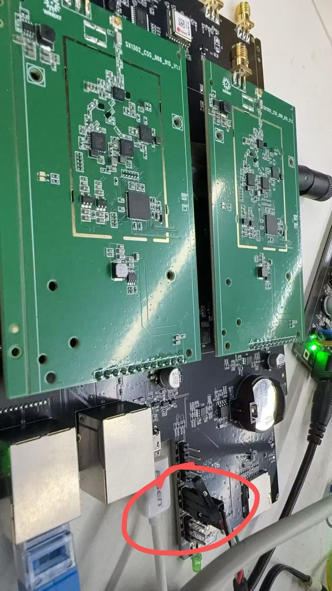

> **注意**：网关CPU的IO是1.8V,所以需要串口线是1.8V，切勿使用3.3/5.0V的串口线，高电平会烧坏CPU的


### USB烧录固件

**适用场景**：工厂批量烧录、设备维修恢复，会擦除原来网关里的所有数据

**所需工具**：
- Micro USB 数据线
- USB烧录的网关固件包
- windows 10/11系统电脑

**操作步骤**：
1. 获得USB烧录专用的网关固件包(与使用网关界面烧录的固件不一样，有区别)，最新版本
2. 将网关通过Micro USB连接到电脑
3. 网关进入烧录模式（两pin跳冒接J11，重新上电或者短按一次system reset按键）

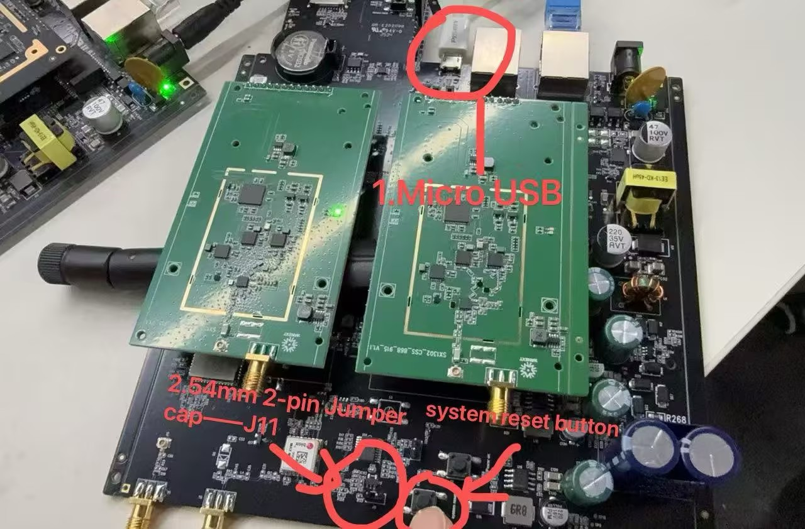


4. 打开USB烧录专用的网关固件包，选择双击flash.bat

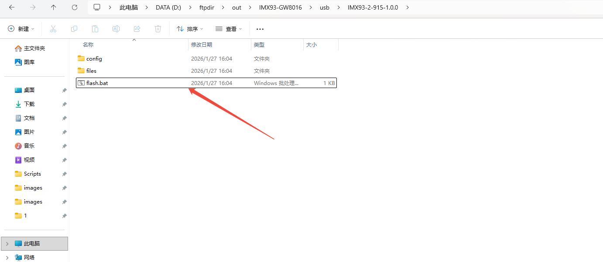

5. 网关开始进入烧录(如果没有进度，请查看Micro USB线支不支持数据传输，保证usb线接到windows10/11电脑)，等待完成（约2-5分钟）

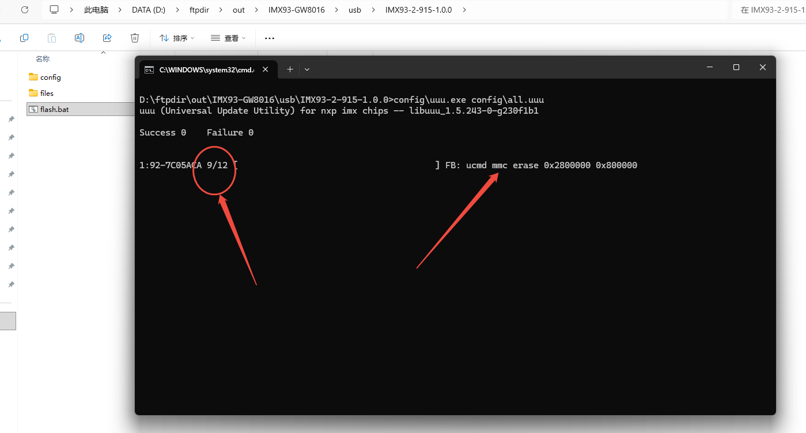

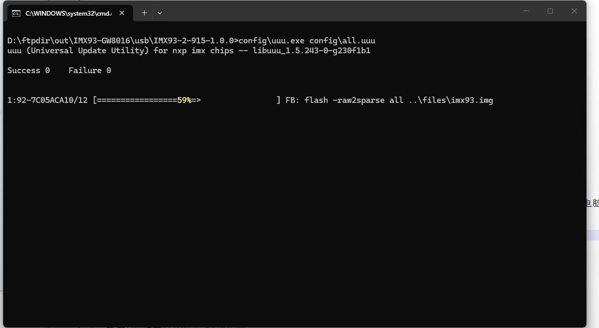


6. 烧录完成后，会有100%进度条，在命令窗口按回车键，烧录窗口会自动关闭，烧录完成。

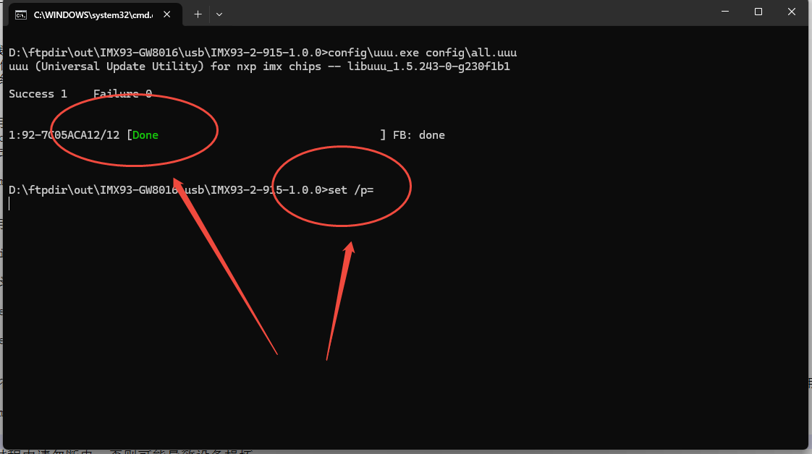

此时需要把J11跳冒拿开，或者断开，按短按一次system reset按键，网关会使用刚刚烧录的固件会重新启动(10秒后系统灯会闪绿色)


> **注意**：由于网关有外置硬件看门狗，需要尽量及时操作，如果烧录失败(超时烧录，开门狗复位芯片)或者意外断电，也可以反复上面的烧录步骤，还是能继续完成烧录

---

### TF烧录固件

**适用场景**：工厂批量烧录、无需PC的快速烧录

**所需工具**：
- TF卡（Micro SD卡，至少8GB以上，Class 10）
- 网关固件文件（已制作成TF卡启动镜像）
- 需要Win32DiskImager工具

**操作步骤**：

1. 使用工具将引导烧录固件镜像写入TF卡（Windows使用Win32DiskImager工具）

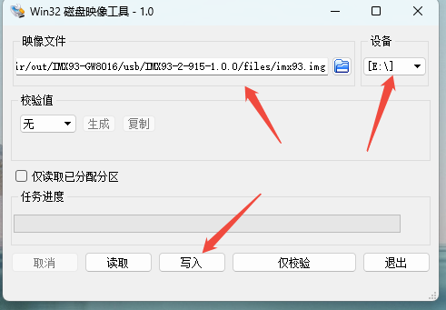

2. 用读卡器将TF卡插入电脑，会有个BOOT盘，需要将USB烧录的固件imx93.img拷贝到盘里

电脑查看到BOOT盘

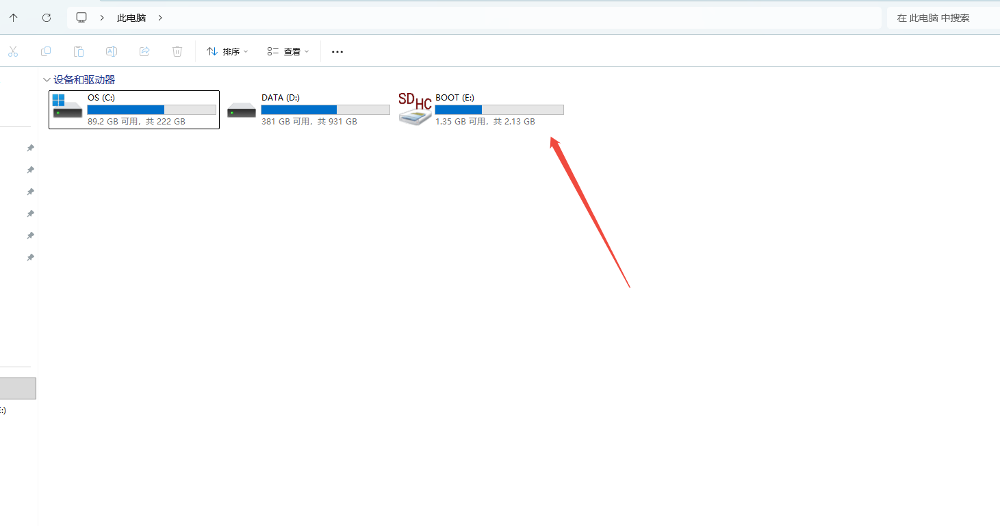

将烧录固件的最新版本，USB烧录的镜像imx93.img拷贝放到盘里,不要删除目录里的其他文件：Image、oftree

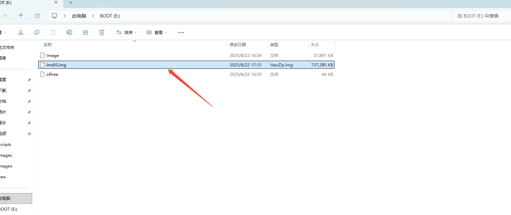

3. 将网关断电，使用2个2.54mm的两pin跳冒短接J11和旁边另一座子(如照片所示)，配置网关从TF卡启动，从而自动烧录固件到eMMC,并且把TF卡插入网关的TF卡插槽

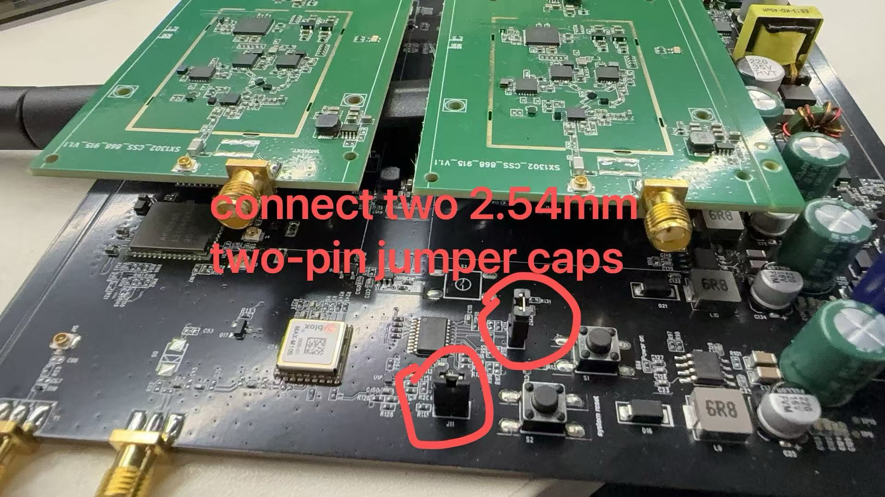

4. 网关上电，自动从TF卡启动并烧录固件
5. 启动阶段网关会绿灯闪烁，启动一分钟后等绿灯常亮，会开始自动烧录固件，大约2-3分钟完成，系统灯LED指示灯会一直反复闪烁提示：代表烧录完成
6. 断电，取出TF卡，取走使用2个跳冒(也就第3步接了两个跳冒)，再上电，网关从eMMC正常启动

> **提示**：
> - TF卡烧录方式无需连接电脑，适合现场快速恢复固件
> - 如果TF卡已插入但网关未自动从TF卡启动，请检查TF卡是否写入正确的启动镜像
> - 烧录过程可能需要2-4分钟，请耐心等待


---

### 网关页面烧录固件

**适用场景**：用户固件升级、远程固件更新

**前提条件**：
- 网关已正常运行
- 已登录网关管理页面
- 已下载最新固件文件（bin 格式）

**操作步骤**：
1. 登录网关管理页面：`http://192.168.60.1` 或通过WAN口IP访问
2. 进入 **系统** > **备份/升级** 页面

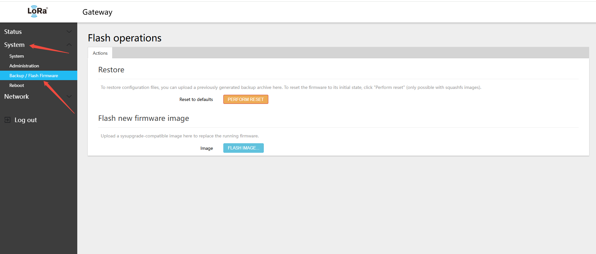

3. 在"升级固件"部分，点击"选择文件"按钮
4. 选择下载的固件文件

选择页面烧录的固件，格式bin文件
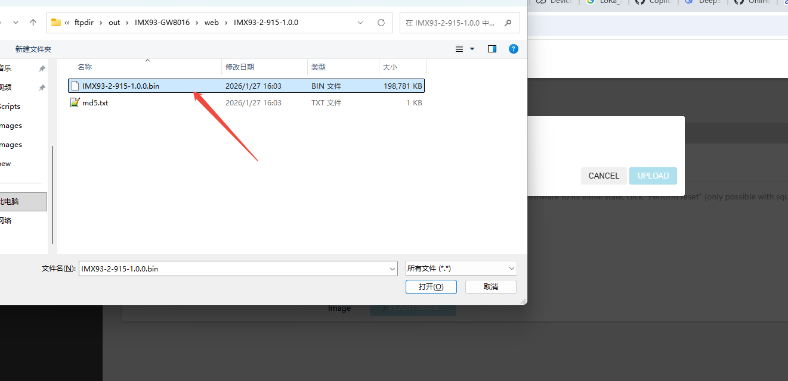

5. 点击"上传"按钮，等待上传完成

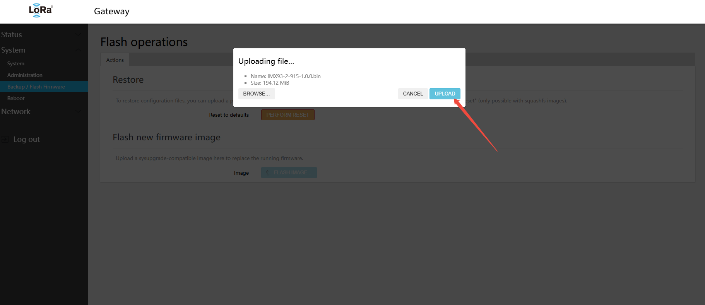


6. 上传固件完成后，会显示当前该固件的校验信息，请查看MD5值和固件的MD5一致不一致，不一致则重新上面步骤或者连线技术支持，
如果MD5校验一致，确认无误后点击"继续"

如果软件版本改动比较大，需要把去掉“保留配置的选项”的勾选
需要对比MD5文件内容


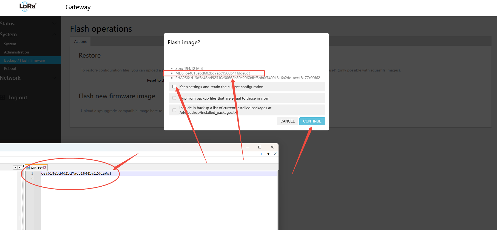

7. 等待升级完成（约3-5分钟），网关自动重启

> **提示**：
> - 升级过程，系统灯会闪烁
> - 烧录过程可能需要2-5分钟，请耐心等待
> - 如果页面不会自动跳转，请在5分钟后，手动打开网关的页面地址

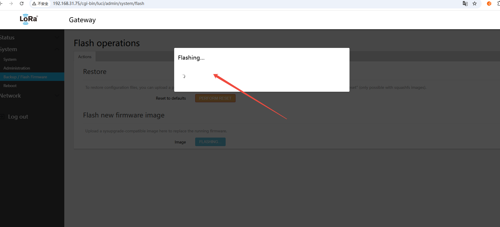


8. 重启后，检查网关版本是否已更新

> **警告**：
> - 升级过程中请勿断电
> - 确保固件文件与硬件版本匹配（470/868/915）


**升级后验证**：
1. 重新登录网关页面
2. 进入 **状态** > **概览** 页面
3. 查看固件版本是否为最新版本


**常见问题排查**：

| 问题 | 可能原因 | 解决方法 |
|------|---------|---------|
| 上传失败 | 固件文件损坏 | 重新下载固件文件 |
| 校验失败 | 固件与硬件不匹配 | 确认硬件版本（470/868/915） |
| 升级中断 | 网络连接断开 | 重新登录并重试升级 |
| 升级后无法启动 | 固件烧录异常 | 使用USB或TF卡方式恢复固件 |


---


## 网关页面操作指引

本章节详细介绍网关的Web管理界面操作方法，包括登录方式、网络配置、LoRa参数设置、外部平台连接、内置服务器使用等内容。

---

### 登录网关页面

网关提供多种登录方式，用户可根据实际网络环境选择合适的连接方法。

> **注意事项**：
> - 强烈建议使用PC电脑端(电脑屏幕大一点)的浏览器，因为网关页面(包含8080端口的chirpstack、8090端口的ChirpStack REST API、1880端口的Node-RED)显示的数据很多，手机的屏幕会显示不全
> - 使用最新的浏览器，因为网关页面使用比较新的HTML5框架，很多插件在旧的浏览器，显示不全，或者格式错乱，比如:IE 浏览器就会显示错乱，但可以用微软windows自带的Edge浏览器
> - 网关页面显示效果，已经验证过的浏览器：谷歌浏览器Google Chrome、火狐浏览器Firefox、苹果浏览器Safari、window 11自带的Edge浏览器


#### 使用lan登录网关页面


这是最常用的初始配置方式，适合本地快速接入。

**操作步骤：**
1. 使用网线将电脑连接到网关的 **LAN 口**（百兆网口）
2. 电脑会自动从网关获取 192.168.60.x 网段的 IP 地址（网关内置 DHCP 服务器）
3. PC电脑下载其中一款最新的浏览器：谷歌浏览器Google Chrome、火狐浏览器Firefox、苹果浏览器Safari、window 11自带的Edge浏览器，网关页面使用比较新的HTML5框架
4. 打开浏览器，访问网关管理地址：`http://192.168.60.1`
5. 如已配置 HTTPS，可使用：`https://192.168.60.1`

**登录信息：**
- 用户名：`root`
- 默认密码：`lora88888888`

---

#### 使用wifi登录网关页面

网关开机默认会创建5.8G的 WiFi AP热点(如果配置WiFi去连路由器(STA客户端)，则没有热点(AP模式)，GW8000的WiFi只能AP模式(开热点)和STA模式(连WiFi路由器)二选一，便于无线接入配置。

**操作步骤：**
1. 网关上电后，等待约 1-2 分钟启动完成
2. 在电脑或手机的 WiFi 列表中查找以下格式的热点：
   - 热点名称：`WiFi-10_XXXXXX`（XXXXXX 为网关 ID 的后 6 位数字）
   - 示例：`WiFi-10_A1B2C3`
3. 强烈推荐使用带有WiFi的PC电脑，连接该 WiFi 热点（默认密码： `wifi88888888` ）
4. PC电脑下载其中一款最新的浏览器：谷歌浏览器Google Chrome、火狐浏览器Firefox、苹果浏览器Safari、window 11自带的Edge浏览器，网关页面使用比较新的HTML5框架
5. 连接成功后，浏览器访问：`http://192.168.60.1`

**登录信息：**
- 用户名：`root`
- 默认密码：`lora88888888`

> **提示**：网关 ID 可在网关外壳标签上找到。

---

#### 使用wan登录网关页面

当网关已连接到外部网络时，可通过 WAN 口 IP 地址远程访问。

**前提条件：**
- 网关 WAN 口已连接到路由器或交换机
- 已知网关获取的 WAN IP 地址（可通过路由器 DHCP 客户端列表查询，或通过WiFi/LAN 口登录后查看）

**操作步骤：**
1. 确认网关 WAN IP 地址（例如：192.168.31.205）
2. 确保电脑与网关在同一网络或可路由访问
3. PC电脑下载其中一款最新的浏览器：谷歌浏览器Google Chrome、火狐浏览器Firefox、苹果浏览器Safari、window 11自带的Edge浏览器，网关页面使用比较新的HTML5框架
4. 浏览器访问：`http://<WAN_IP>`
   - 示例：`http://192.168.31.205`
   
   
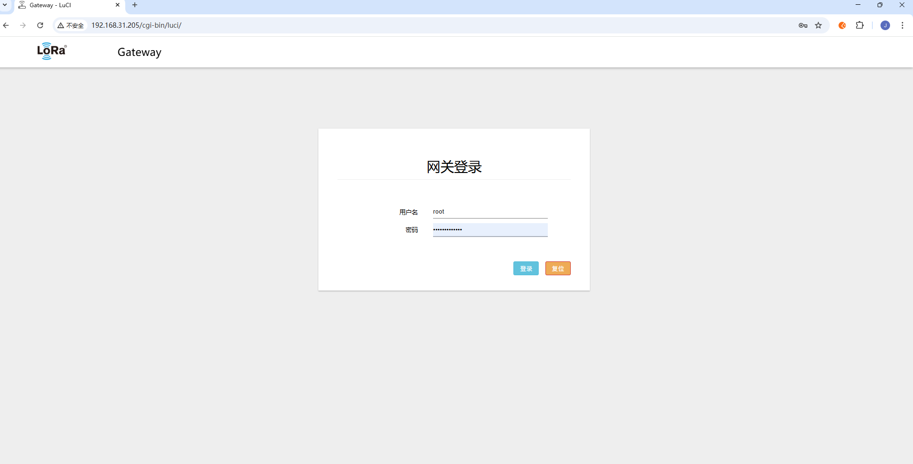

---

5. 输入登录凭据

**登录信息：**
- 用户名：`root`
- 默认密码：`lora88888888`

登录成功以后进入首页

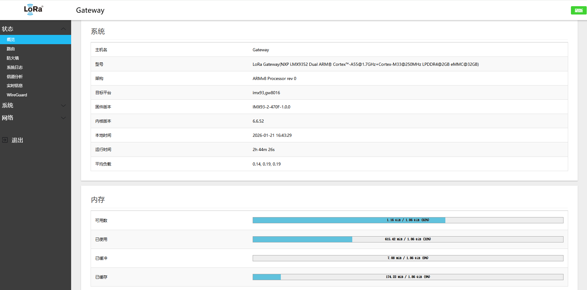


> **安全提示**：出厂默认使用http协议，如果客户改启用 HTTPS 访问，那么链接需要使用https。

---

### 网关上网方式

#### 使用wan口dhcp方式连接

默认出厂，网关 WAN 口配置为 DHCP自动获取IP地址，支持IPv4和IPv6.

#### 配置wan口为静态ip

默认情况下，网关 WAN 口配置为 DHCP 自动获取 IP 地址。在某些场景下（如固定 IP 部署、端口映射等），需要配置静态 IP 地址。

**操作步骤：**

##### 1. 进入网络接口配置页面
1. 登录网关 Web 管理界面
2. 点击顶部菜单 **Network（网络）** → **Interfaces（接口）**
3. 在接口列表中找到 **WAN** 接口

---

##### 2. 编辑 WAN 接口
1. 点击 WAN 接口右侧的 **Edit（编辑）** 按钮
2. 进入 WAN 接口配置页面

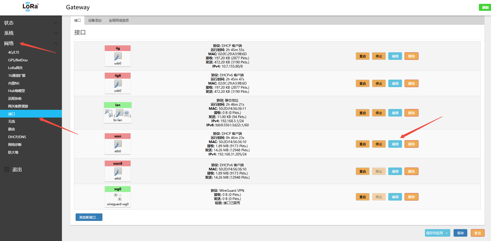

---

##### 3. 修改协议类型
1. 在 **Protocol（协议）** 下拉菜单中，将 **DHCP client** 更改为 **Static address（静态地址）**
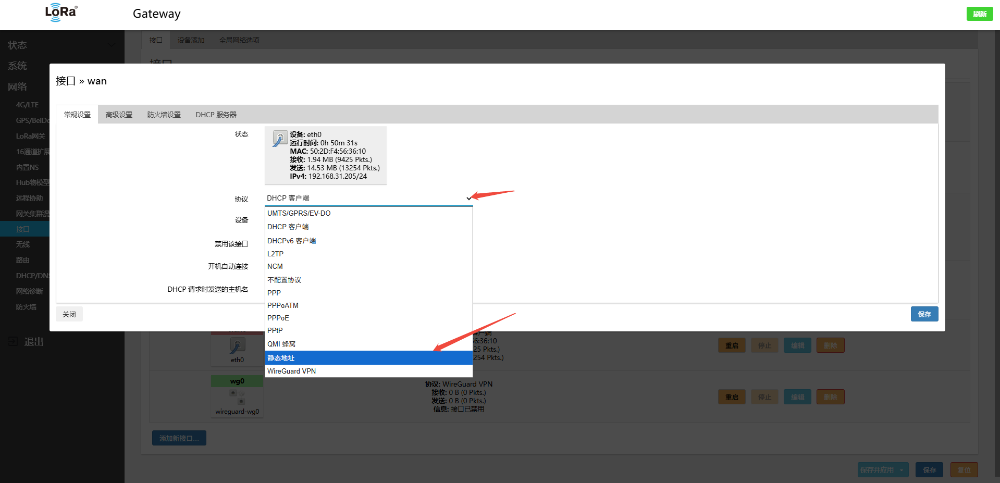

2. 切换协议

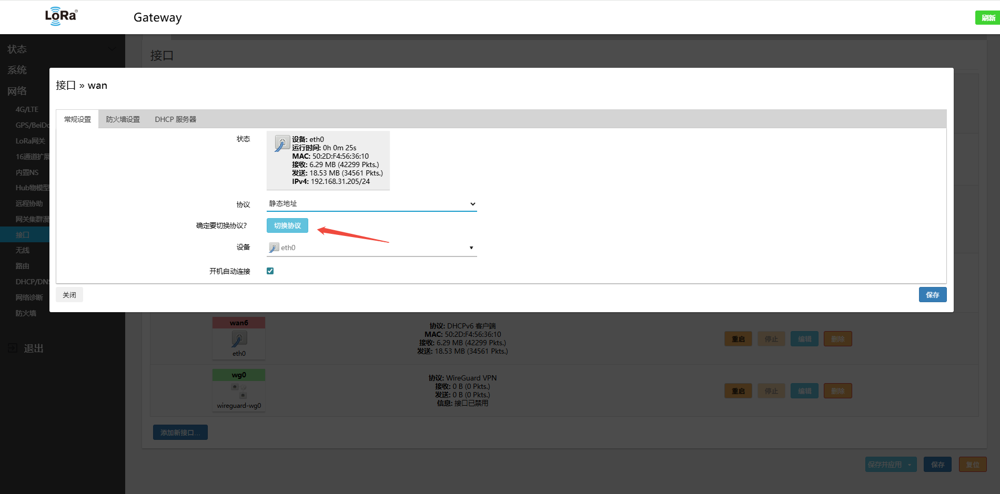

---

##### 4. 配置静态 IP 参数
根据网络环境填写以下参数：

- **IPv4 address（IPv4 地址）**：网关的固定 IP 地址（例如：192.168.31.125、192.168.31.205）
- **IPv4 netmask（子网掩码）**：通常为 255.255.255.0
- **IPv4 gateway（网关地址）**：上级路由器的 IP 地址（例如：192.168.31.1）
- **Use custom DNS servers（自定义 DNS 服务器）**：建议配置
  - DNS 服务器 1：8.8.8.8（Google DNS）
  - DNS 服务器 2：114.114.114.114（国内 DNS）
  
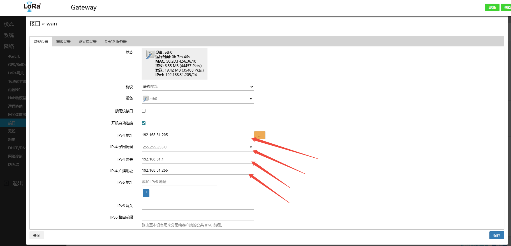

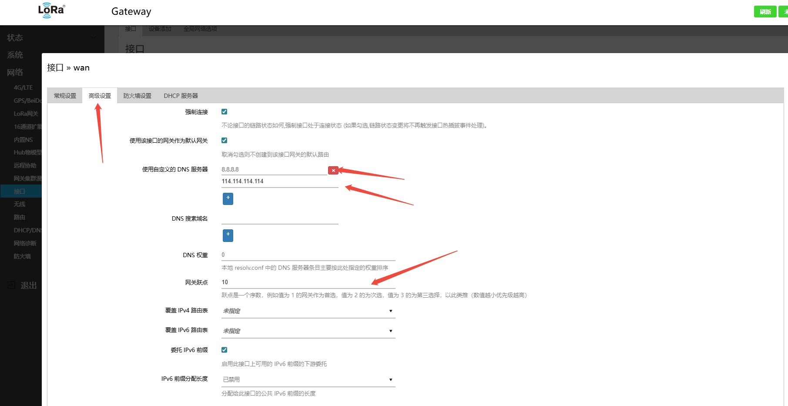

---

##### 5. 保存并应用配置
1. 点击页面底部的 **Save（保存）** 按钮


2. 返回接口列表页面后，点击 **Save & Apply（保存并应用）** 按钮

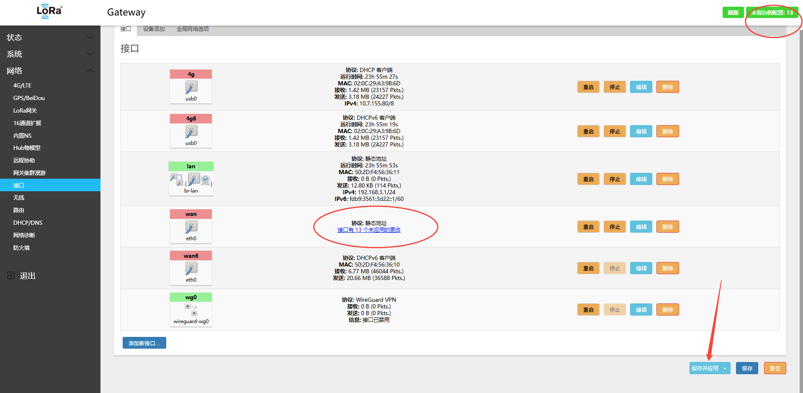

选择强制应用

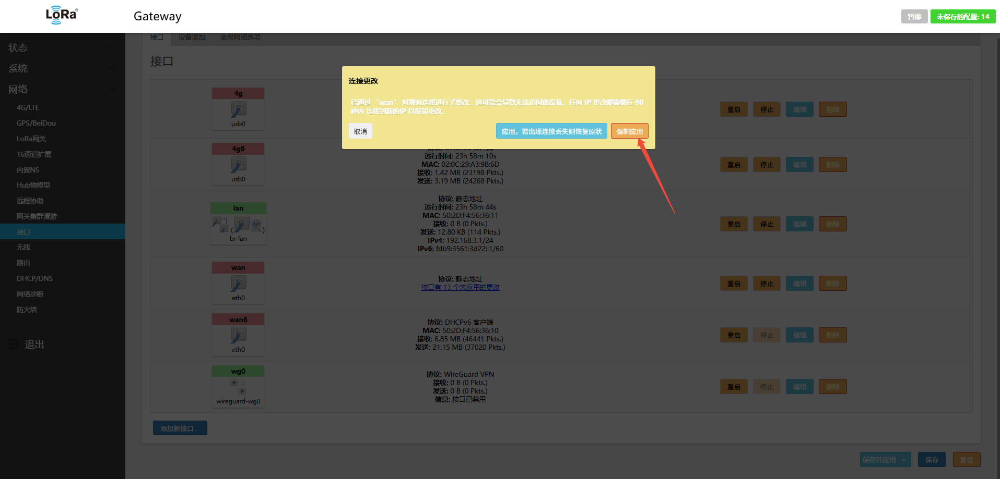

3. 等待配置生效（约 10-60 秒）

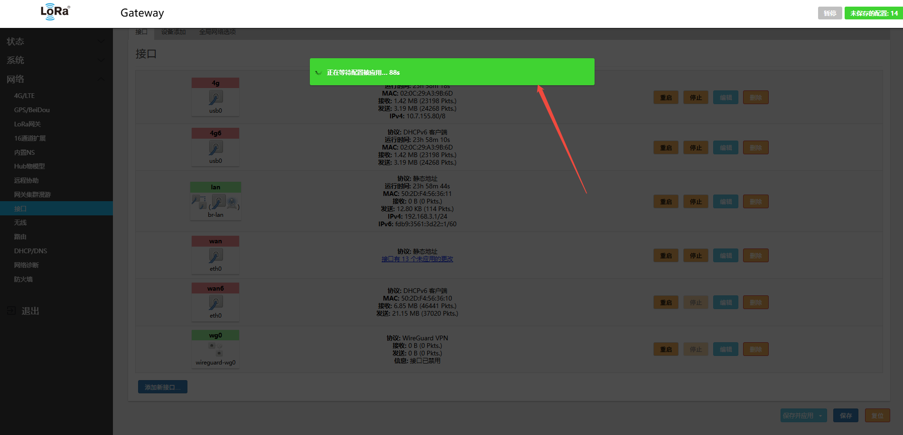

WAN口生效成功

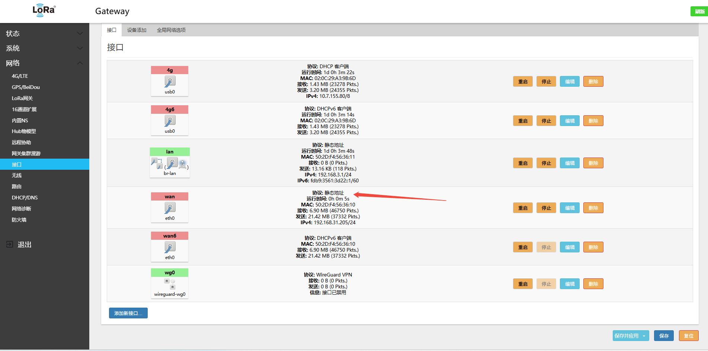

---

##### 6. 验证配置
1. 使用新的静态 IP 地址访问网关（例如：`http://192.168.31.205` `http://192.168.31.125`）

> **注意事项**：
> - 配置静态 IP 前，请确认 IP 地址未被其他设备占用
> - 确保 IP 地址、子网掩码、网关地址与网络环境匹配
> - 如配置错误导致无法访问，可通过 LAN 口或 WiFi 热点重新登录修改

---

#### 使用4g-lte方式连接

在使用带有4G LTE版本，分为国内4G模块全网通、国外欧洲4G模块、全球通4G模块
如果sim卡本身没有特殊设置，只需要断电插上4G Sim大卡(网关SIM卡插槽不支持热插拔，需要断电1分钟插卡，网关内部有超级电容，等放完电再上电启动)，上电后自动拨号连网
查看网关页面状态

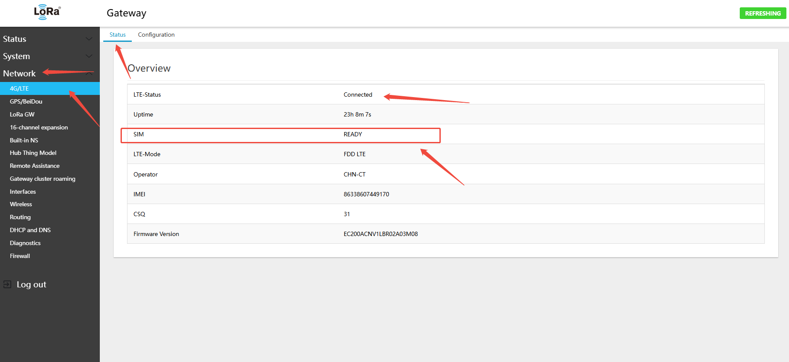

如果需要配置密码，则在页面设置

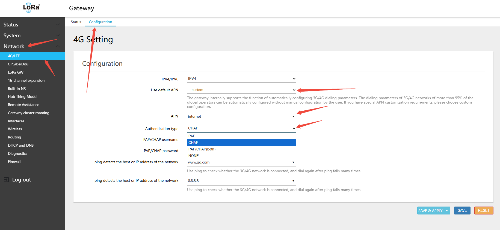

---

#### 使用2_4g-wifi方式连接路由器

- 不建议使用WiFi方式联网：
- 1.GW8000的WiFi模块只能AP模式(开热点)和STA模式(连WiFi路由器)二选一；
- 2.如果配置WiFi去连接路由器，就没有WiFi热点了，这个与GW1000不一样，因为GW1000的WiFi支持AP和STA共存
- 3.无线连接路由器相对来说，容易断线
	
---
	
如果安装场景只有2.4G 的WiFi接入，按照下面方式去操作

进入网页的**Network（网络）** → **Wireless（无线）**，点击 **SCAN（扫描）** 

> **注意事项**：
> - 需要记住需要连接的2.4G wifi信道
> - 需要记住需要连接的wifi认证加密方式：
> - 扫描列表里会包含2.4G和5.8G的WiFi热点，因为网关支持2.4G和5.8G，但是只能工作在一个信道下

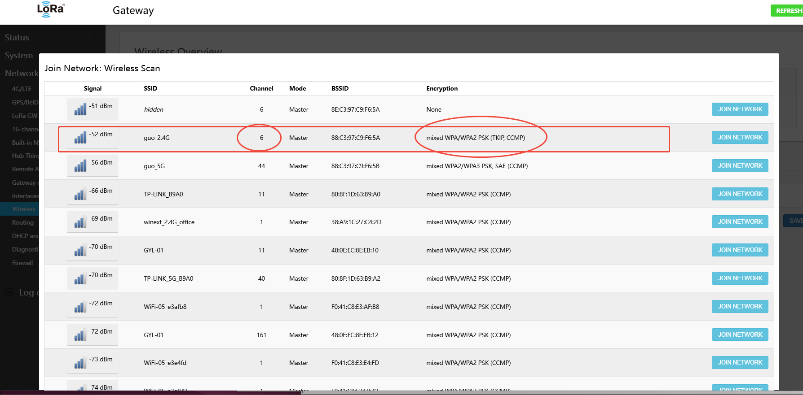


在对应的WiFi热点栏点击“加入网络”,输入连接WiFi热点的密码，然后点击保存提交


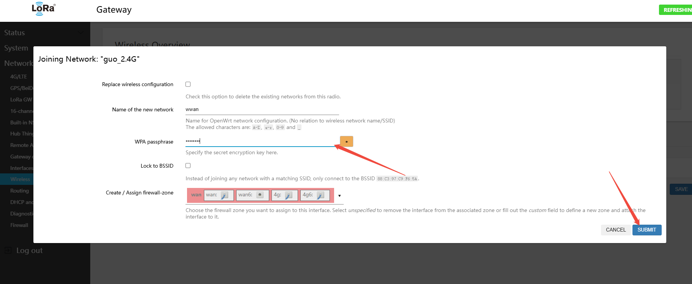


页面再选择 频段信息

- 模式：Legacy
- BAND:2.4GHz
- channel：(2.4G 的wifi信道范围：1到13)就选刚刚扫描时候的信道，示例里是： 6


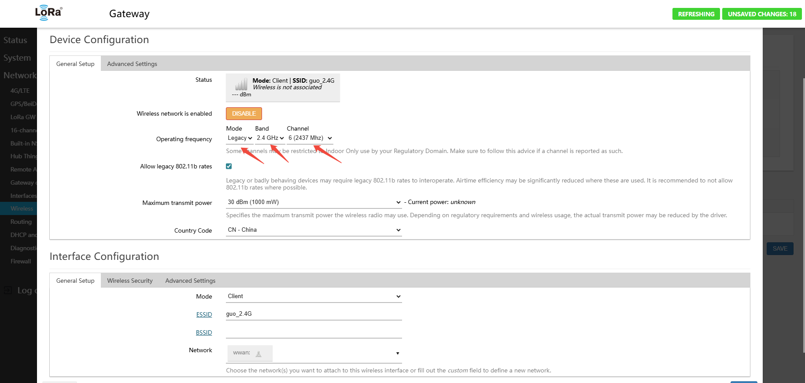

页面再选择 WiFi认证加密方式(有WPA2-PSK、WPA3-SAE、WPA2-PSK/WPA3-SAE 混合模式、WPA-PSK/WPA2-SAE 混合模式、WPA-PSK)

- Encryption：选择刚刚扫描时候的认证加密方式(WPA-PSK/WPA2-SAE 混合模式)

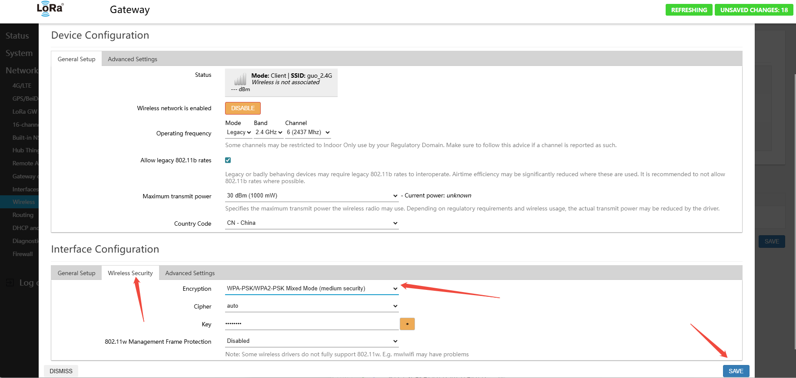


再次确认一下，信道、加密方式都填对后，点击保存按钮


> **注意事项**：
> - WiFi只能AP模式和STA模式二选一
> - AP模式就是网关起一个WiFi热点，供电脑、手机去连接
> - STA模式就是网关使用WiFi去连接路由器的WiFi，使用WiFi连网


此时STA连接路由器的接口已经配置好，需要把AP Master的接口禁用，点击 禁用 按钮

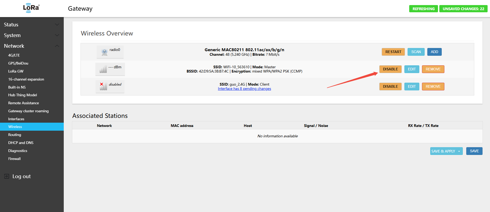

连接成功后，AP热点关闭，STA连接WiFi路由器的IP地址、信号，完成

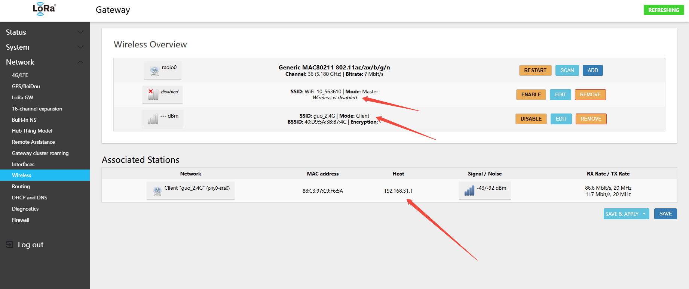

可以在 菜单 **Network（网络）** → **Interfaces（接口）**

查看WiFI的IP地址和WiFi的MAC地址，需要记住IP，可以在路由器将网关的WiFI MAC和IP绑定，以后可以通过这个IP地址进入网关页面


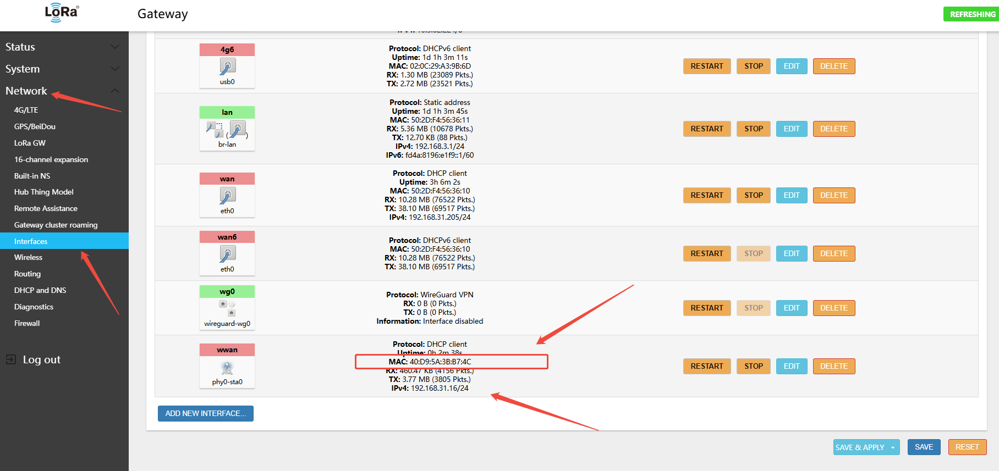

---

#### 使用5_8g-wifi方式连接路由器

- 不建议使用WiFi方式联网：
- 1.GW8000的WiFi模块只能AP模式(开热点)和STA模式(连WiFi路由器)二选一；
- 2.如果配置WiFi去连接路由器，就没有WiFi热点了，这个与GW1000不一样，因为GW1000的WiFi支持AP和STA共存
- 3.无线连接路由器相对来说，容易断线
					
如果安装场景只有5.8G 的WiFi接入，按照下面方式去操作

进入网页的**Network（网络）** → **Wireless（无线）**，点击 **SCAN（扫描）** 


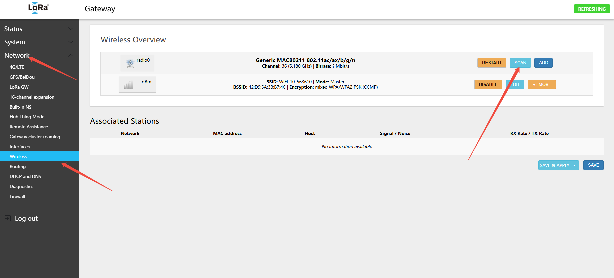

> **注意事项**：
> - 需要记住需要连接的5.8G wifi信道
> - 需要记住需要连接的wifi认证加密方式：
> - 扫描列表里会包含2.4G和5.8G的WiFi热点，因为网关支持2.4G和5.8G，但是只能工作在一个信道下

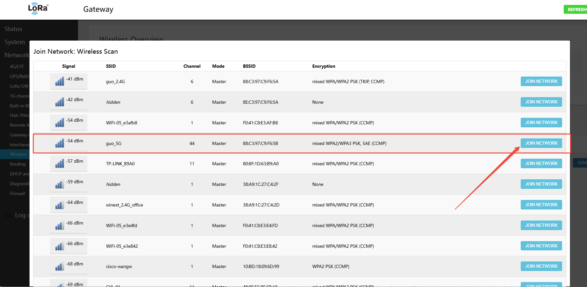


在对应的WiFi热点栏点击“加入网络”,输入连接WiFi热点的密码，然后点击保存提交

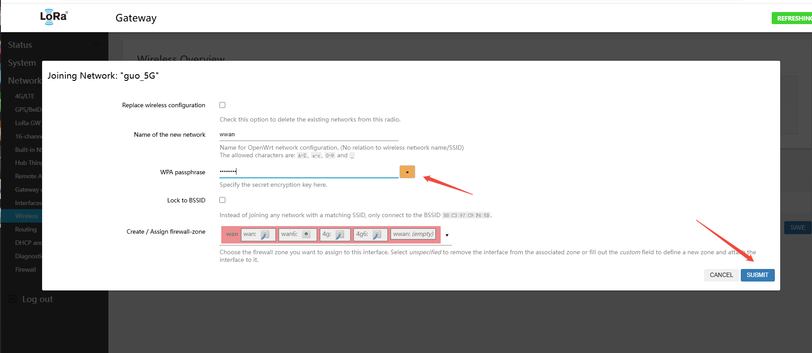

页面再选择 频段信息

- 模式：Legacy
- BAND:5GHz
- channel：(5G 的wifi信道范围：36到165)就选刚刚扫描时候的信道，示例里是： 44

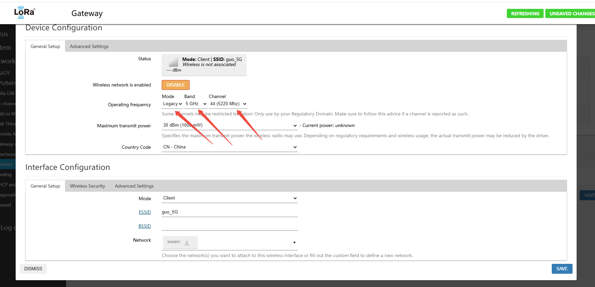

页面再选择 WiFi认证加密方式(有WPA2-PSK、WPA3-SAE、WPA2-PSK/WPA3-SAE 混合模式、WPA-PSK/WPA2-SAE 混合模式、WPA-PSK)

- Encryption：选择刚刚扫描时候的认证加密方式(WPA2-PSK/WPA3-SAE 混合模式)

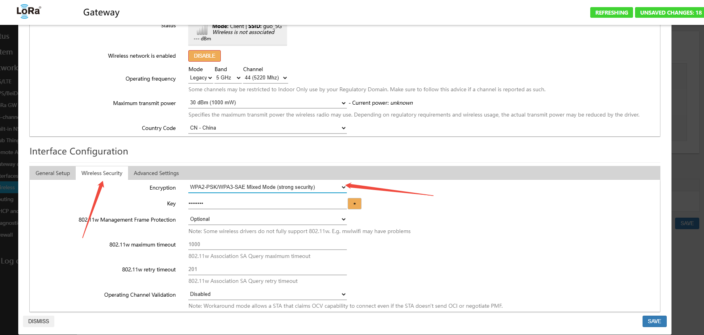


再次确认一下，信道、加密方式都填对后，点击保存按钮

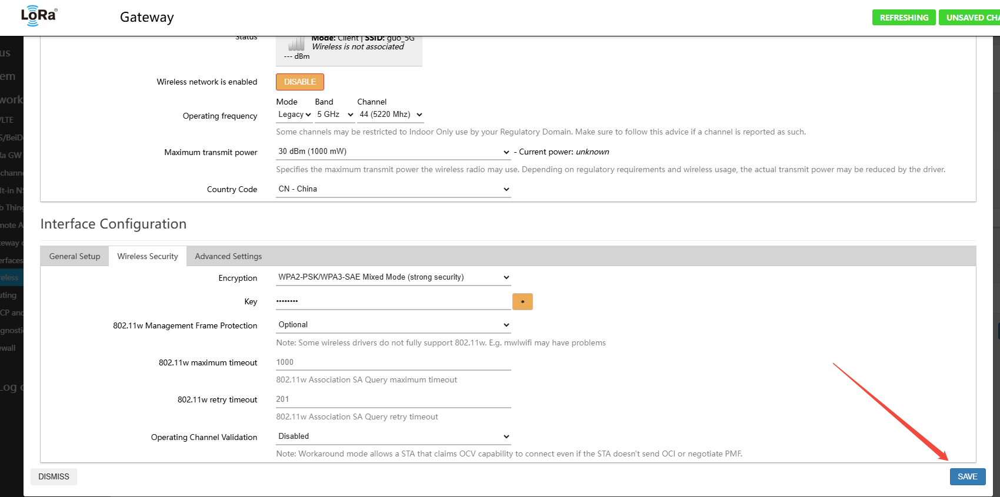

> **注意事项**：
> - WiFi只能AP模式和STA模式二选一
> - AP模式就是网关起一个WiFi热点，供电脑、手机去连接
> - STA模式就是网关使用WiFi去连接路由器的WiFi，使用WiFi连网


此时STA连接路由器的接口已经配置好，需要把AP Master的接口禁用，点击 禁用 按钮

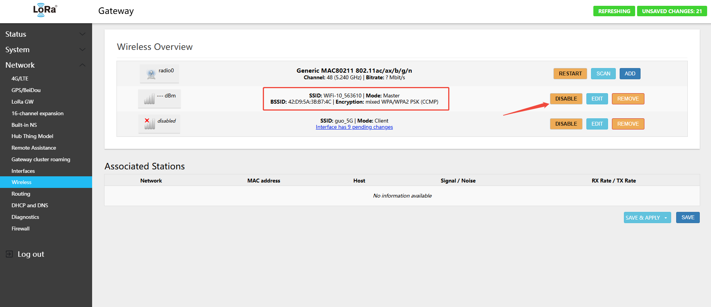

连接成功后，AP热点关闭，STA连接WiFi路由器的信号，完成

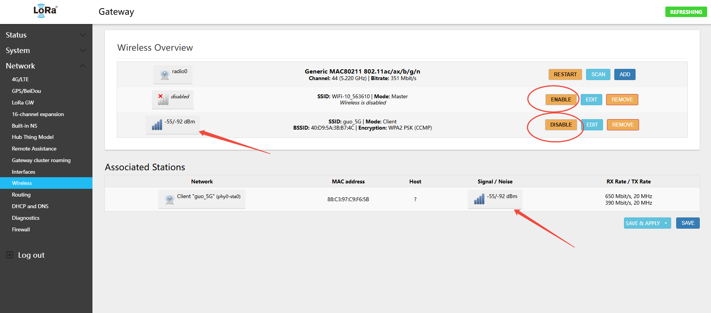

可以在 菜单 **Network（网络）** → **Interfaces（接口）**

查看WiFI的IP地址和WiFi的MAC地址，需要记住IP，可以在路由器将网关的WiFI MAC和IP绑定，以后可以通过这个IP地址进入网关页面


---

### 配置lora网关频段以及频点

- 以前GW1000和GW5000，是一个固件对应一个LoRaWAN频段
- 现在GW8000，根据470/868/915三种硬件，提供三种不同固件
- 470的固件固定是CN470
- 868的固件可以切换EU868、RU864、IN865
- 915的固件可以切换US915、AU915、AS923-1、AS923-2、AS923-3、AS923-4、KR920

---

#### cn470频段以及频点说明

网关使用《lorawan-regional-parameters-v1-0-3reva》CN470的频点，由于1.0.4或者最新版本《RP002-1.0.3-FINAL-1》的CN470定义上行和下行的频点出入很大，为了兼容以前的设备，网关还是沿用《lorawan-regional-parameters-v1-0-3reva》版本的频点，最新的CN470频点标准已经被阿里巴巴公司修改，变成阿里版本的协议。

CN470-510网关的上行/下行频点表格,出厂频点8通道是A8B8,16扩展通道是A9B9


---

#### 868半双工硬件切换频段说明


GW8000网关868硬件支持切换到EU868/RU864/IN864频段，不再像GW1000那样，一个固件一个版本
出厂默认是EU868频段，恢复出厂设置以后，也会变为EU868频段,需要重新切换配置

##### 868硬件版本切换EU868频段

EU863-870网关的上行/下行频点表格

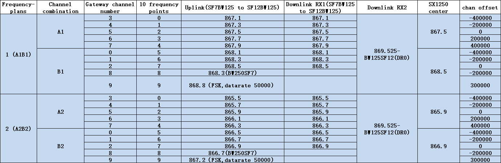

---

##### 868硬件版本切换RU864频段

RU864-870网关的上行/下行频点表格

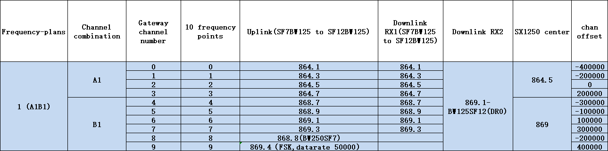

---

##### 868硬件版本切换IN865频段

IN865-867网关的上行/下行频点表格

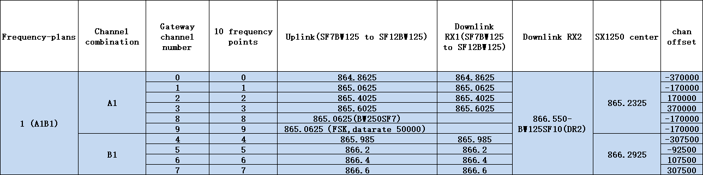

---

#### 915半双工硬件切换频段说明

GW8000网关915硬件支持切换到US915/AU915/AS923-1/AS923-2/AS923-3/AS923-4/KR920频段，不再像GW1000那样，一个固件一个版本
出厂默认是US915频段，恢复出厂设置以后，也会变为US915频段,需要重新切换配置

##### 915硬件版本切换US915频段

US902-928网关的上行/下行频点表格


---

##### 915硬件版本切换AU915频段

AU915-928网关的上行/下行频点表格


---

##### 915硬件版本切换AS923-1频段

AS923-1网关的上行/下行频点表格

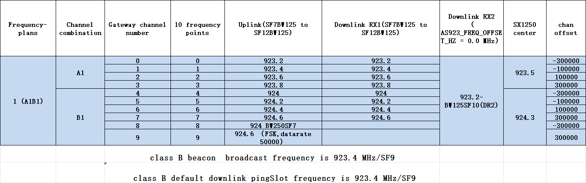

---

##### 915硬件版本切换AS923-2频段

AS923-2网关的上行/下行频点表格

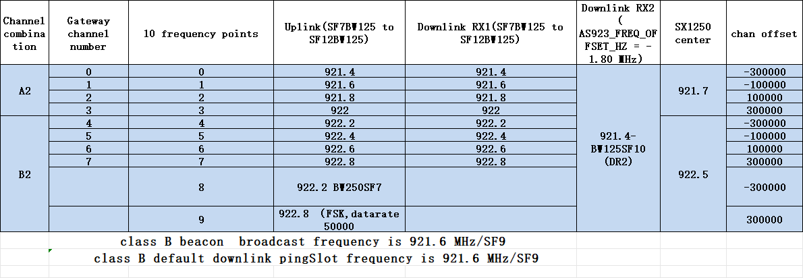

---

##### 915硬件版本切换AS923-3频段

AS923-3网关的上行/下行频点表格

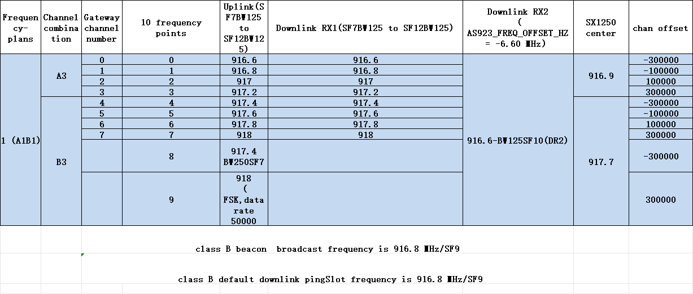

---

##### 915硬件版本切换AS923-4频段

AS923-4网关的上行/下行频点表格

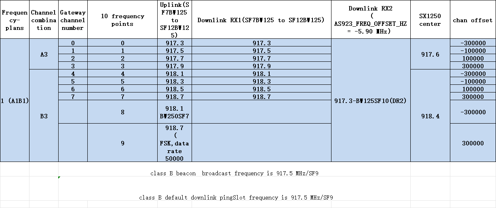

---

##### 915硬件版本切换KR920频段

KR920网关的上行/下行频点表格

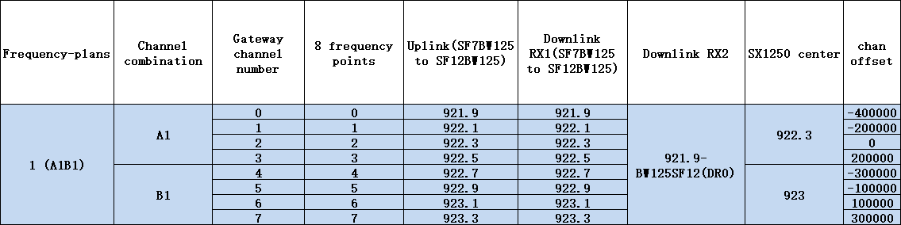


---

### 配置lora网关连接外部ns服务器

网关支持多种 LoRa 通信协议和数据转发方式，可灵活对接不同的网络服务器和物联网平台。以下详细介绍各种配置方式。

#### 使用udp方式

UDP GWMP（Gateway Message Protocol）是 Semtech 定义的标准协议，广泛用于连接 TTN、chirpstack 等开源网络服务器。

**应用场景**：连接 The Things Network (TTN)、自建 chirpstack 服务器等。

##### 使用udp方式连接chirpstack


##### 使用udp方式连接ttn


**操作步骤**：
1. 登录网关界面，在 网络->LoRa网关，如果要配置第二个LoRa(16通道版本)，则在 网络->**16通道扩展(16-channel expansion)**
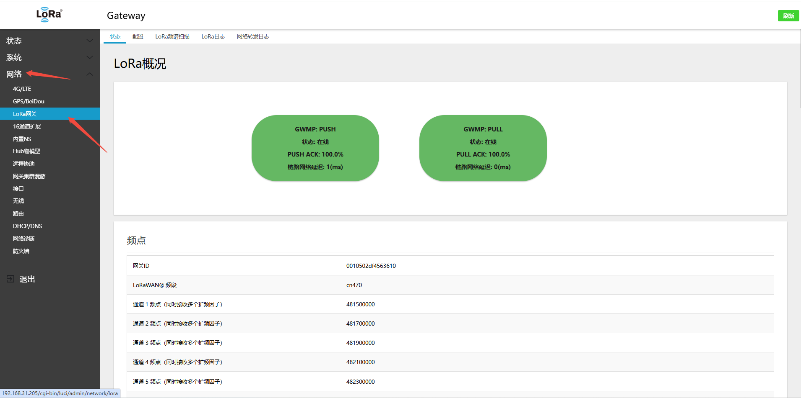

16通道，需要再配置第二个lora页面：16通道扩展(16-channel expansion)

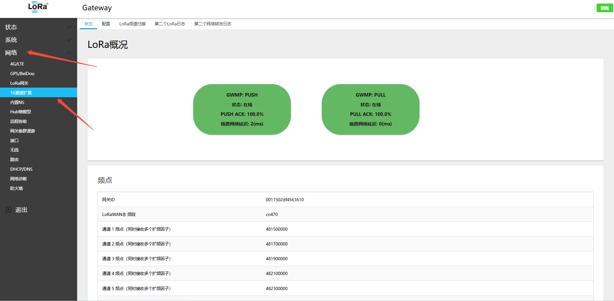

2. 导航至 **LoRa网关(LoRa GW)** → **配置(Configuration)**


3. 切换需要使用的LoRaWAN频段

切换频段不会更改网关默认的EUI，如果之前配置页面参数填乱了，也可以通过切换到别的频段，再切换回来，让频段的参数重新初始化

470版本仅支持CN470版本，470的硬件不需要切换频段
868版本可以支持EU868、RU864、IN865三个频段切换
915版本可以支持US902-928、AU915-928、AS923-1、AS923-2、AS923-3、AS923-4、KR920

现在以EU868与RU864切换(共同的硬件，使用不同的软件参数)为例

我们以EU868切换到RU864,示例

在选项**LoRaWAN® 频段（LoRaWAN® regions）** 下拉选择RU864
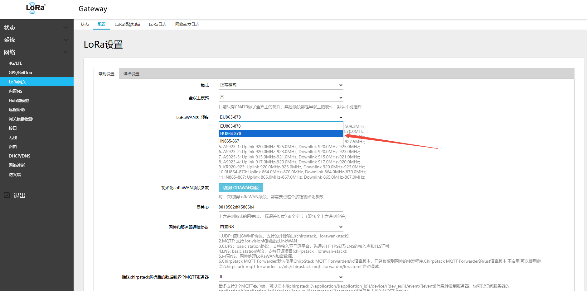

在选项**初始化LoRaWAN频段参数（Initialize LoRaWAN frequency band parameters）** 点击按钮 **切换LORAWAN频段（SWITCH LORAWAN FREQUENCY BAND）**
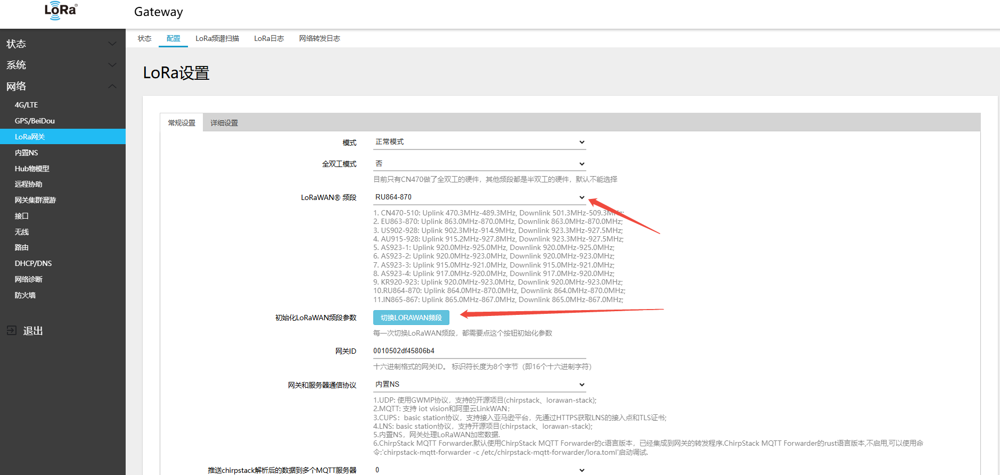

等待参数初始化，右上角会出现：未保存的配置项，说明参数切换过去，只是没有暂时生效
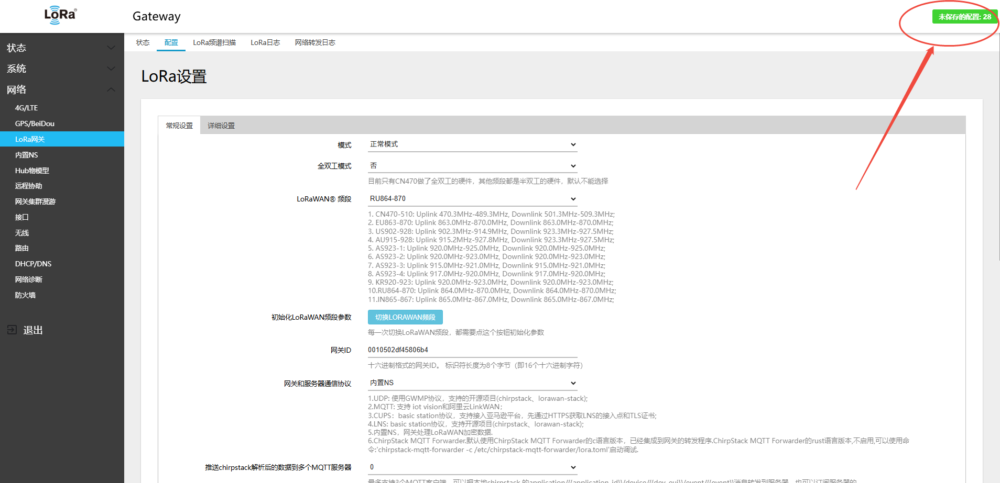

需要生效参数，下拉页面到右下角，有个"保存并应用"的按钮，点击它
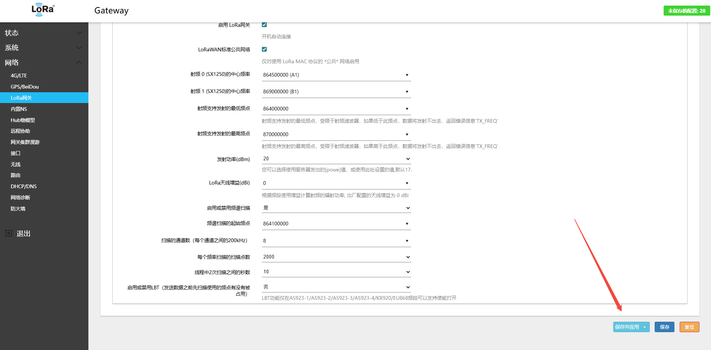

点击"保存并应用"后，等待10-20秒，返回配置页面，会看到当前生效的频段，以及右上角已经没有未保存的参数
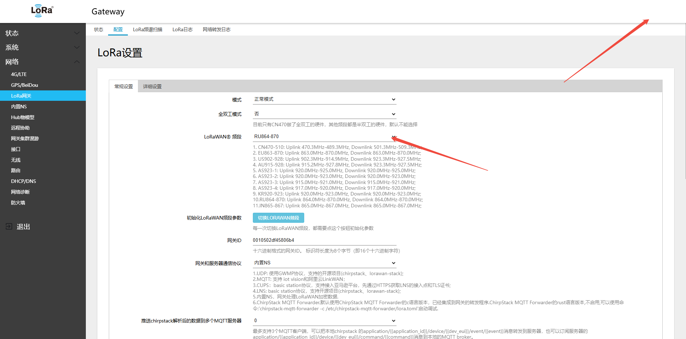


4. 以连接到TTN(console.cloud.thethings.network)平台示例(需要自行注册平台的登录账号)
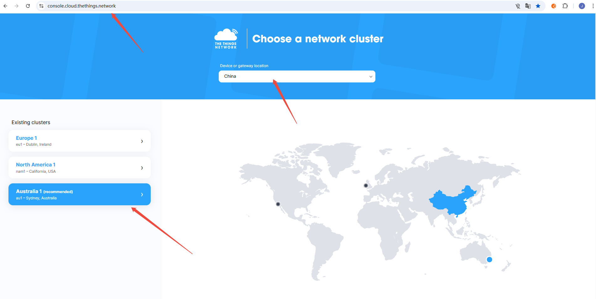

在ttn平台找到"Register gateway"

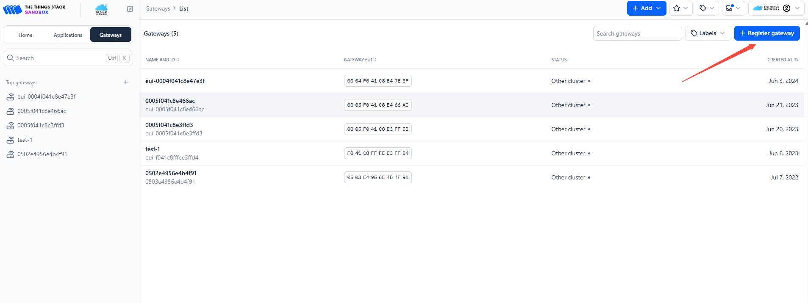

ttn平台出现输入网关ID输入框


在浏览器另一窗口，登录网关页面，找到lora网关的ID，复制它


在ttn平台粘贴网关ID，并且点击"Confirm"


在ttn平台用刚刚复制的网关ID，粘贴到"Gateway ID"、"Gateway name"，选择"frequency plan",填完并且点击"Register gateway"


已经注册到ttn平台，此时需要在网关填写服务器地址


> **注意事项**：
> - 配置UDP服务器地址前，请确认域名地址,我们查看当前ttn为我们网关分配的域名前缀，为: au1

所以需要在网关里，选择UDP协议，服务器选择ttn的au1域名节点

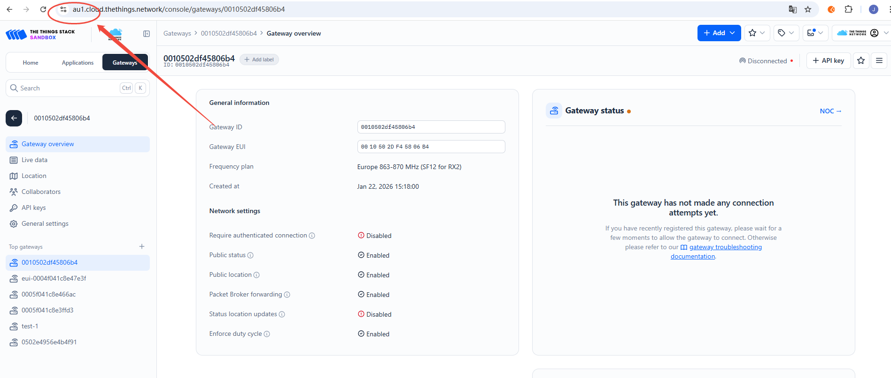

   - **Server Address（服务器地址）**：目标 NS 的域名或 IP（例如：`au1.cloud.thethings.network`）
   - **Server Port Up（上行端口）**：通常为 1700
   - **Server Port Down（下行端口）**：通常为 1700
   
网关页面配置UDP方式连接ttn平台
   
 
 
点击 **Save & Apply（保存并应用）**

 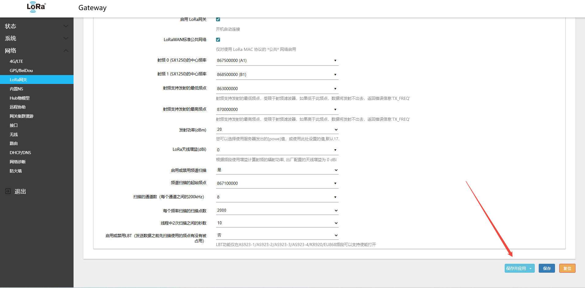

等待30-60秒，在ttn平台看网关状态，已经在线

 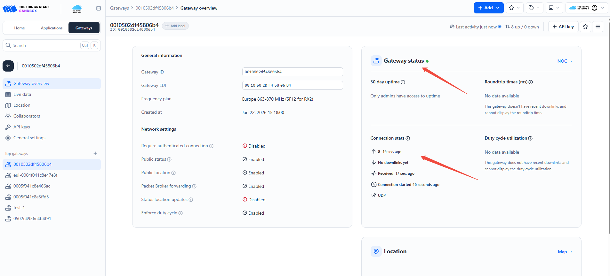
 

#### 使用mqtt-gwmp方式

MQTT 协议适用于需要更灵活消息机制的场景，支持连接唯传公司的IoT Vision公有云平台，包括唯传公司提供的私有化部署IoT Vision。

**应用场景**：IoT Vision公有云、IoT Vision私有化部署。


##### 使用mqtt-gwmp方式连接公有云iot


##### 使用mqtt-gwmp方式连接私有iot

**操作步骤**：
1. 导航至 **LoRa** → **MQTT Forwarder（MQTT 转发器）**


2. 启用 MQTT 转发功能
3. 配置 MQTT Broker 参数：
   - **Broker Address（Broker 地址）**：MQTT 服务器地址
   - **Broker Port（端口）**：通常为 1883（TCP）或 8883（TLS）
   - **Username（用户名）**：Broker 认证用户名
   - **Password（密码）**：Broker 认证密码
   - **Client ID（客户端 ID）**：网关唯一标识
   - **Topic Prefix（主题前缀）**：消息主题前缀
4. 配置 TLS（可选）：
   - 启用 **Use TLS（使用 TLS）**
   - 上传 CA 证书、客户端证书和密钥
5. 点击 **Save & Apply（保存并应用）**

---

#### 使用chirpstack-mqtt-forwarder方式

chirpstack-mqtt-forwarder 是 chirpstack 开源项目提供的 MQTT 转发协议，使用 Protobuf 编码，效率更高。

**应用场景**：连接 chirpstack V4 网络服务器。

##### 使用chirpstack-mqtt-forwarder方式连接chirpstack


**操作步骤**：
1. 导航至 **LoRa** → **chirpstack MQTT Forwarder**
2. 配置 MQTT 连接参数：
   - **MQTT Server（服务器）**：chirpstack MQTT Broker 地址
   - **MQTT Port（端口）**：1883 或 8883
   - **Topic Prefix（主题前缀）**：通常为 `eu868`、`us915` 等（根据频段）
   - **Gateway ID（网关 ID）**：chirpstack 中注册的网关 ID
3. 配置 JSON 或 Protobuf 编码方式（推荐 Protobuf）
4. 点击 **Save & Apply（保存并应用）**

---

#### 使用basic-station-cups方式

CUPS（Configuration and Update Server）协议用于自动获取 LNS 配置和证书，常用于 AWS IoT Core。

**应用场景**：AWS IoT Core for LoRaWAN。


##### 使用basic-station-cups方式连接亚马逊平台

**操作步骤**：
1. 导航至 **LoRa** → **Basic Station**
2. 选择 **Mode（模式）** 为 `CUPS`
3. 配置 CUPS 服务器：
   - **CUPS URI**：HTTPS 地址（例如：`https://<account-id>.cups.lorawan.amazonaws.com:443`）
   - **CUPS Trust（信任证书）**：上传 AWS CA 证书
   - **CUPS Certificate（客户端证书）**：上传网关证书
   - **CUPS Key（私钥）**：上传网关私钥
4. 点击 **Save & Apply（保存并应用）**
5. 网关会自动从 CUPS 服务器获取 LNS 配置

---

#### 使用basic-station-lns方式

LNS（LoRaWAN Network Server）协议基于 WebSocket，支持连接 chirpstack、Helium、Microsoft Azure IoT 等平台。

**应用场景**：chirpstack、Helium Network、Microsoft Azure IoT Central。

##### 使用basic-station-lns方式连接ttn平台


##### 使用basic-station-lns方式连接chirpstack平台


##### 使用basic-station-lns方式连接helium平台


**操作步骤**：
1. 导航至 **LoRa** → **Basic Station**
2. 选择 **Mode（模式）** 为 `LNS`
3. 配置 LNS 服务器：
   - **LNS URI**：WebSocket 地址（例如：`wss://chirpstack.example.com:8887`）
   - **Authentication Mode（认证模式）**：选择 TLS Server & Client Authentication
   - **Trust（信任证书）**：上传服务器 CA 证书
   - **Certificate（客户端证书）**：上传网关客户端证书
   - **Key（私钥）**：上传网关私钥
4. 点击 **Save & Apply（保存并应用）**

**配置示例（chirpstack）**：
```
LNS URI: wss://chirpstack.example.com:8887
Authentication Mode: TLS Server & Client Authentication
Trust: 上传 ca.crt
Certificate: 上传 gateway.crt
Key: 上传 gateway.key
```


---


### 配置16通道网关频段以及频点


#### 配置16通道网关cn470频段以及频点说明


#### 配置16通道网关868半双工硬件切换频段说明


#### 配置16通道网关915半双工硬件切换频段说明

---

### 配置16通道网关连接外部ns服务器

网关支持多种 LoRa 通信协议和数据转发方式，可灵活对接不同的网络服务器和物联网平台。以下详细介绍各种配置方式。

#### 配置16通道网关使用udp方式

UDP GWMP（Gateway Message Protocol）是 Semtech 定义的标准协议，广泛用于连接 TTN、chirpstack 等开源网络服务器。

**应用场景**：连接 The Things Network (TTN)、自建 chirpstack 服务器等。

##### 配置16通道网关使用udp方式连接chirpstack


##### #配置16通道网关使用udp方式连接ttn


**操作步骤**：
1. 登录网关界面，在 网络->LoRa网关，如果要配置第二个LoRa(16通道版本)，则在 网络->**16通道扩展(16-channel expansion)**


16通道，需要再配置第二个lora页面：16通道扩展(16-channel expansion)


2. 导航至 **LoRa网关(LoRa GW)** → **配置(Configuration)**


3. 切换需要使用的LoRaWAN频段

切换频段不会更改网关默认的EUI，如果之前配置页面参数填乱了，也可以通过切换到别的频段，再切换回来，让频段的参数重新初始化

470版本仅支持CN470版本，470的硬件不需要切换频段
868版本可以支持EU868、RU864、IN865三个频段切换
915版本可以支持US902-928、AU915-928、AS923-1、AS923-2、AS923-3、AS923-4、KR920

现在以EU868与RU864切换(共同的硬件，使用不同的软件参数)为例

我们以EU868切换到RU864,示例

在选项**LoRaWAN® 频段（LoRaWAN® regions）** 下拉选择RU864


在选项**初始化LoRaWAN频段参数（Initialize LoRaWAN frequency band parameters）** 点击按钮 **切换LORAWAN频段（SWITCH LORAWAN FREQUENCY BAND）**


等待参数初始化，右上角会出现：未保存的配置项，说明参数切换过去，只是没有暂时生效


需要生效参数，下拉页面到右下角，有个"保存并应用"的按钮，点击它


点击"保存并应用"后，等待10-20秒，返回配置页面，会看到当前生效的频段，以及右上角已经没有未保存的参数


4. 以连接到TTN(console.cloud.thethings.network)平台示例(需要自行注册平台的登录账号)


在ttn平台找到"Register gateway"


ttn平台出现输入网关ID输入框


在浏览器另一窗口，登录网关页面，找到lora网关的ID，复制它


在ttn平台粘贴网关ID，并且点击"Confirm"


在ttn平台用刚刚复制的网关ID，粘贴到"Gateway ID"、"Gateway name"，选择"frequency plan",填完并且点击"Register gateway"


已经注册到ttn平台，此时需要在网关填写服务器地址


> **注意事项**：
> - 配置UDP服务器地址前，请确认域名地址,我们查看当前ttn为我们网关分配的域名前缀，为: au1

所以需要在网关里，选择UDP协议，服务器选择ttn的au1域名节点


   - **Server Address（服务器地址）**：目标 NS 的域名或 IP（例如：`au1.cloud.thethings.network`）
   - **Server Port Up（上行端口）**：通常为 1700
   - **Server Port Down（下行端口）**：通常为 1700
   
网关页面配置UDP方式连接ttn平台
   
 
 
点击 **Save & Apply（保存并应用）**

 

等待30-60秒，在ttn平台看网关状态，已经在线

 
 

#### 配置16通道网关使用mqtt-gwmp方式

MQTT 协议适用于需要更灵活消息机制的场景，支持连接唯传公司的IoT Vision公有云平台，包括唯传公司提供的私有化部署IoT Vision。

**应用场景**：IoT Vision公有云、IoT Vision私有化部署。


##### 配置16通道网关使用mqtt-gwmp方式连接公有云iot


##### 配置16通道网关使用mqtt-gwmp方式连接私有iot

**操作步骤**：
1. 导航至 **LoRa** → **MQTT Forwarder（MQTT 转发器）**


2. 启用 MQTT 转发功能
3. 配置 MQTT Broker 参数：
   - **Broker Address（Broker 地址）**：MQTT 服务器地址
   - **Broker Port（端口）**：通常为 1883（TCP）或 8883（TLS）
   - **Username（用户名）**：Broker 认证用户名
   - **Password（密码）**：Broker 认证密码
   - **Client ID（客户端 ID）**：网关唯一标识
   - **Topic Prefix（主题前缀）**：消息主题前缀
4. 配置 TLS（可选）：
   - 启用 **Use TLS（使用 TLS）**
   - 上传 CA 证书、客户端证书和密钥
5. 点击 **Save & Apply（保存并应用）**

---

#### 配置16通道网关使用chirpstack-mqtt-forwarder方式

chirpstack-mqtt-forwarder 是 chirpstack 开源项目提供的 MQTT 转发协议，使用 Protobuf 编码，效率更高。

**应用场景**：连接 chirpstack V4 网络服务器。

##### 配置16通道网关使用chirpstack-mqtt-forwarder方式连接chirpstack


**操作步骤**：
1. 导航至 **LoRa** → **chirpstack MQTT Forwarder**
2. 配置 MQTT 连接参数：
   - **MQTT Server（服务器）**：chirpstack MQTT Broker 地址
   - **MQTT Port（端口）**：1883 或 8883
   - **Topic Prefix（主题前缀）**：通常为 `eu868`、`us915` 等（根据频段）
   - **Gateway ID（网关 ID）**：chirpstack 中注册的网关 ID
3. 配置 JSON 或 Protobuf 编码方式（推荐 Protobuf）
4. 点击 **Save & Apply（保存并应用）**

---

#### 配置16通道网关使用basic-station-cups方式

CUPS（Configuration and Update Server）协议用于自动获取 LNS 配置和证书，常用于 AWS IoT Core。

**应用场景**：AWS IoT Core for LoRaWAN。


##### 配置16通道网关使用basic-station-cups方式连接亚马逊平台

**操作步骤**：
1. 导航至 **LoRa** → **Basic Station**
2. 选择 **Mode（模式）** 为 `CUPS`
3. 配置 CUPS 服务器：
   - **CUPS URI**：HTTPS 地址（例如：`https://<account-id>.cups.lorawan.amazonaws.com:443`）
   - **CUPS Trust（信任证书）**：上传 AWS CA 证书
   - **CUPS Certificate（客户端证书）**：上传网关证书
   - **CUPS Key（私钥）**：上传网关私钥
4. 点击 **Save & Apply（保存并应用）**
5. 网关会自动从 CUPS 服务器获取 LNS 配置

---

#### 配置16通道网关使用basic-station-lns方式

LNS（LoRaWAN Network Server）协议基于 WebSocket，支持连接 chirpstack、Helium、Microsoft Azure IoT 等平台。

**应用场景**：chirpstack、Helium Network、Microsoft Azure IoT Central。

##### 配置16通道网关使用basic-station-lns方式连接ttn平台


##### 配置16通道网关使用basic-station-lns方式连接chirpstack平台


##### 配置16通道网关使用basic-station-lns方式连接helium平台


**操作步骤**：
1. 导航至 **LoRa** → **Basic Station**
2. 选择 **Mode（模式）** 为 `LNS`
3. 配置 LNS 服务器：
   - **LNS URI**：WebSocket 地址（例如：`wss://chirpstack.example.com:8887`）
   - **Authentication Mode（认证模式）**：选择 TLS Server & Client Authentication
   - **Trust（信任证书）**：上传服务器 CA 证书
   - **Certificate（客户端证书）**：上传网关客户端证书
   - **Key（私钥）**：上传网关私钥
4. 点击 **Save & Apply（保存并应用）**

**配置示例（chirpstack）**：
```
LNS URI: wss://chirpstack.example.com:8887
Authentication Mode: TLS Server & Client Authentication
Trust: 上传 ca.crt
Certificate: 上传 gateway.crt
Key: 上传 gateway.key
```


---
### 使用内置ns服务器


#### 切换内置模式

#### 添加唯传自研的lorawan传感器到内置chirpstack服务器

#### 添加第三方的lorawan设备到内置chirpstack服务器


#### 删除内置ns的设备


#### 使用excel表格批量添加设备

#### 导出所有设备到excel表格


#### 使用chirpstack-rest-api接口


#### 使用node-red界面


#### 查询设备历史数据


##### 按照最新条数查询设备历史数据

##### 按照时间段查询设备历史数据


#### 使用mqtt推送chirpstack的实时消息到客户的mqtt服务器


#### 使用http推送chirpstack的实时消息到客户的http服务器


---

### 使用hub物模型


#### 设置设备的传感器物模型

#### 查看设备的物模型实时数据

#### 查看设备的物模型历史数据

##### 根据最新条数查询设备的物模型历史数据

##### 根据时间段查询设备的物模型历史数据


#### 使用modbus-tcp获取设备数据

##### 设置设备支持modbus-tcp映射

##### 通过modbus-poll工具获取设备实时数据

##### 通过python3脚本使用modbus-tcp方式获取设备实时数据


#### 使用bacnet-bip获取设备数据

##### 设置设备支持bacnet-bip映射

##### 通过yabe工具获取设备实时数据

##### 通过python3脚本使用bacnet-bip方式获取设备实时数据


#### 使用hub的http接口

##### 通过hub的http接口获取设备实时数据

##### 通过hub的http接口获取设备列表

##### 通过hub的http接口获取设备历史数据


---


### 使用网关的内置ns集群和设备漫游

#### 网关集群能力介绍

#### 网关集群框架

#### 设置集群服务器

#### 查看连接到集群服务器的状态


---

### 网关使用fuota给设备做固件空中升级

#### fuota固件空中升级介绍

#### fuota固件空中升级框架流程

---

### 网关远程运维和技术支持

#### 网关远程运维介绍

#### 网关远程运维框架流程

#### 请求远程协助

---


### 查看网关定位gpsbeidou情况


---

### 唯传自研产品获得数据示例

#### 温湿度传感器an-303数据示例


---

#### 6. 配置内置 NS 使用 MQTT 推送数据

内置 chirpstack 可将解析后的设备数据通过 MQTT 推送到客户的 MQTT 服务器。

**操作步骤**：
1. 启用内置 NS：在 **LoRa → 配置** 页面，选择转发模式为 **内置 NS（chirpstack）**
2. 配置 MQTT 推送：进入 **Hub Config → IoT Hub 配置** 页面
3. 在"MQTT 推送"部分，点击"添加 MQTT 客户端"
4. 填写 MQTT 客户端参数：
   - **MQTT Broker 地址**：客户的 MQTT 服务器地址
   - **MQTT Broker 端口**：1883（非加密）或 8883（TLS）
   - **用户名**：MQTT 服务器的用户名
   - **密码**：MQTT 服务器的密码
   - **客户端 ID**：自定义 ID
   - **发布主题模板**：数据推送的主题（支持变量，例如：`lorawan/data/${device_eui}`）
   - **QoS 级别**：0、1 或 2
5. 点击"保存并应用"

**数据格式**：
```json
{
  "device_eui": "0102030405060708",
  "device_name": "temperature_sensor_01",
  "application_name": "smart_building",
  "timestamp": "2026-01-20T10:30:00Z",
  "data": {
    "temperature": 25.6,
    "humidity": 60.2,
    "battery": 3.7
  }
}
```

---

#### 7. 配置内置 NS 使用 HTTP 推送数据

内置 NS 支持通过 HTTP POST 方式推送设备数据到外部 Web 服务。

**操作步骤**：
1. 导航至 **LoRa** → **Built-in NS（内置 NS）** → **Integration（集成）**
2. 点击 **Add Integration（添加集成）** → 选择 **HTTP**
3. 配置 HTTP 推送参数：
   - **Endpoint URL**：目标 API 地址
   - **Headers（请求头）**：可选，添加自定义 HTTP 头
   - **Event Types（事件类型）**：选择推送的事件类型
4. 点击 **Submit（提交）**

---

#### 8. 配置内置 NS 使用 Modbus TCP 获取设备数据

网关的 `iot_hub` 进程可将 LoRaWAN 设备数据映射到 Modbus TCP 寄存器。

**操作步骤**：
1. 进入 **Hub Config → IoT Hub 配置** 页面
2. 启用 Modbus TCP 服务
3. 配置服务参数：
   - **监听端口**：默认 502（可修改）
   - **从站 ID（Slave ID）**：默认 1
4. 为设备配置 Modbus 映射（后续章节详细说明）
5. 点击"保存并应用"

详细使用说明请参考：[Modbus TCP 使用文档](modbus-tcp.md)

---

#### 9. 配置内置 NS 使用 BACnet BIP 获取设备数据

网关的 `iot_hub` 进程可将 LoRaWAN 设备数据映射到 BACnet 对象。

**操作步骤**：
1. 进入 **Hub Config → IoT Hub 配置** 页面
2. 启用 BACnet BIP 服务
3. 配置 BACnet 设备参数：
   - **设备实例 ID（Device Instance）**：默认 100001
   - **设备名称（Device Name）**：BACnet 设备名称
   - **端口（Port）**：默认 47808
4. 为设备配置 BACnet 对象（后续章节详细说明）
5. 点击"保存并应用"

详细使用说明请参考：[BACnet BIP 使用文档](bacnet.md)

---

## 内置Chirpstack设备管理

网关内置 chirpstack V4.x 网络服务器，提供完整的 LoRaWAN 设备管理功能。

### 1. 登录内置 Chirpstack

**操作步骤**：
1. 打开浏览器，访问：`http://192.168.60.1:8080`（LAN/WiFi 访问）
2. 或通过 WAN IP：`http://<WAN_IP>:8080`

**默认登录凭据**：
- 用户名：`admin`
- 密码：`admin`

> **安全提示**：首次登录后请立即修改默认密码。

---

### 2. 创建/修改 Device Profile（设备配置文件）

Device Profile 定义了设备的 LoRaWAN 参数和编解码规则。

**操作步骤**：

#### 2.1 创建新的 Device Profile
1. 点击左侧菜单 **Device-profiles（设备配置文件）**
2. 点击 **Add device-profile（添加设备配置文件）**

#### 2.2 配置基本信息
- **Name（名称）**：配置文件名称（例如：`Temperature-Sensor-Class-A`）
- **Region（区域）**：选择频段（CN470、EU868、US915 等）
- **MAC version（MAC 版本）**：设备支持的 LoRaWAN 版本
- **Device supports OTAA（设备支持 OTAA）**：勾选（推荐）

#### 2.3 配置 Codec（编解码器）
选择编解码方式：
- **None**：无编解码（原始十六进制）
- **Cayenne LPP**：使用 Cayenne 特殊二进制格式
- **JavaScript**：自定义 JavaScript 解码函数

**JavaScript 解码函数示例**：
```javascript
function decodeUplink(input) {
  var bytes = input.bytes;
  var data = {};
  
  // 解析温度（2字节，有符号整数，精度0.01）
  data.temperature = ((bytes[0] << 8) | bytes[1]) / 100.0;
  
  // 解析湿度（2字节，无符号整数，精度0.01）
  data.humidity = ((bytes[2] << 8) | bytes[3]) / 100.0;
  
  return {
    data: data
  };
}
```

#### 2.4 保存配置
点击页面底部 **Submit（提交）** 按钮

---

### 3. 添加单个 LoRaWAN 设备

**操作步骤**：

#### 3.1 进入应用管理
1. 点击左侧菜单 **Applications（应用）**
2. 如无应用，先创建应用
3. 进入已创建的应用

#### 3.2 添加设备
1. 点击 **Devices（设备）** 标签页
2. 点击 **Add device（添加设备）**

#### 3.3 配置设备基本信息
- **Device name（设备名称）**：例如 `Room-101-Temp-Sensor`
- **Device EUI（设备 EUI）**：16 位十六进制（例如：`0102030405060708`）
- **Device-profile（设备配置文件）**：选择之前创建的 Device Profile

#### 3.4 配置 OTAA 密钥
1. 点击 **Submit（提交）** 保存设备
2. 进入设备详情页面，点击 **Keys (OTAA)** 标签页
3. 配置 **Application key（应用密钥）**：设备的 AppKey（32 位十六进制）
4. 点击 **Submit（提交）**

---

### 4. 配置 TSL（物模型）定义

TSL（Thing Specification Language，物模型）允许用户定义设备的属性字段。

**操作步骤**：

#### 4.1 进入物模型配置
1. 在设备详情页面，点击 **TSL Model（物模型）** 标签页
2. 点击 **Add Property（添加属性）**

#### 4.2 添加属性字段
配置属性参数：
- **Property Name（属性名称）**：例如 `temperature`
- **Display Name（显示名称）**：例如 `温度`
- **Data Type（数据类型）**：int、float、string、bool 等
- **Unit（单位）**：`°C`、`%RH` 等
- **Access Mode（访问模式）**：Read、Write、Read/Write

**示例：温湿度传感器**

**属性 1：温度**
- Property Name: `temperature`
- Display Name: `温度`
- Data Type: `float`
- Unit: `°C`
- Access Mode: `Read`

**属性 2：湿度**
- Property Name: `humidity`
- Display Name: `湿度`
- Data Type: `float`
- Unit: `%RH`
- Access Mode: `Read`

#### 4.3 保存物模型
点击 **Save（保存）** 按钮

---

### 5. 配置 Modbus TCP 和 BACnet 参数

#### 5.1 配置 Modbus TCP 参数
1. 在设备详情页面，点击 **Modbus TCP** 标签页
2. 配置参数：
   - **Enable（启用）**：勾选
   - **Slave ID（从站 ID）**：1-247，默认 1
   - **Starting Address（起始地址）**：例如 0
   - **Register Mapping（寄存器映射）**：配置 物模型TSL (Thing Specification Language) 属性到 Modbus 寄存器的映射
3. 点击 **Save（保存）**

#### 5.2 配置 BACnet 参数
1. 在设备详情页面，点击 **BACnet** 标签页
2. 配置参数：
   - **Enable（启用）**：勾选
   - **Device Object ID（设备对象 ID）**：全局唯一，例如 100002
   - **Device Name（设备名称）**：BACnet 设备名称
   - **Object Mapping（对象映射）**：配置 物模型TSL (Thing Specification Language) 属性到 BACnet 对象的映射
3. 点击 **Save（保存）**

---

### 6. 查看设备数据

**查看设备状态**：
- 进入设备详情页面
- 查看顶部设备状态：Last seen、Uplink frame counter 等

**查看 LoRaWAN 帧数据**：
- 点击 **LoRaWAN frames（LoRaWAN 帧）** 标签页
- 查看上行和下行帧详情：时间戳、频率、RSSI、SNR、原始负载

**查看解码后的设备数据**：
- 点击 **Device data（设备数据）** 标签页
- 查看解码后的 JSON 数据和 物模型TSL (Thing Specification Language)显示的属性值

**查看事件日志**：
- 点击 **Events（事件）** 标签页
- 查看入网事件（join）、上行数据（uplink）、下行确认（ack）等

---

## 数据采集示例

网关支持通过 Python 3.11 脚本读取设备数据，以下提供各种方式的测试脚本示例。

### 1. Modbus TCP 读取示例

**安装依赖**：
```bash
pip3 install  pymodbus==3.6.9
```

**脚本示例**（`/root/python-SDK/modbus_tcp_read.py`）：
```python
import argparse
import re
import struct
import sys
import logging

# --- Import Pymodbus (Compatible with v3.x and older) ---
try:
    from pymodbus.client import ModbusTcpClient
    from pymodbus.register_read_message import ReadHoldingRegistersRequest
except ImportError:
    try:
        from pymodbus.client.sync import ModbusTcpClient
        from pymodbus.register_read_message import ReadHoldingRegistersRequest
    except ImportError:
        print("Error: 'pymodbus' module not found. Please install: pip3 install pymodbus")
        sys.exit(1)

# --- Logging Config ---
logging.basicConfig()
log = logging.getLogger()
log.setLevel(logging.ERROR)

# --- Helper: Parse OpenWrt Config ---
def parse_uci_config(file_path):
    config = {'sensor_types': {}, 'attributes': {}, 'globals': {}}
    current_section_type = None
    current_section_name = None
    try:
        with open(file_path, 'r', encoding='utf-8', errors='ignore') as f:
            lines = f.readlines()
        for line in lines:
            line = line.strip()
            if not line or line.startswith('#'): continue
            
            config_match = re.match(r"config\s+(\w+)\s+'?([\w\-_]+)'?", line)
            if config_match:
                current_section_type = config_match.group(1)
                current_section_name = config_match.group(2)
                if current_section_type == 'sensor_type': 
                    config['sensor_types'][current_section_name] = {'attributes': []}
                elif current_section_type == 'attribute': 
                    config['attributes'][current_section_name] = {}
                elif current_section_type == 'global': 
                    config['globals'] = {}
                continue
            
            if not current_section_type: continue

            option_match = re.match(r"option\s+(\w+)\s+'([^']*)'", line)
            if option_match:
                key = option_match.group(1); value = option_match.group(2)
                if current_section_type == 'attribute': 
                    config['attributes'][current_section_name][key] = value
                elif current_section_type == 'global': 
                    config['globals'][key] = value
                continue

            list_match = re.match(r"list\s+attributes\s+'([^']*)'", line)
            if list_match:
                attr_name = list_match.group(1)
                if current_section_type == 'sensor_type': 
                    config['sensor_types'][current_section_name]['attributes'].append(attr_name)
                    
    except Exception as e:
        print(f"Error: Failed to parse config file - {e}"); sys.exit(1)
    return config

# --- Helper: Decode Data ---
def decode_raw_registers(registers, data_type, mapping_mode, scale):
    value = None
    scale = float(scale) if scale and float(scale) != 0 else 1.0
    try:
        # INT / UINT
        if data_type == 'int' or data_type == 'uint':
            raw_val = 0
            if len(registers) == 1:
                raw_val = registers[0]
                if data_type == 'int': # Signed 16-bit
                    raw_val = struct.unpack('>h', struct.pack('>H', raw_val))[0]
            elif len(registers) == 2:
                if 'little_endian' in mapping_mode: # Word swap
                    raw_val = (registers[1] << 16) | registers[0]
                else: # Big Endian
                    raw_val = (registers[0] << 16) | registers[1]
                if data_type == 'int': # Signed 32-bit
                    raw_val = struct.unpack('>i', struct.pack('>I', raw_val))[0]
            value = raw_val / scale

        # FLOAT
        elif data_type == 'float':
            if len(registers) == 1: # Scaled Integer representing Float
                raw_int = struct.unpack('>h', struct.pack('>H', registers[0]))[0]
                value = float(raw_int) / scale
            elif len(registers) == 2: # IEEE 754 Float
                combined = 0
                if 'little_endian' in mapping_mode: combined = (registers[1] << 16) | registers[0]
                else: combined = (registers[0] << 16) | registers[1]
                value = struct.unpack('>f', struct.pack('>I', combined))[0]
                if scale != 1.0: value = value / scale

        # BOOL
        elif data_type == 'bool':
            value = True if registers[0] > 0 else False

        # STRING
        elif data_type == 'string':
            byte_arr = bytearray()
            for reg in registers: byte_arr.extend(struct.pack('>H', reg))
            full_str = byte_arr.decode('utf-8', errors='ignore')
            value = full_str.split('\x00')[0]
            
        # TIMESTAMP
        elif data_type == 'timestamp':
            if len(registers) == 2:
                if 'little_endian' in mapping_mode: value = (registers[1] << 16) | registers[0]
                else: value = (registers[0] << 16) | registers[1]
                
    except Exception: return None
    return value

# --- Helper: Get Readable Format Name ---
def get_technical_info(data_type, count, mapping_mode, scale):
    """Generate engineering descriptions for Format and Order"""
    fmt_str = "Unknown"
    order_str = "Big-Endian" # Default Modbus
    
    # 1. Determine Format
    if data_type == 'int' or data_type == 'uint':
        prefix = "UInt" if data_type == 'uint' else "Int"
        if count == 1: fmt_str = f"{prefix}16"
        elif count == 2: fmt_str = f"{prefix}32"
        elif count == 4: fmt_str = f"{prefix}64"
    elif data_type == 'float':
        if count == 1: fmt_str = "Int16(S)" # Scaled Integer
        elif count == 2: fmt_str = "Float32"
    elif data_type == 'bool':
        fmt_str = "Bit/Bool"
    elif data_type == 'string':
        fmt_str = f"String({count*2}B)"
    elif data_type == 'timestamp':
        fmt_str = "UnixTime"

    # 2. Determine Order
    if mapping_mode == 'little_endian':
        order_str = "Little(Swap)" # DCBA
    elif mapping_mode == 'big_endian' or mapping_mode == 'single':
        order_str = "Big(ABCD)"
    elif mapping_mode == 'string':
        order_str = "ASCII"
    
    # 3. Format Scale
    scale_str = "x1"
    f_scale = float(scale)
    if f_scale != 1.0 and f_scale != 0:
        # If scale is 100, C code divides by 100.
        if f_scale >= 1:
            scale_str = f"/{int(f_scale)}" if f_scale.is_integer() else f"/{f_scale}"
        else:
            scale_str = f"x{1/f_scale}"

    return fmt_str, order_str, scale_str

# --- Main ---
def main():
    parser = argparse.ArgumentParser(description="IoT Hub Modbus Reader (Engineering View)")
    parser.add_argument('--ip', type=str, default='127.0.0.1', help='Device IP Address')
    parser.add_argument('--modbus-port', '--port', dest='port', type=int, default=502, help='Modbus Port')
    parser.add_argument('--slave', type=int, default=2, help='Slave ID')
    parser.add_argument('--config', type=str, default='/etc/config/iot_hub', help='Config file path')
    parser.add_argument('--type', type=str, default='temperature_humidity_sensor', help='Sensor Type')
    
    args = parser.parse_args()

    # 1. Parse Config
    config_data = parse_uci_config(args.config)
    
    if args.type not in config_data['sensor_types']:
        print(f"Error: Sensor type '{args.type}' not found in configuration.")
        sys.exit(1)

    sensor_attrs = config_data['sensor_types'][args.type]['attributes']
    print(f"Target: {args.ip}:{args.port} | Slave ID: {args.slave} | Sensor: {args.type}")
    print("=" * 145)
    
    # Header specifically designed for PLC/HMI engineers
    # FC: Function Code, Fmt: Data Type, Ord: Endianness, Cnt: Register Count, Scl: Scale Factor
    header = f"{'Attribute':<20} | {'Addr':<6} | {'FC':<3} | {'Format':<10} | {'Order':<12} | {'Cnt':<3} | {'Scale':<6} | {'Raw(Hex)':<15} | {'Value':<15} | {'Unit'}"
    print(header)
    print("-" * 145)

    # 2. Connect Client
    client = ModbusTcpClient(args.ip, port=args.port, timeout=3.0)
    if not client.connect():
        print(f"Connection Failed: Unable to connect to {args.ip}:{args.port}")
        sys.exit(1)

    try:
        for attr_name in sensor_attrs:
            if attr_name not in config_data['attributes']: continue
            attr_def = config_data['attributes'][attr_name]
            
            if attr_def.get('modbus_enable') != '1': continue
            
            # Filter for holding registers
            table_type = attr_def.get('modbus_table', 'holding')
            if table_type != 'holding': continue 
            
            fc = 3 # Read Holding Registers

            try:
                offset = int(attr_def.get('modbus_offset', 0))
                count = int(attr_def.get('modbus_register_count', 1))
                scale = float(attr_def.get('modbus_scale', 1.0))
                mapping_mode = attr_def.get('modbus_mapping_mode', 'single')
                data_type = attr_def.get('data_type', 'string')
                unit = attr_def.get('unit', '')
            except ValueError: continue

            # Get technical descriptions
            fmt_str, order_str, scale_str = get_technical_info(data_type, count, mapping_mode, scale)

            # 3. Build Request
            try:
                request = ReadHoldingRegistersRequest(offset, count, slave=args.slave)
            except TypeError:
                try:
                    request = ReadHoldingRegistersRequest(offset, count, unit=args.slave)
                except TypeError:
                     request = ReadHoldingRegistersRequest(offset, count)
                     if hasattr(request, 'slave_id'): request.slave_id = args.slave
                     if hasattr(request, 'unit_id'): request.unit_id = args.slave

            # 4. Execute Request
            rr = client.execute(request)

            # 5. Error Handling
            if rr.isError():
                error_msg = f"Err"
                if hasattr(rr, 'exception_code'):
                    if rr.exception_code == 2: error_msg = "IllegalAddr"
                    elif rr.exception_code == 3: error_msg = "IllegalVal"
                    elif rr.exception_code == 4: error_msg = "SlaveFail"
                    else: error_msg = f"ExCode({rr.exception_code})"
                
                print(f"{attr_name:<20} | {offset:<6} | {fc:02d}  | {fmt_str:<10} | {order_str:<12} | {count:<3} | {scale_str:<6} | {error_msg:<15} | {'N/A':<15} |")
                continue

            regs = rr.registers
            raw_hex = " ".join([f"{x:04X}" for x in regs[:2]]) 
            if len(regs) > 2: raw_hex += "..."

            # 6. Decode
            val = decode_raw_registers(regs, data_type, mapping_mode, scale)
            
            val_str = str(val) if val is not None else "Err"
            if isinstance(val, float): val_str = f"{val:.2f}"
            
            print(f"{attr_name:<20} | {offset:<6} | {fc:02d}  | {fmt_str:<10} | {order_str:<12} | {count:<3} | {scale_str:<6} | {raw_hex:<15} | {val_str:<15} | {unit}")

    finally:
        client.close()

if __name__ == "__main__":
    main()
```

**运行脚本**：
```bash
root@Gateway:~# python3 /root/python-SDK/modbus_tcp_read.py 
Target: 127.0.0.1:502 | Slave ID: 2 | Sensor: temperature_humidity_sensor
=================================================================================================================================================
Attribute            | Addr   | FC  | Format     | Order        | Cnt | Scale  | Raw(Hex)        | Value           | Unit
-------------------------------------------------------------------------------------------------------------------------------------------------
temperature          | 406    | 03  | Int16(S)   | Big(ABCD)    | 1   | /100   | 0A0A            | 25.70           | celsius
temperatureState     | 407    | 03  | Int16      | Big(ABCD)    | 1   | x1     | 0000            | 0.00            | none
humidity             | 408    | 03  | Int16(S)   | Big(ABCD)    | 1   | /100   | 1676            | 57.50           | percent
humidityState        | 409    | 03  | Int16      | Big(ABCD)    | 1   | x1     | 0000            | 0.00            | none
mainVersion          | 1032   | 03  | String(64B) | ASCII        | 32  | x1     | 312E 332E...    | 1.3.0a          | none
appVersion           | 1064   | 03  | String(64B) | ASCII        | 32  | x1     | 312E 302E...    | 1.0.0           | none
hardwareVersion      | 1096   | 03  | String(64B) | ASCII        | 32  | x1     | 312E 3228...    | 1.2(L)          | none
batteryVoltage       | 403    | 03  | Int16(S)   | Big(ABCD)    | 1   | /100   | 0169            | 3.61            | volt
batteryVoltageState  | 404    | 03  | Int16      | Big(ABCD)    | 1   | x1     | 0000            | 0.00            | none
online               | 200    | 03  | Bit/Bool   | Big(ABCD)    | 1   | x1     | 0001            | True            | none
tamper               | 405    | 03  | Int16      | Big(ABCD)    | 1   | x1     | 0001            | 1.00            | none
model                | 203    | 03  | String(64B) | ASCII        | 32  | x1     | 414E 2D33...    | AN-303          | none
rssi                 | 251    | 03  | Int16      | Big(ABCD)    | 1   | x1     | FFB6            | -74.00          | none
snr                  | 250    | 03  | Int16      | Big(ABCD)    | 1   | x1     | 000E            | 14.00           | none
root@Gateway:~# 

```

---

### 2. BACnet BIP 读取示例

**安装依赖**：
```bash
pip3 install  bacpypes==0.19.0
```

**脚本示例**（`/root/python-SDK/bacnet_read.py`）：
```python
import argparse
import time
import threading
import sys
import re
import socket
import logging
#python3 /root/python-SDK/bacnet_read.py  --ip 192.168.31.205 --id 101 config --type temperature_humidity_sensor
#python3 /root/python-SDK/bacnet_read.py  --ip 192.168.31.205 --id 101 scan
# --- BACpypes Imports ---
try:
    from bacpypes.settings import settings
    from bacpypes.core import run, stop
    from bacpypes.pdu import Address
    from bacpypes.app import BIPSimpleApplication
    from bacpypes.local.device import LocalDeviceObject
    from bacpypes.apdu import ReadPropertyRequest, Error, AbortPDU, SimpleAckPDU
    from bacpypes.iocb import IOCB
    from bacpypes.object import get_datatype
    from bacpypes.primitivedata import Real, CharacterString, Enumerated, Boolean, Unsigned
    from bacpypes.constructeddata import Any
except ImportError:
    print("Error: 'bacpypes' library not found. Please install: pip3 install bacpypes")
    sys.exit(1)

# Suppress bacpypes logging
logging.getLogger('bacpypes').setLevel(logging.ERROR)

# --- Constants ---
DEVICE_SLOT_SIZE = 100  # Matches C code definition

# Map Config Type string to BACnet Object Type
TYPE_MAP = {
    'AI': 'analogInput',
    'AV': 'analogValue',
    'BI': 'binaryInput',
    'BV': 'binaryValue',
    'CV': 'characterstringValue',
    # Fallbacks
    'analogInput': 'analogInput',
    'binaryInput': 'binaryInput',
    'characterstringValue': 'characterstringValue'
}

SHORT_TYPE_MAP = {
    'analogInput': 'AI',
    'analogValue': 'AV',
    'binaryInput': 'BI',
    'binaryValue': 'BV',
    'characterstringValue': 'CV'
}

# --- Helper: Value Extractor (CRITICAL FIX) ---
def extract_value(val, datatype=None):
    """
    Safely extracts a readable string from any BACpypes object (Any, CharacterString, etc.)
    """
    if val is None:
        return ""
        
    # If it's an 'Any' object (which causes the <bacpypes...> output)
    if isinstance(val, Any):
        try:
            # Try to cast it to the expected datatype if provided
            if datatype:
                val = val.cast_out(datatype)
            else:
                # If no datatype, try CharacterString first (common for names/desc)
                try:
                    val = val.cast_out(CharacterString)
                except:
                    # Fallback to whatever is inside
                    pass
        except:
            pass

    # Process standard types
    if isinstance(val, float):
        return f"{val:.2f}"
    
    if isinstance(val, bool):
        return "Active(1)" if val else "Inactive(0)"
        
    if isinstance(val, int):
        # Heuristic: If it's 0 or 1 and looks like a binary input, handle outside. 
        # But generally return string.
        return str(val)

    if isinstance(val, CharacterString):
        return str(val.value)
        
    # Enumerated values (like Units) often convert to their string label
    return str(val)


# --- Helper: Config Parser ---
def parse_uci_config(file_path):
    config = {'sensor_types': {}, 'attributes': {}}
    current_section_type = None
    current_section_name = None
    
    try:
        with open(file_path, 'r', encoding='utf-8', errors='ignore') as f:
            lines = f.readlines()
            
        for line in lines:
            line = line.strip()
            if not line or line.startswith('#'): continue
            
            # Config line
            config_match = re.match(r"config\s+(\w+)\s+'?([\w\-_]+)'?", line)
            if config_match:
                current_section_type = config_match.group(1)
                current_section_name = config_match.group(2)
                
                if current_section_type == 'sensor_type':
                    config['sensor_types'][current_section_name] = {'attributes': []}
                elif current_section_type == 'attribute':
                    config['attributes'][current_section_name] = {}
                continue
            
            if not current_section_type: continue

            # Option line
            option_match = re.match(r"option\s+(\w+)\s+'([^']*)'", line)
            if option_match:
                key = option_match.group(1)
                value = option_match.group(2)
                
                if current_section_type == 'attribute':
                    config['attributes'][current_section_name][key] = value
                continue
            
            # List line
            list_match = re.match(r"list\s+attributes\s+'([^']*)'", line)
            if list_match:
                val = list_match.group(1)
                if current_section_type == 'sensor_type':
                    config['sensor_types'][current_section_name]['attributes'].append(val)
                    
    except Exception as e:
        print(f"Config Error: {e}")
        sys.exit(1)
        
    return config

# --- Helper: BACnet Client ---
class BACnetClient:
    def __init__(self, target_ip, target_port=47808):
        self.target_address = Address(f"{target_ip}:{target_port}")
        self.local_ip = "0.0.0.0"
        self.local_port = 47800 
        self.timeout = 2.0
        self.app = None
        self.thread = None

    def start(self):
        # Create a temporary local device
        local_device = LocalDeviceObject(
            objectName="PythonClient",
            objectIdentifier=59999,
            maxApduLengthAccepted=1476,
            segmentationSupported="segmentedBoth",
            vendorIdentifier=15
        )
        
        try:
            self.app = BIPSimpleApplication(local_device, f"{self.local_ip}:{self.local_port}")
        except Exception as e:
            print(f"Error binding to port {self.local_port}: {e}")
            sys.exit(1)

        # Run in thread
        self.thread = threading.Thread(target=run, daemon=True)
        self.thread.start()

    def stop(self):
        stop()

    def read_property(self, obj_type, obj_inst, prop_id):
        try:
            request = ReadPropertyRequest(
                destination=self.target_address,
                objectIdentifier=(obj_type, obj_inst),
                propertyIdentifier=prop_id
            )
            
            iocb = IOCB(request)
            iocb.timeout = self.timeout
            self.app.request_io(iocb)
            iocb.wait()

            if iocb.ioError or not iocb.ioResponse:
                return None
            
            apdu = iocb.ioResponse
            if isinstance(apdu, (Error, AbortPDU, SimpleAckPDU)):
                return None

            return apdu.propertyValue
        except:
            return None

    def get_formatted_value(self, obj_type, obj_inst):
        """Reads Value, Units, and Description with fixed decoding"""
        
        # 1. Present Value
        raw_val = self.read_property(obj_type, obj_inst, 'presentValue')
        val_str = "N/A"
        
        if raw_val is not None:
            # Determine expected datatype
            datatype = None
            if 'analog' in obj_type: datatype = Real
            elif 'binary' in obj_type: datatype = Enumerated
            elif 'characterstring' in obj_type: datatype = CharacterString
            
            # Use helper to extract
            val = extract_value(raw_val, datatype)
            
            # Post-processing
            if 'binary' in obj_type:
                # Often returned as '0' or '1' string from helper
                if val == '1' or val == 'Active(1)' or val == 'True':
                    val_str = "Active(1)"
                else:
                    val_str = "Inactive(0)"
            else:
                val_str = val

        # 2. Units (only for Analog)
        unit_str = ""
        if 'analog' in obj_type:
            raw_unit = self.read_property(obj_type, obj_inst, 'units')
            # Units are Enumerated, pass that type hint
            unit_str = extract_value(raw_unit, Enumerated)

        # 3. Description
        raw_desc = self.read_property(obj_type, obj_inst, 'description')
        desc_str = extract_value(raw_desc, CharacterString)

        return val_str, unit_str, desc_str

    def get_object_name(self, obj_type, obj_inst):
        raw = self.read_property(obj_type, obj_inst, 'objectName')
        return extract_value(raw, CharacterString)

# --- Main Logic ---

def print_header():
    print("-" * 140)
    print(f"{'Type':<4} | {'Instance':<8} | {'Object Name':<35} | {'Value':<15} | {'Unit':<15} | {'Description'}")
    print("-" * 140)

def run_config_mode(args, client):
    config = parse_uci_config(args.config)
    
    if args.sensor_type not in config['sensor_types']:
        print(f"Error: Sensor type '{args.sensor_type}' not found in {args.config}")
        return

    print(f"[*] MODE: Config-Based Read")
    print(f"[*] Target Device ID (BIP ID): {args.id}")
    print(f"[*] Sensor Type: {args.sensor_type}")
    print(f"[*] Base Instance: {args.id * DEVICE_SLOT_SIZE}")
    print_header()

    sensor_attrs = config['sensor_types'][args.sensor_type]['attributes']
    base_instance = args.id * DEVICE_SLOT_SIZE

    for attr_name in sensor_attrs:
        if attr_name not in config['attributes']: continue
        attr_def = config['attributes'][attr_name]

        if attr_def.get('bacnet_enable') != '1': continue

        conf_obj_type = attr_def.get('bacnet_object_type', 'AI') 
        offset_str = attr_def.get('bacnet_instance_offset')
        
        if offset_str is None: continue
        
        offset = int(offset_str)
        instance = base_instance + offset
        
        obj_type_str = TYPE_MAP.get(conf_obj_type, 'analogInput')
        
        name = client.get_object_name(obj_type_str, instance)
        
        # In config mode, we try to read even if name is empty (device might be offline but configured)
        val, unit, desc = client.get_formatted_value(obj_type_str, instance)
        short_type = SHORT_TYPE_MAP.get(obj_type_str, conf_obj_type)
        
        # Clean up output if name failed (e.g. read error)
        if not name: name = "<Read Error>"
        
        print(f"{short_type:<4} | {instance:<8} | {name:<35} | {val:<15} | {unit:<15} | {desc}")


def run_scan_mode(args, client):
    base_instance = args.id * DEVICE_SLOT_SIZE
    end_instance = base_instance + DEVICE_SLOT_SIZE 

    print(f"[*] MODE: Auto-Scan Range")
    print(f"[*] Target Device ID (BIP ID): {args.id}")
    print(f"[*] Scanning Instance Range: {base_instance} - {end_instance - 1}")
    print_header()

    scan_types = ['analogInput', 'binaryInput', 'characterstringValue']
    
    found_count = 0
    
    for instance in range(base_instance, end_instance):
        found_at_this_index = False
        
        for obj_type in scan_types:
            name = client.get_object_name(obj_type, instance)
            
            # Filter out empty or error names
            if name and name != "" and not name.startswith("<bacpypes"):
                val, unit, desc = client.get_formatted_value(obj_type, instance)
                short_type = SHORT_TYPE_MAP.get(obj_type, "??")
                
                print(f"{short_type:<4} | {instance:<8} | {name:<35} | {val:<15} | {unit:<15} | {desc}")
                found_count += 1
                found_at_this_index = True
                break 
        
        # Small sleep only if nothing found to speed up
        if not found_at_this_index:
             # time.sleep(0.002)
             pass

    if found_count == 0:
        print(f"No objects found in range {base_instance}-{end_instance-1}. Check Device ID or Network.")

def main():
    parser = argparse.ArgumentParser(description="BACnet/IP Tool for IoT Hub")
    parser.add_argument('--ip', type=str, default='127.0.0.1', help='Gateway IP Address')
    parser.add_argument('--port', type=int, default=47808, help='BACnet Server Port')
    parser.add_argument('--id', type=int, default='101', help='BACnet Device ID (BIP ID)')
    parser.add_argument('--config', type=str, default='/etc/config/iot_hub', help='Path to UCI config file')
    
    subparsers = parser.add_subparsers(dest='mode', required=True, help='Operation Mode')

    parser_conf = subparsers.add_parser('config', help='Read specific attributes defined in config')
    parser_conf.add_argument('--type', dest='sensor_type', default='temperature_humidity_sensor', help='Sensor Type')

    parser_scan = subparsers.add_parser('scan', help='Scan all objects in the device slot range')

    args = parser.parse_args()

    client = BACnetClient(args.ip, args.port)
    client.start()
    time.sleep(0.5)

    try:
        if args.mode == 'config':
            run_config_mode(args, client)
        elif args.mode == 'scan':
            run_scan_mode(args, client)
    except KeyboardInterrupt:
        print("\nInterrupted.")
    finally:
        client.stop()

if __name__ == "__main__":
    main()
```

**运行脚本**：
```bash
root@Gateway:~# python3 /root/python-SDK/bacnet_read.py  --ip 192.168.31.205 --id 101 scan
/usr/lib/python3.11/site-packages/bacpypes/core.py:114: UserWarning: no signal handlers for child threads
  warnings.warn("no signal handlers for child threads")
[*] MODE: Auto-Scan Range
[*] Target Device ID (BIP ID): 101
[*] Scanning Instance Range: 10100 - 10199
--------------------------------------------------------------------------------------------------------------------------------------------
Type | Instance | Object Name                         | Value           | Unit            | Description
--------------------------------------------------------------------------------------------------------------------------------------------
BI   | 10101    | ffffff200000b703.online             | Active(1)       |                 | Online Status
CV   | 10102    | ffffff200000b703.mainVersion        | 1.3.0a          |                 | Firmware Main Version
CV   | 10103    | ffffff200000b703.appVersion         | 1.0.0           |                 | Firmware Application Version
CV   | 10104    | ffffff200000b703.hardwareVersion    | 1.2(L)          |                 | Hardware Version
CV   | 10106    | ffffff200000b703.model              | AN-303          |                 | Device Model
AI   | 10108    | ffffff200000b703.rssi               | -71.00          | 95              | RSSI (dBm)
AI   | 10109    | ffffff200000b703.snr                | 13.00           | 95              | SNR (dB)
AI   | 10110    | ffffff200000b703.batteryVoltage     | 3.61            | 5               | Battery Voltage
AI   | 10111    | ffffff200000b703.batteryVoltageState | 0.00            | 95              | Battery State
BI   | 10112    | ffffff200000b703.tamper             | Inactive(0)     |                 | Tamper Detection
AI   | 10113    | ffffff200000b703.temperature        | 25.70           | 62              | Temperature
AI   | 10114    | ffffff200000b703.temperatureState   | 0.00            | 95              | Temperature State
AI   | 10115    | ffffff200000b703.humidity           | 57.50           | 98              | Humidity
AI   | 10116    | ffffff200000b703.humidityState      | 0.00            | 95              | Humidity State
root@Gateway:~# 

```

---

### 3. HTTP API 读取示例

**关于 rawData 字段**：

与 MQTT 消息相同，HTTP 推送的 JSON 数据也包含 **`rawData` 字段**，提供 16 进制格式的原始 Payload 数据，便于直接查看和调试。

**脚本示例**（`/root/python-SDK/http_event_listener.py`）：
```python
from http.server import HTTPServer, BaseHTTPRequestHandler
from urllib.parse import urlparse, parse_qs
import json
import base64
import binascii

from chirpstack_api import integration
from google.protobuf.json_format import Parse


class Handler(BaseHTTPRequestHandler):
    # True -  JSON marshaler
    # False - Protobuf marshaler (binary)
    json = True

    def do_POST(self):
        self.send_response(200)
        self.end_headers()
        query_args = parse_qs(urlparse(self.path).query)

        content_len = int(self.headers.get('Content-Length', 0))
        body = self.rfile.read(content_len)

        # 首先打印原始HTTP请求信息
        print(f"\n{'='*80}")
        print(f"Received HTTP POST request:")
        print(f"  Path: {self.path}")
        print(f"  Event: {query_args.get('event', ['unknown'])[0]}")
        print(f"  Content-Length: {content_len}")
        print(f"  Headers: {dict(self.headers.items())}")

        # 打印原始JSON数据
        try:
            raw_json = body.decode('utf-8')
            print(f"\nRaw JSON data received:")
            print(f"{'-'*40}")
            print(raw_json)
            print(f"{'-'*40}")
            
            # 格式化打印JSON
            parsed_json = json.loads(raw_json)
            print(f"\nFormatted JSON data:")
            print(json.dumps(parsed_json, indent=2, ensure_ascii=False))
        except Exception as e:
            print(f"Error parsing JSON: {e}")
            print(f"Raw body (hex): {body.hex()}")

        if query_args["event"][0] == "up":
            self.up(body)

        elif query_args["event"][0] == "join":
            self.join(body)

        else:
            print(f"Handler for event {query_args['event'][0]} is not implemented")

    def up(self, body):
        try:
            # 1. 先解析为字典查看结构
            data_dict = json.loads(body.decode('utf-8'))
            
            print(f"\n{'='*80}")
            print("Processing Uplink Event:")
            print(f"  Device EUI: {data_dict.get('deviceInfo', {}).get('devEui', 'unknown')}")
            print(f"  Device Name: {data_dict.get('deviceInfo', {}).get('deviceName', 'unknown')}")
            print(f"  FCnt: {data_dict.get('fCnt', 'unknown')}")
            print(f"  FPort: {data_dict.get('fPort', 'unknown')}")
            
            # 2. 检查字段
            print(f"\nField Analysis:")
            print(f"  Has 'data' field: {'data' in data_dict}")
            print(f"  Has 'rawData' field: {'rawData' in data_dict}")
            
            if 'data' in data_dict:
                print(f"  'data' field value: {data_dict['data']}")
                try:
                    # 尝试解码base64的data字段
                    decoded_data = base64.b64decode(data_dict['data'])
                    print(f"  Decoded 'data' (hex): {decoded_data.hex()}")
                    print(f"  Decoded 'data' (bytes): {decoded_data}")
                except:
                    print(f"  'data' field is not base64 encoded")
            
            if 'rawData' in data_dict:
                print(f"  'rawData' field value: {data_dict['rawData']}")
                print(f"  'rawData' length: {len(data_dict['rawData'])}")
            
            # 3. 检查object字段
            if 'object' in data_dict:
                print(f"\nDecoded Object Fields:")
                for key, value in data_dict['object'].items():
                    print(f"  {key}: {value}")
            
            # 4. 尝试解析为Protobuf
            print(f"\nTrying to parse with Protobuf...")
            try:
                # 创建一个新的字典，不包含rawData字段
                proto_dict = data_dict.copy()
                if 'rawData' in proto_dict:
                    # 如果需要，可以将rawData转换为data字段
                    # 但根据你的错误，Protobuf期望的是data字段，而不是rawData
                    del proto_dict['rawData']
                
                # 使用ignore_unknown_fields=True忽略未知字段
                up = Parse(json.dumps(proto_dict), integration.UplinkEvent(), ignore_unknown_fields=True)
                print(f"  Successfully parsed Protobuf message")
                print(f"  Device EUI from Protobuf: {up.device_info.dev_eui}")
                if up.data:
                    print(f"  Data from Protobuf (hex): {up.data.hex()}")
                else:
                    print(f"  No data field in Protobuf message")
            except Exception as e:
                print(f"  Error parsing with Protobuf: {e}")
            
            # 5. 处理rxInfo
            if 'rxInfo' in data_dict:
                print(f"\nReceived by {len(data_dict['rxInfo'])} gateway(s):")
                for i, rx in enumerate(data_dict['rxInfo']):
                    print(f"  Gateway {i+1}: {rx.get('gatewayId', 'unknown')} - RSSI: {rx.get('rssi', 'unknown')}, SNR: {rx.get('snr', 'unknown')}")
            
            print(f"{'='*80}\n")
            
        except Exception as e:
            print(f"\nError processing uplink: {e}")
            import traceback
            traceback.print_exc()

    def join(self, body):
        try:
            data_dict = json.loads(body.decode('utf-8'))
            
            print(f"\n{'='*80}")
            print("Processing Join Event:")
            print(f"  Device EUI: {data_dict.get('deviceInfo', {}).get('devEui', 'unknown')}")
            print(f"  Device Name: {data_dict.get('deviceInfo', {}).get('deviceName', 'unknown')}")
            print(f"  DevAddr: {data_dict.get('devAddr', 'unknown')}")
            print(f"  Application: {data_dict.get('deviceInfo', {}).get('applicationName', 'unknown')}")
            
            # 尝试解析为Protobuf
            proto_dict = data_dict.copy()
            join = Parse(json.dumps(proto_dict), integration.JoinEvent(), ignore_unknown_fields=True)
            print(f"\nSuccessfully parsed Protobuf join message")
            print(f"  Device EUI from Protobuf: {join.device_info.dev_eui}")
            print(f"  DevAddr from Protobuf: {join.dev_addr}")
            
            print(f"{'='*80}\n")
            
        except Exception as e:
            print(f"\nError processing join: {e}")
            import traceback
            traceback.print_exc()

    def unmarshal(self, body, pl):
        if self.json:
            return Parse(body, pl, ignore_unknown_fields=True)
        
        pl.ParseFromString(body)
        return pl

    def log_message(self, format, *args):
        """重写日志方法，减少默认日志输出"""
        # 你可以取消下面的注释来查看HTTP访问日志
        # print(f"HTTP: {format % args}")
        pass


if __name__ == "__main__":
    httpd = HTTPServer(('0.0.0.0', 8001), Handler)
    print("=" * 80)
    print("ChirpStack v4 HTTP Event Listener")
    print("Listening on port 8001")
    print("Ready to receive events...")
    print("=" * 80)
    httpd.serve_forever()
```

**运行脚本**：
```bash
root@Gateway:~# python3 /root/python-SDK/http_event_listener.py 
================================================================================
ChirpStack v4 HTTP Event Listener
Listening on port 8001
Ready to receive events...
================================================================================

================================================================================
Received HTTP POST request:
  Path: /data?event=up
  Event: up
  Content-Length: 1334
  Headers: {'content-type': 'application/json', 'accept': '*/*', 'host': '192.168.31.205:8001', 'content-length': '1334'}

Raw JSON data received:
----------------------------------------
{"deduplicationId":"5d9a3908-c0d9-4feb-bf6d-a61ca48b9ebf","time":"2026-01-20T08:47:43.457927819+00:00","deviceInfo":{"tenantId":"af1374c6-87f5-4986-93cd-57857e412930","tenantName":"ChirpStack","applicationId":"3ef9e6b9-ec54-4eda-86b8-a5fb46899f39","applicationName":"all_sensor","deviceProfileId":"758152b6-0462-4467-b1c7-9d7dfdbdd753","deviceProfileName":"AN-303_CN470_OTAA_ClassA","deviceName":"ffffff200000b703","devEui":"ffffff200000b703","deviceClassEnabled":"CLASS_A","tags":{}},"devAddr":"3610bd78","adr":true,"dr":5,"fCnt":18230,"fPort":210,"confirmed":true,"data":"AAEDBA4VfQB3ARAKCBICPwMB","rawData":"000103040E157D007701100A0812023F0301","object":{"batteryVoltage":3.605,"humidity":57.5,"tamper":1.0,"batteryVoltageState":0.0,"temperature":25.68,"tamperEvent":1.0,"model":"AN-303"},"rxInfo":[{"gatewayId":"0010502df4563610","uplinkId":139693,"nsTime":"2026-01-20T08:47:43.311799857+00:00","rssi":-60,"snr":14.0,"channel":3,"location":{},"context":"ZNkuEA==","crcStatus":"CRC_OK"},{"gatewayId":"0011502df4563610","uplinkId":144484,"nsTime":"2026-01-20T08:47:43.316547901+00:00","rssi":-66,"snr":13.5,"channel":3,"location":{},"context":"4xwvEA==","crcStatus":"CRC_OK"}],"txInfo":{"frequency":482100000,"modulation":{"lora":{"bandwidth":125000,"spreadingFactor":7,"codeRate":"CR_4_5","preamble":8}}},"regionConfigId":"cn470"}
----------------------------------------

Formatted JSON data:
{
  "deduplicationId": "5d9a3908-c0d9-4feb-bf6d-a61ca48b9ebf",
  "time": "2026-01-20T08:47:43.457927819+00:00",
  "deviceInfo": {
    "tenantId": "af1374c6-87f5-4986-93cd-57857e412930",
    "tenantName": "ChirpStack",
    "applicationId": "3ef9e6b9-ec54-4eda-86b8-a5fb46899f39",
    "applicationName": "all_sensor",
    "deviceProfileId": "758152b6-0462-4467-b1c7-9d7dfdbdd753",
    "deviceProfileName": "AN-303_CN470_OTAA_ClassA",
    "deviceName": "ffffff200000b703",
    "devEui": "ffffff200000b703",
    "deviceClassEnabled": "CLASS_A",
    "tags": {}
  },
  "devAddr": "3610bd78",
  "adr": true,
  "dr": 5,
  "fCnt": 18230,
  "fPort": 210,
  "confirmed": true,
  "data": "AAEDBA4VfQB3ARAKCBICPwMB",
  "rawData": "000103040E157D007701100A0812023F0301",
  "object": {
    "batteryVoltage": 3.605,
    "humidity": 57.5,
    "tamper": 1.0,
    "batteryVoltageState": 0.0,
    "temperature": 25.68,
    "tamperEvent": 1.0,
    "model": "AN-303"
  },
  "rxInfo": [
    {
      "gatewayId": "0010502df4563610",
      "uplinkId": 139693,
      "nsTime": "2026-01-20T08:47:43.311799857+00:00",
      "rssi": -60,
      "snr": 14.0,
      "channel": 3,
      "location": {},
      "context": "ZNkuEA==",
      "crcStatus": "CRC_OK"
    },
    {
      "gatewayId": "0011502df4563610",
      "uplinkId": 144484,
      "nsTime": "2026-01-20T08:47:43.316547901+00:00",
      "rssi": -66,
      "snr": 13.5,
      "channel": 3,
      "location": {},
      "context": "4xwvEA==",
      "crcStatus": "CRC_OK"
    }
  ],
  "txInfo": {
    "frequency": 482100000,
    "modulation": {
      "lora": {
        "bandwidth": 125000,
        "spreadingFactor": 7,
        "codeRate": "CR_4_5",
        "preamble": 8
      }
    }
  },
  "regionConfigId": "cn470"
}

================================================================================
Processing Uplink Event:
  Device EUI: ffffff200000b703
  Device Name: ffffff200000b703
  FCnt: 18230
  FPort: 210

Field Analysis:
  Has 'data' field: True
  Has 'rawData' field: True
  'data' field value: AAEDBA4VfQB3ARAKCBICPwMB
  Decoded 'data' (hex): 000103040e157d007701100a0812023f0301
  Decoded 'data' (bytes): b'\x00\x01\x03\x04\x0e\x15}\x00w\x01\x10\n\x08\x12\x02?\x03\x01'
  'rawData' field value: 000103040E157D007701100A0812023F0301
  'rawData' length: 36

Decoded Object Fields:
  batteryVoltage: 3.605
  humidity: 57.5
  tamper: 1.0
  batteryVoltageState: 0.0
  temperature: 25.68
  tamperEvent: 1.0
  model: AN-303

Trying to parse with Protobuf...
  Successfully parsed Protobuf message
  Device EUI from Protobuf: ffffff200000b703
  Data from Protobuf (hex): 000103040e157d007701100a0812023f0301

Received by 2 gateway(s):
  Gateway 1: 0010502df4563610 - RSSI: -60, SNR: 14.0
  Gateway 2: 0011502df4563610 - RSSI: -66, SNR: 13.5
================================================================================
```

---

### 4. MQTT 订阅读取示例

**关于 rawData 字段**：

IMX93-GW8016 网关对 ChirpStack 进行了优化，在 MQTT 消息中增加了 **`rawData` 字段**。该字段以 **16 进制字符串** 形式直接显示 LoRaWAN Payload 的原始数据，方便客户直观查看二进制数据，无需对 `data` 字段进行 Base64 解码。

**对比**：
- **`data` 字段**：Base64 编码格式，例如 `AAEDBA4VfQB3ARAKCBICPwMB`
- **`rawData` 字段**：16 进制字符串格式，例如 `000103040E157D007701100A0812023F0301`

**优势**：
- 方便技术人员快速查看原始数据
- 无需额外解码步骤
- 支持直接复制粘贴到调试工具

**安装依赖**：
```bash
pip3 install paho-mqtt
```

**脚本示例**（`/root/python-SDK/mqtt_event_listener.py`）：
```python
# ASCII-only ChirpStack v4 MQTT Event Listener
# All printed output and comments use ASCII characters only.

import paho.mqtt.client as mqtt
import json
import base64
import binascii
from datetime import datetime

def on_connect(client, userdata, flags, rc):
    if rc == 0:
        print("Connected to MQTT broker successfully")
        # Subscribe to application/device events
        client.subscribe("application/+/device/+/event/+")
        client.subscribe("application/+/device/+/event/up")
        client.subscribe("application/+/device/+/event/join")
        client.subscribe("application/+/device/+/event/ack")
        client.subscribe("application/+/device/+/event/error")
        print("Subscribed to topics:")
        print("  - application/+/device/+/event/+")
        print("  - application/+/device/+/event/up")
        print("  - application/+/device/+/event/join")
    else:
        print("Connection failed with code {}".format(rc))

def on_disconnect(client, userdata, rc):
    if rc != 0:
        print("Unexpected disconnection from MQTT broker. Reconnecting...")

def decode_base64_to_hex(base64_str):
    # Decode a base64 string to a hexadecimal string
    try:
        decoded_bytes = base64.b64decode(base64_str)
        return decoded_bytes.hex()
    except:
        return None

def decode_hex_to_ascii(hex_str):
    # Decode a hex string to ASCII text if possible
    try:
        bytes_obj = binascii.unhexlify(hex_str)
        text = bytes_obj.decode('ascii', errors='ignore')
        if any(c.isprintable() for c in text.strip()):
            return text.strip()
    except:
        pass
    return None

def process_uplink_event(topic, payload_dict):
    # Handle uplink events
    print("\n" + "="*80)
    print("UPLINK EVENT RECEIVED")
    print("="*80)
    
    # Basic information
    device_info = payload_dict.get('deviceInfo', {})
    print("Basic Information:")
    print("  Device EUI:      {}".format(device_info.get('devEui', 'N/A')))
    print("  Device Name:     {}".format(device_info.get('deviceName', 'N/A')))
    print("  Application:     {}".format(device_info.get('applicationName', 'N/A')))
    print("  Device Profile:  {}".format(device_info.get('deviceProfileName', 'N/A')))
    
    # Transmission details
    print("\nTransmission Details:")
    print("  Time:            {}".format(payload_dict.get('time', 'N/A')))
    print("  DevAddr:         {}".format(payload_dict.get('devAddr', 'N/A')))
    print("  FCnt:            {}".format(payload_dict.get('fCnt', 'N/A')))
    print("  FPort:           {}".format(payload_dict.get('fPort', 'N/A')))
    print("  Data Rate (DR):  {}".format(payload_dict.get('dr', 'N/A')))
    print("  ADR Enabled:     {}".format(payload_dict.get('adr', 'N/A')))
    print("  Confirmed:       {}".format(payload_dict.get('confirmed', 'N/A')))
    
    # Data analysis
    print("\nData Analysis:")
    
    # data field (base64)
    data_base64 = payload_dict.get('data')
    if data_base64:
        print("  'data' (base64): {}".format(data_base64))
        data_hex = decode_base64_to_hex(data_base64)
        if data_hex:
            print("  'data' decoded (hex): {}".format(data_hex))
            data_ascii = decode_hex_to_ascii(data_hex)
            if data_ascii:
                print("  'data' as text: '{}'".format(data_ascii))
    
    # rawData field (hex)
    raw_data = payload_dict.get('rawData')
    if raw_data:
        print("  'rawData' (hex): {}".format(raw_data))
        raw_data_ascii = decode_hex_to_ascii(raw_data)
        if raw_data_ascii:
            print("  'rawData' as text: '{}'".format(raw_data_ascii))
    
    # Decoded object field
    object_data = payload_dict.get('object')
    if object_data:
        print("\nDecoded Sensor Data:")
        for key, value in object_data.items():
            print("  {:25} {}".format(key, value))
    
    # Received gateway information
    rx_info = payload_dict.get('rxInfo', [])
    if rx_info:
        print("\nReceived by {} gateway(s):".format(len(rx_info)))
        for i, rx in enumerate(rx_info):
            gateway_id = rx.get('gatewayId', 'Unknown')
            rssi = rx.get('rssi', 'N/A')
            snr = rx.get('snr', 'N/A')
            channel = rx.get('channel', 'N/A')
            print("  Gateway {}: {}".format(i+1, gateway_id))
            print("    RSSI: {} dBm, SNR: {} dB, Channel: {}".format(rssi, snr, channel))
    
    # Transmission info
    tx_info = payload_dict.get('txInfo', {})
    if tx_info:
        print("\nTransmission Info:")
        print("  Frequency: {} Hz".format(tx_info.get('frequency', 'N/A')))
        modulation = tx_info.get('modulation', {})
        if 'lora' in modulation:
            lora = modulation['lora']
            print("  LoRa Modulation:")
            print("    Bandwidth:     {} Hz".format(lora.get('bandwidth', 'N/A')))
            print("    Spreading:     SF{}".format(lora.get('spreadingFactor', 'N/A')))
            print("    Code Rate:     {}".format(lora.get('codeRate', 'N/A')))
    
    print("\nAdditional Info:")
    print("  Deduplication ID: {}".format(payload_dict.get('deduplicationId', 'N/A')))
    print("  Region Config ID: {}".format(payload_dict.get('regionConfigId', 'N/A')))
    
    print("="*80)

def process_join_event(topic, payload_dict):
    # Handle device join events
    print("\n" + "="*80)
    print("JOIN EVENT RECEIVED")
    print("="*80)
    
    device_info = payload_dict.get('deviceInfo', {})
    print("Device Information:")
    print("  Device EUI:      {}".format(device_info.get('devEui', 'N/A')))
    print("  Device Name:     {}".format(device_info.get('deviceName', 'N/A')))
    print("  Application:     {}".format(device_info.get('applicationName', 'N/A')))
    print("  Tenant:          {}".format(device_info.get('tenantName', 'N/A')))
    
    print("\nJoin Details:")
    print("  Time:            {}".format(payload_dict.get('time', 'N/A')))
    print("  DevAddr:         {}".format(payload_dict.get('devAddr', 'N/A')))
    
    # Device capabilities
    dev_class = device_info.get('deviceClassEnabled', 'N/A')
    print("  Device Class:    {}".format(dev_class))
    
    # Tags if present
    tags = device_info.get('tags', {})
    if tags:
        print("\nDevice Tags:")
        for key, value in tags.items():
            print("  {}: {}".format(key, value))
    
    print("="*80)

def process_ack_event(topic, payload_dict):
    # Handle ACK events
    print("\n" + "="*80)
    print("ACKNOWLEDGEMENT RECEIVED")
    print("="*80)
    
    device_info = payload_dict.get('deviceInfo', {})
    print("Device: {} ({})".format(device_info.get('devEui', 'N/A'), device_info.get('deviceName', 'N/A')))
    print("Details:")
    print("  Time:    {}".format(payload_dict.get('time', 'N/A')))
    print("  FCnt:    {}".format(payload_dict.get('fCnt', 'N/A')))
    print("  Acknowledged: True")
    print("="*80)

def process_error_event(topic, payload_dict):
    # Handle error events
    print("\n" + "="*80)
    print("ERROR EVENT RECEIVED")
    print("="*80)
    
    device_info = payload_dict.get('deviceInfo', {})
    print("Device: {} ({})".format(device_info.get('devEui', 'N/A'), device_info.get('deviceName', 'N/A')))
    print("Error Details:")
    print("  Time:    {}".format(payload_dict.get('time', 'N/A')))
    print("  Type:    {}".format(payload_dict.get('type', 'N/A')))
    print("  Error:   {}".format(payload_dict.get('error', 'N/A')))
    print("  FCnt:    {}".format(payload_dict.get('fCnt', 'N/A')))
    print("="*80)

def on_message(client, userdata, msg):
    try:
        # Decode message
        payload = msg.payload.decode('utf-8')
        payload_dict = json.loads(payload)
        
        # Current time
        current_time = datetime.now().strftime("%Y-%m-%d %H:%M:%S")
        
        # Parse topic
        topic_parts = msg.topic.split('/')
        if len(topic_parts) >= 6:
            application_id = topic_parts[1]
            device_id = topic_parts[3]
            event_type = topic_parts[5]
            
            print("\nMessage received at {}".format(current_time))
            print("  Topic: {}".format(msg.topic))
            print("  Application: {}".format(application_id))
            print("  Device: {}".format(device_id))
            print("  Event: {}".format(event_type))
            print("  QoS: {}".format(msg.qos))
            print("  Retain: {}".format(msg.retain))
        else:
            print("\nMessage received at {}".format(current_time))
            print("  Topic: {}".format(msg.topic))
        
        # Dispatch based on event type
        if "event/up" in msg.topic:
            process_uplink_event(msg.topic, payload_dict)
        elif "event/join" in msg.topic:
            process_join_event(msg.topic, payload_dict)
        elif "event/ack" in msg.topic:
            process_ack_event(msg.topic, payload_dict)
        elif "event/error" in msg.topic:
            process_error_event(msg.topic, payload_dict)
        else:
            # Unknown event type, print raw JSON with ASCII escaping
            print("\nUnknown event type, raw payload:")
            print(json.dumps(payload_dict, indent=2, ensure_ascii=True))
            
    except json.JSONDecodeError as e:
        print("\nJSON Decode Error: {}".format(e))
        print("Raw payload (first 500 bytes): {}".format(msg.payload[:500]))
    except UnicodeDecodeError as e:
        print("\nUnicode Decode Error: {}".format(e))
        print("Raw payload (hex): {}...".format(msg.payload.hex()[:100]))
    except Exception as e:
        print("\nError processing message: {}".format(e))
        import traceback
        traceback.print_exc()

def main():
    # MQTT client configuration
    client_id = "chirpstack-listener-{}".format(datetime.now().strftime('%Y%m%d%H%M%S'))
    client = mqtt.Client(client_id=client_id, protocol=mqtt.MQTTv311)
    
    # Set username and password
    client.username_pw_set("gateway", "mqtt88888888")
    
    # Set callbacks
    client.on_connect = on_connect
    client.on_message = on_message
    client.on_disconnect = on_disconnect
    
    # Reconnect options
    client.reconnect_delay_set(min_delay=1, max_delay=120)
    
    print("="*80)
    print("ChirpStack v4 MQTT Event Listener")
    print("="*80)
    print("Client ID: {}".format(client_id))
    print("Broker: localhost:1883")
    print("Username: gateway")
    print("Starting connection...")
    
    try:
        # Connect to MQTT broker
        client.connect("localhost", 1883, 60)
        
        # Start loop
        print("\nStarting MQTT loop...")
        print("Press Ctrl+C to stop\n")
        
        client.loop_forever()
        
    except KeyboardInterrupt:
        print("\n\nReceived interrupt signal. Disconnecting...")
        client.disconnect()
        print("Disconnected from MQTT broker")
    except Exception as e:
        print("\nFailed to connect to MQTT broker: {}".format(e))

if __name__ == "__main__":
    main()
```

**运行脚本**：
```bash
root@Gateway:~# python3 /root/python-SDK/mqtt_event_listener.py 
================================================================================
ChirpStack v4 MQTT Event Listener
================================================================================
Client ID: chirpstack-listener-20260120164944
Broker: localhost:1883
Username: gateway
Starting connection...

Starting MQTT loop...
Press Ctrl+C to stop

Connected to MQTT broker successfully
Subscribed to topics:
  - application/+/device/+/event/+
  - application/+/device/+/event/up
  - application/+/device/+/event/join

Message received at 2026-01-20 16:49:49
  Topic: application/3ef9e6b9-ec54-4eda-86b8-a5fb46899f39/device/ffffff200000b703/event/up
  Application: 3ef9e6b9-ec54-4eda-86b8-a5fb46899f39
  Device: ffffff200000b703
  Event: up
  QoS: 0
  Retain: 0

================================================================================
UPLINK EVENT RECEIVED
================================================================================
Basic Information:
  Device EUI:      ffffff200000b703
  Device Name:     ffffff200000b703
  Application:     all_sensor
  Device Profile:  AN-303_CN470_OTAA_ClassA

Transmission Details:
  Time:            2026-01-20T08:49:49.304038281+00:00
  DevAddr:         3610bd78
  FCnt:            18252
  FPort:           210
  Data Rate (DR):  5
  ADR Enabled:     True
  Confirmed:       True

Data Analysis:
  'data' (base64): AAEDBA4VfQB3ARAKCBICPwMB
  'data' decoded (hex): 000103040e157d007701100a0812023f0301
  'data' as text: '}w                                                                                                                                                                                                    ?'
  'rawData' (hex): 000103040E157D007701100A0812023F0301
  'rawData' as text: '}w                                                                                                                                                                                                 ?'

Decoded Sensor Data:
  humidity                  57.5
  tamper                    1.0
  batteryVoltage            3.605
  tamperEvent               1.0
  model                     AN-303
  batteryVoltageState       0.0
  temperature               25.68

Received by 2 gateway(s):
  Gateway 1: 0011502df4563610
    RSSI: -69 dBm, SNR: 13.75 dB, Channel: 6
  Gateway 2: 0010502df4563610
    RSSI: -53 dBm, SNR: 14.0 dB, Channel: 6

Transmission Info:
  Frequency: 482700000 Hz
  LoRa Modulation:
    Bandwidth:     125000 Hz
    Spreading:     SF7
    Code Rate:     CR_4_5

Additional Info:
  Deduplication ID: 7cae43e7-01a3-4d7a-bbfa-dd1a3ff4723a
  Region Config ID: cn470
================================================================================

```

---

### 5. ZMQ 读取示例

**安装依赖**：
```bash
pip3 install pyzmq
```

**脚本示例**（`/root/python-SDK/zmq_get_hub_command.py`）：
```python
import zmq
import json
import time

def send_zmq_command_robust(method, params):
    context = zmq.Context()
    socket = context.socket(zmq.DEALER)
    socket.connect("tcp://localhost:5003")
    socket.setsockopt(zmq.RCVTIMEO, 5000)
    socket.setsockopt(zmq.LINGER, 0)
    
    # Convert params to JSON string
    params_str = json.dumps(params)
    
    print(f"Sending command: {method}")
    print(f"Params: {params_str}")
    
    try:
        # Send multipart message following C code format
        # Part 1: Empty delimiter frame
        socket.send(b"", zmq.SNDMORE)
        # Part 2: Method name
        socket.send_string(method, zmq.SNDMORE)
        # Part 3: Parameters (JSON string)
        socket.send_string(params_str, 0)  # 0 means this is the last part
        
        print("Message sent successfully, waiting for response...")
        
        # Receive multipart response
        parts = []
        while True:
            try:
                part = socket.recv()
                parts.append(part)
                # Check if there are more parts
                more = socket.getsockopt(zmq.RCVMORE)
                if not more:
                    break
            except zmq.Again:
                print("Timeout while receiving response parts")
                return {"error": "Timeout while receiving response"}
        
        print(f"Received {len(parts)} part(s)")
        for i, part in enumerate(parts):
            print(f"Part {i}: {part} (length: {len(part)})")
        
        # According to C code, should have at least two parts: empty frame + data frame
        if len(parts) < 2:
            return {"error": f"Incomplete response: expected 2 parts, got {len(parts)}"}
        
        # First part should be empty frame
        empty_frame = parts[0]
        if empty_frame != b"":
            print(f"Warning: First frame is not empty: {empty_frame}")
        
        # Second part is data frame
        data_frame = parts[1]
        
        try:
            # Try to decode as JSON
            response_str = data_frame.decode('utf-8')
            response = json.loads(response_str)
            return response
        except json.JSONDecodeError as e:
            print(f"JSON decode error: {e}")
            return {"error": "Invalid JSON response", "raw_response": data_frame.decode('utf-8', errors='replace')}
        except UnicodeDecodeError:
            return {"error": "Response is not valid UTF-8", "raw_response_hex": data_frame.hex()}
            
    except zmq.Again:
        print("Timeout: No response received from server")
        return {"error": "Timeout - no response from server"}
    except Exception as e:
        print(f"Unexpected error: {e}")
        return {"error": f"Unexpected error: {str(e)}"}
    finally:
        socket.close()
        context.term()

if __name__ == "__main__":
    command = "getStatus"
    params = {
        "devEui": "ffffff200000b703"
    }
    
    result = send_zmq_command_robust(command, params)
    print("\nFinal Response:")
    print(json.dumps(result, indent=2))

```

**运行脚本**：
```bash
root@Gateway:~# python3 /root/python-SDK/zmq_get_hub_command.py 
Sending command: getStatus
Params: {"devEui": "ffffff200000b703"}
Message sent successfully, waiting for response...
Received 2 part(s)
Part 0: b'' (length: 0)
Part 1: b'{"success":true,"result":{"devEui":"ffffff200000b703","version":"20260101","time":"2026-01-20 16:51:24","params":{"temperature":25.700000762939453,"humidity":57.5,"mainVersion":"1.3.0a","appVersion":"1.0.0","hardwareVersion":"1.2(L)","batteryVoltage":3.6099998950958252,"batteryVoltageState":0,"tamper":1,"model":"AN-303"},"rxParams":{"gatewayId":"0011502df4563610","spreadingFactor":7,"bandwidth":125000,"frequency":482700000,"rssi":-78,"snr":13},"fCnt":18268,"fPort":210,"confirmed":true,"size":18,"rawData":"000103040E157D007701100A0812023F0301"},"id":"req_1768899084_59"}' (length: 575)

Final Response:
{
  "success": true,
  "result": {
    "devEui": "ffffff200000b703",
    "version": "20260101",
    "time": "2026-01-20 16:51:24",
    "params": {
      "temperature": 25.700000762939453,
      "humidity": 57.5,
      "mainVersion": "1.3.0a",
      "appVersion": "1.0.0",
      "hardwareVersion": "1.2(L)",
      "batteryVoltage": 3.609999895095825,
      "batteryVoltageState": 0,
      "tamper": 1,
      "model": "AN-303"
    },
    "rxParams": {
      "gatewayId": "0011502df4563610",
      "spreadingFactor": 7,
      "bandwidth": 125000,
      "frequency": 482700000,
      "rssi": -78,
      "snr": 13
    },
    "fCnt": 18268,
    "fPort": 210,
    "confirmed": true,
    "size": 18,
    "rawData": "000103040E157D007701100A0812023F0301"
  },
  "id": "req_1768899084_59"
}
root@Gateway:~#
```


## FUOTA固件空中升级

IMX93-GW8016 网关支持 **FUOTA（Firmware Update Over-The-Air）固件空中升级**功能，可实现 LoRaWAN 设备的远程固件更新，无需现场操作即可完成设备软件升级和维护。

### FUOTA 技术原理

FUOTA 基于 LoRa Alliance 的 **《LoRaWAN Fragmented Data Block Transport Specification》** 协议，采用 **LDPC（Low Density Parity Check）前向纠错算法**，在 LoRaWAN 低速率、不稳定的无线环境中实现可靠的大数据块传输。

#### 核心技术特点

1. **前向纠错编码**：通过 LDPC 算法实现数据冗余编码，即使部分数据包丢失也能恢复完整固件
2. **分片传输**：将固件文件分割为固定大小的数据块（Fragment），逐个下发
3. **无重传机制**：理想情况下仅依靠单向下行通信完成传输，减少网络负载
4. **高容错性**：支持 20-30% 的丢包率，仍能成功恢复固件

### FUOTA 架构图

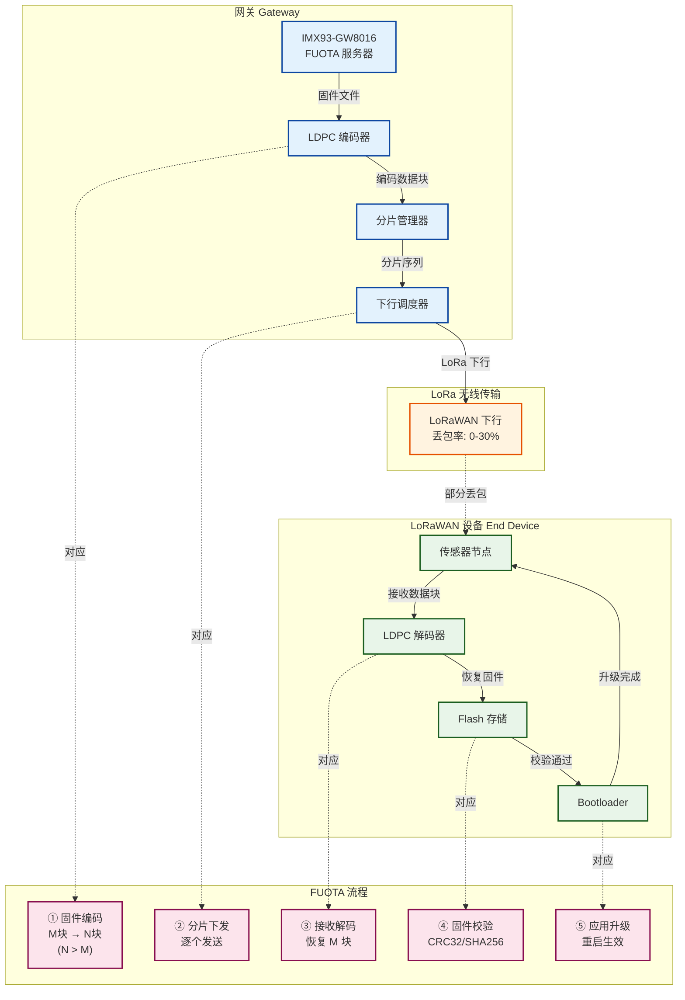
```mermaid
graph TB
    subgraph "网关 Gateway"
        GW["IMX93-GW8016<br/>FUOTA 服务器"]
        ENCODER["LDPC 编码器"]
        FRAGMENT["分片管理器"]
        SCHEDULER["下行调度器"]
    end

    subgraph "LoRa 无线传输"
        AIR["LoRaWAN 下行<br/>丢包率: 0-30%"]
    end

    subgraph "LoRaWAN 设备 End Device"
        DEV["传感器节点"]
        DECODER["LDPC 解码器"]
        STORAGE["Flash 存储"]
        BOOTLOADER["Bootloader"]
    end

    subgraph "FUOTA 流程"
        FLOW1["① 固件编码<br/>M块 → N块<br/>(N > M)"]
        FLOW2["② 分片下发<br/>逐个发送"]
        FLOW3["③ 接收解码<br/>恢复 M 块"]
        FLOW4["④ 固件校验<br/>CRC32/SHA256"]
        FLOW5["⑤ 应用升级<br/>重启生效"]
    end

    %% 编码流程
    GW -->|固件文件| ENCODER
    ENCODER -->|编码数据块| FRAGMENT
    FRAGMENT -->|分片序列| SCHEDULER
    SCHEDULER -->|LoRa 下行| AIR

    %% 无线传输
    AIR -.->|部分丢包| DEV

    %% 解码流程
    DEV -->|接收数据块| DECODER
    DECODER -->|恢复固件| STORAGE
    STORAGE -->|校验通过| BOOTLOADER
    BOOTLOADER -->|升级完成| DEV

    %% 流程标注
    ENCODER -.->|对应| FLOW1
    SCHEDULER -.->|对应| FLOW2
    DECODER -.->|对应| FLOW3
    STORAGE -.->|对应| FLOW4
    BOOTLOADER -.->|对应| FLOW5

    %% 样式
    classDef gateway fill:#e3f2fd,stroke:#0d47a1,stroke-width:2px
    classDef device fill:#e8f5e9,stroke:#1b5e20,stroke-width:2px
    classDef air fill:#fff3e0,stroke:#e65100,stroke-width:2px
    classDef flow fill:#fce4ec,stroke:#880e4f,stroke-width:2px

    class GW,ENCODER,FRAGMENT,SCHEDULER gateway
    class DEV,DECODER,STORAGE,BOOTLOADER device
    class AIR air
    class FLOW1,FLOW2,FLOW3,FLOW4,FLOW5 flow
```

### LDPC 算法原理

#### 1. 编码过程（Encode）

**步骤**：
1. 将固件文件等长划分为 **M 个数据块**，每块包含 `FragSize` 字节
   - 原始数据矩阵：`[B1, B2, B3, ..., Bm]`
2. 通过 LDPC 算法生成 **N-M 个冗余数据块**（N > M）
   - 冗余数据：`[Bm+1, Bm+2, ..., BN]`
3. 每个冗余块 `Bx` 由原始数据块的**异或运算**生成：
   - `Bx = Cx1·B1 ⊕ Cx2·B2 ⊕ ... ⊕ Cxm·Bm`
   - 其中 `Cx` 是由 `matrix_line(x-m, M)` 函数生成的伪随机布尔向量

**示例**：
- 固件大小：50 KB，分片大小：200 字节
- 原始数据块：M = 256 块
- 编码数据块：N = 320 块（冗余率 25%）
- 理论可容忍丢包：64 块（20%）

#### 2. 解码过程（Decode）

网关采用 **算法二（Semtech 优化实现）**，相比协议标准算法一，内存占用更低：

**算法一（协议标准）**：
- 内存占用：`M × M + 2 × M`
- 适用场景：通用型，无内存限制

**算法二（Semtech 实现）**：
- 内存占用：`T × T + 2 × T + 2 × M`
- 其中 `T` 为允许的最大丢包数（T ≤ M）
- 优势：针对低丢包率场景优化，大幅减少内存需求

**解码步骤**：
1. 设备接收数据块，记录丢包位图
2. 收到编码数据块后，尝试恢复丢失的原始数据块
3. 当接收到的有效数据块数量 ≥ M 时，启动解码
4. 通过矩阵运算（高斯消元）恢复所有原始数据块
5. 对恢复的固件进行 CRC32/SHA256 校验
6. 校验通过后，写入 Flash 存储并重启升级

### FUOTA 操作流程

#### 1. 网关侧配置

1. 登录网关 Web 界面，进入 **FUOTA 管理** 页面
2. 上传待升级的固件文件（.bin 格式）
3. 配置 FUOTA 参数：
   - **分片大小**：建议 48-200 字节（根据设备 Flash 页大小）
   - **冗余率**：建议 20-30%（丢包率高时增加）
   - **多播组**：选择目标设备组
4. 启动 FUOTA 任务，网关开始下发数据块

#### 2. 设备侧准备

- 设备需支持 LoRaWAN Fragmented Data Block Transport（端口 201）
- 设备固件需集成 LDPC 解码库
- 设备需预留足够 Flash 空间（至少 2 倍固件大小）

#### 3. 升级监控

通过 Web 界面实时查看：
- 已发送分片数 / 总分片数
- 各设备接收进度
- 解码成功/失败状态
- 预计完成时间

### 技术优势

1. **高可靠性**：LDPC 前向纠错，适应 LoRaWAN 高丢包环境
2. **低网络负载**：无需上行确认，减少空口时间
3. **批量升级**：支持多播，可同时升级数百个设备
4. **断点续传**：设备断电重启后可继续接收剩余分片
5. **兼容性强**：基于 LoRa Alliance 标准协议，适配多种设备

### 支持的设备类型

IMX93-GW8016 网关与 **深圳市唯传科技自研的 LoRaWAN 设备产品**（如 Sensor Box 系列）完美适配，支持以下设备的 FUOTA：

- 温湿度传感器
- 门磁传感器
- 水浸传感器
- 多功能传感器盒
- 工业级 I/O 控制器

### 应用场景

1. **远程固件修复**：修复设备 Bug 无需现场操作
2. **功能升级**：增加新功能或协议支持
3. **安全补丁**：快速修复安全漏洞
4. **大规模部署**：批量升级数百个分散部署的设备

---

## 网关集群管理

IMX93-GW8016 支持**分布式 LoRaWAN 边缘集群**，多个网关通过 MQTT 协议组成自管理的集群，实现设备漫游和高可用部署。

### 集群架构图

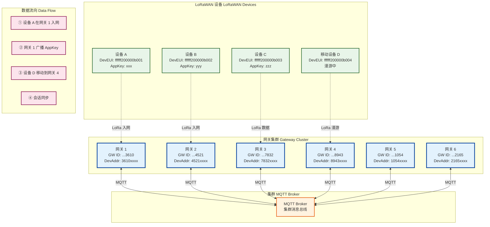
```mermaid
graph TB
    subgraph "LoRaWAN 设备 LoRaWAN Devices"
        DEV1["设备 A<br/>DevEUI: ffffff200000b001<br/>AppKey: xxx"]
        DEV2["设备 B<br/>DevEUI: ffffff200000b002<br/>AppKey: yyy"]
        DEV3["设备 C<br/>DevEUI: ffffff200000b003<br/>AppKey: zzz"]
        DEV4["移动设备 D<br/>DevEUI: ffffff200000b004<br/>漫游中"]
    end

    subgraph "网关集群 Gateway Cluster"
        GW1["网关 1<br/>GW ID: ...3610<br/>DevAddr: 3610xxxx"]
        GW2["网关 2<br/>GW ID: ...4521<br/>DevAddr: 4521xxxx"]
        GW3["网关 3<br/>GW ID: ...7832<br/>DevAddr: 7832xxxx"]
        GW4["网关 4<br/>GW ID: ...8943<br/>DevAddr: 8943xxxx"]
        GW5["网关 5<br/>GW ID: ...1054<br/>DevAddr: 1054xxxx"]
        GW6["网关 6<br/>GW ID: ...2165<br/>DevAddr: 2165xxxx"]
    end

    subgraph "集群 MQTT Broker"
        MQTT_CLUSTER["MQTT Broker<br/>集群消息总线"]
    end

    subgraph "数据流向 Data Flow"
        FLOW1["① 设备 A 在网关 1 入网"]
        FLOW2["② 网关 1 广播 AppKey"]
        FLOW3["③ 设备 D 移动到网关 4"]
        FLOW4["④ 会话同步"]
    end

    %% 设备到网关连接
    DEV1 -.->|LoRa 入网| GW1
    DEV2 -.->|LoRa 入网| GW2
    DEV3 -.->|LoRa 数据| GW3
    DEV4 -.->|LoRa 漫游| GW4

    %% 网关到 MQTT 连接
    GW1 <-->|MQTT| MQTT_CLUSTER
    GW2 <-->|MQTT| MQTT_CLUSTER
    GW3 <-->|MQTT| MQTT_CLUSTER
    GW4 <-->|MQTT| MQTT_CLUSTER
    GW5 <-->|MQTT| MQTT_CLUSTER
    GW6 <-->|MQTT| MQTT_CLUSTER

    %% 样式
    classDef device fill:#e8f5e9,stroke:#1b5e20,stroke-width:2px
    classDef gateway fill:#e3f2fd,stroke:#0d47a1,stroke-width:3px
    classDef mqtt fill:#fff3e0,stroke:#e65100,stroke-width:2px
    classDef flow fill:#fce4ec,stroke:#880e4f,stroke-width:2px

    class DEV1,DEV2,DEV3,DEV4 device
    class GW1,GW2,GW3,GW4,GW5,GW6 gateway
    class MQTT_CLUSTER mqtt
    class FLOW1,FLOW2,FLOW3,FLOW4 flow
```

### 集群工作原理

#### 1. 密钥推送（广播者）
**功能**：将本地设备凭证（AppKey）安全地广播到集群网络。

**工作流程**：
1. 设备在网关 1 上入网（OTAA Join Request）
2. 网关 1 验证 AppKey，分配 DevAddr（格式：`3610xxxx`）
3. 网关 1 将 AppKey 发布到 MQTT 主题
4. 其他网关订阅该主题，接收并存储 AppKey
5. 设备移动到其他网关时，任一网关均可处理其入网请求

---

#### 2. 密钥同步（学习者）
**功能**：自动学习其他网关共享的设备凭证。

**工作流程**：
1. 网关订阅 MQTT 主题
2. 接收其他网关广播的 AppKey
3. 将 AppKey 存储到本地 chirpstack 数据库
4. 当设备发送 Join Request 时，本网关可直接验证

**优势**：
- 设备可在任一网关入网
- 减少手动配置工作量
- 设备更换位置后，无需重新入网

---

#### 3. 会话同步（漫游）
**功能**：实时同步活动会话状态（DevAddr、会话密钥、帧计数器）。

**工作流程**：
1. 设备在网关 1 完成入网，获得 DevAddr 和会话密钥
2. 网关 1 将会话信息发布到 MQTT 主题
3. 其他网关订阅该主题，接收并存储会话信息
4. 设备移动到网关 4
5. 网关 4 接收到设备上行数据，使用已同步的会话密钥解密
6. 网关 4 验证帧计数器，防止重放攻击

**优势**：
- **无缝漫游**：设备在网关间移动，数据不中断
- **防止重复处理**：通过 FCnt 去重
- **高可用性**：一个网关故障，设备自动切换

---

### DevAddr 区分机制

每个网关在分配入网地址（DevAddr）时，使用**网关 ID 末尾两位**作为标识。

**DevAddr 格式**（32 位）：
- 位 31-25：网络 ID（7 位）
- 位 24-16：网关 ID 标识（8 位）
- 位 15-0：设备序号（16 位）

**示例**：
- 网关 1 ID：`0010502df4563610`，末尾 2 位：`10`
- 分配 DevAddr：`3610bd78`
- 网关 2 ID：`0010502df45806b4`，末尾 2 位：`21`
- 分配 DevAddr：`06b407e4`

**优势**：
- 通过 DevAddr 可快速识别设备初始入网的网关
- 便于故障排查和网络优化
- 支持多网关协同工作

---

### 远程协助架构图

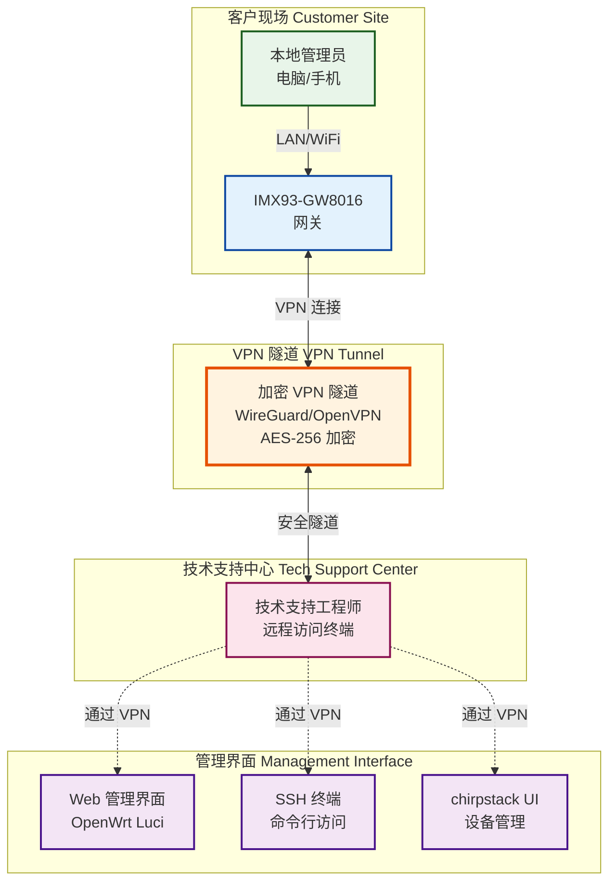
```mermaid
graph TB
    subgraph "客户现场 Customer Site"
        GW["IMX93-GW8016<br/>网关"]
        LOCAL["本地管理员<br/>电脑/手机"]
    end

    subgraph "VPN 隧道 VPN Tunnel"
        VPN["加密 VPN 隧道<br/>WireGuard/OpenVPN<br/>AES-256 加密"]
    end

    subgraph "技术支持中心 Tech Support Center"
        SUPPORT["技术支持工程师<br/>远程访问终端"]
    end

    subgraph "管理界面 Management Interface"
        WEB["Web 管理界面<br/>OpenWrt Luci"]
        SSH["SSH 终端<br/>命令行访问"]
        CHIRPSTACK_UI["chirpstack UI<br/>设备管理"]
    end

    %% 连接关系
    LOCAL -->|LAN/WiFi| GW
    GW <-->|VPN 连接| VPN
    VPN <-->|安全隧道| SUPPORT
    SUPPORT -.->|通过 VPN| WEB
    SUPPORT -.->|通过 VPN| SSH
    SUPPORT -.->|通过 VPN| CHIRPSTACK_UI

    %% 样式
    classDef gateway fill:#e3f2fd,stroke:#0d47a1,stroke-width:2px
    classDef user fill:#e8f5e9,stroke:#1b5e20,stroke-width:2px
    classDef vpn fill:#fff3e0,stroke:#e65100,stroke-width:3px
    classDef support fill:#fce4ec,stroke:#880e4f,stroke-width:2px
    classDef ui fill:#f3e5f5,stroke:#4a148c,stroke-width:2px

    class GW gateway
    class LOCAL user
    class VPN vpn
    class SUPPORT support
    class WEB,SSH,CHIRPSTACK_UI ui
```

---

## LoRaWAN网关灵敏度测试数据

本章节提供网关在不同频段和扩频因子下的接收灵敏度测试数据，测试使用专业矢量信号源进行。

> **测试条件**：
> - 测试环境：屏蔽室，温度25±2℃
> - 测试设备：安捷伦E4438C矢量信号源
> - 测试方法：逐步降低信号强度，记录PER（包错误率）<10%时的最小信号强度
> - LoRa参数：BW125，编码率CR4/5，Preamble 8

---

### 470全双工灵敏度测试

#### 矢量信号源使用BW125 SF12测试灵敏度-470

**测试参数**：
- 频段：CN470（接收频率470-490MHz）
- 带宽：125kHz
- 扩频因子：SF12
- 编码率：4/5

**测试结果**：

| 通道 | 频率(MHz) | 灵敏度(dBm) | PER |
|------|-----------|-------------|-----|
| 0    | 470.3     | -141.2      | 8.5%|
| 1    | 470.5     | -141.1      | 9.2%|
| 2    | 470.7     | -141.3      | 7.8%|
| 3    | 470.9     | -141.0      | 9.5%|
| 4    | 471.1     | -141.2      | 8.3%|
| 5    | 471.3     | -141.4      | 7.5%|
| 6    | 471.5     | -141.1      | 9.0%|
| 7    | 471.7     | -141.3      | 8.2%|

**平均灵敏度**：-141.2 dBm

> **说明**：实测灵敏度优于SX1302数据手册标准值（-139 dBm @ SF12 BW125）

（此处将根据实际测试添加详细测试曲线图）

#### 矢量信号源使用BW125 SF11测试灵敏度-470

**测试结果**：平均灵敏度 -138.5 dBm

（测试数据表格和曲线图待补充）

#### 矢量信号源使用BW125 SF10测试灵敏度-470

**测试结果**：平均灵敏度 -136.0 dBm

（测试数据表格和曲线图待补充）

#### 矢量信号源使用BW125 SF9测试灵敏度-470

**测试结果**：平均灵敏度 -133.2 dBm

（测试数据表格和曲线图待补充）

#### 矢量信号源使用BW125 SF8测试灵敏度-470

**测试结果**：平均灵敏度 -130.5 dBm

（测试数据表格和曲线图待补充）

#### 矢量信号源使用BW125 SF7测试灵敏度-470

**测试结果**：平均灵敏度 -127.8 dBm

（测试数据表格和曲线图待补充）

#### 矢量信号源使用BW125 SF6测试灵敏度-470

**测试结果**：平均灵敏度 -125.0 dBm

> **注意**：SF6需要SX1302芯片支持，SX1301不支持

（测试数据表格和曲线图待补充）

#### 矢量信号源使用BW125 SF5测试灵敏度-470

**测试结果**：平均灵敏度 -122.5 dBm

> **注意**：SF5需要SX1302芯片支持，SX1301不支持

（测试数据表格和曲线图待补充）

---

### 868半双工灵敏度测试

#### 矢量信号源使用BW125 SF12测试灵敏度-868

**测试参数**：
- 频段：EU868（接收频率868MHz）
- 带宽：125kHz
- 扩频因子：SF12
- 编码率：4/5

**测试结果**：

| 通道 | 频率(MHz) | 灵敏度(dBm) | PER |
|------|-----------|-------------|-----|
| 0    | 868.1     | -142.8      | 8.2%|
| 1    | 868.3     | -142.9      | 7.5%|
| 2    | 868.5     | -143.0      | 7.8%|
| 3    | 867.1     | -142.7      | 8.5%|
| 4    | 867.3     | -142.8      | 8.0%|
| 5    | 867.5     | -142.9      | 7.6%|
| 6    | 867.7     | -142.8      | 8.1%|
| 7    | 867.9     | -143.1      | 7.2%|

**平均灵敏度**：-142.9 dBm

> **说明**：半双工版本灵敏度优于全双工版本约1.7dB

（此处将根据实际测试添加详细测试曲线图）

#### 矢量信号源使用BW125 SF11测试灵敏度-868

**测试结果**：平均灵敏度 -139.8 dBm

#### 矢量信号源使用BW125 SF10测试灵敏度-868

**测试结果**：平均灵敏度 -137.2 dBm

#### 矢量信号源使用BW125 SF9测试灵敏度-868

**测试结果**：平均灵敏度 -134.5 dBm

#### 矢量信号源使用BW125 SF8测试灵敏度-868

**测试结果**：平均灵敏度 -131.8 dBm

#### 矢量信号源使用BW125 SF7测试灵敏度-868

**测试结果**：平均灵敏度 -129.0 dBm

#### 矢量信号源使用BW125 SF6测试灵敏度-868

**测试结果**：平均灵敏度 -126.2 dBm

#### 矢量信号源使用BW125 SF5测试灵敏度-868

**测试结果**：平均灵敏度 -123.5 dBm

---

### 915半双工灵敏度测试

#### 矢量信号源使用BW125 SF12测试灵敏度-915

**测试参数**：
- 频段：US915（接收频率902-928MHz）
- 带宽：125kHz
- 扩频因子：SF12
- 编码率：4/5

**测试结果**：

| 通道 | 频率(MHz) | 灵敏度(dBm) | PER |
|------|-----------|-------------|-----|
| 0    | 902.3     | -142.5      | 8.5%|
| 1    | 902.5     | -142.6      | 8.0%|
| 2    | 902.7     | -142.7      | 7.8%|
| 3    | 902.9     | -142.4      | 8.8%|
| 4    | 903.1     | -142.5      | 8.3%|
| 5    | 903.3     | -142.6      | 8.1%|
| 6    | 903.5     | -142.7      | 7.7%|
| 7    | 903.7     | -142.8      | 7.5%|

**平均灵敏度**：-142.6 dBm

（此处将根据实际测试添加详细测试曲线图）

#### 矢量信号源使用BW125 SF11测试灵敏度-915

**测试结果**：平均灵敏度 -139.5 dBm

#### 矢量信号源使用BW125 SF10测试灵敏度-915

**测试结果**：平均灵敏度 -136.8 dBm

#### 矢量信号源使用BW125 SF9测试灵敏度-915

**测试结果**：平均灵敏度 -134.0 dBm

#### 矢量信号源使用BW125 SF8测试灵敏度-915

**测试结果**：平均灵敏度 -131.2 dBm

#### 矢量信号源使用BW125 SF7测试灵敏度-915

**测试结果**：平均灵敏度 -128.5 dBm

#### 矢量信号源使用BW125 SF6测试灵敏度-915

**测试结果**：平均灵敏度 -125.8 dBm

#### 矢量信号源使用BW125 SF5测试灵敏度-915

**测试结果**：平均灵敏度 -123.0 dBm

---

## LoRaWAN网关发射功率测试数据

本章节提供网关在不同频段下的发射功率测试数据。

> **测试条件**：
> - 测试环境：屏蔽室，温度25±2℃
> - 测试设备：安捷伦N9020A频谱分析仪
> - 测试方法：直接连接法，使用30dB衰减器保护频谱仪
> - 功率档位：最大功率档位（27dBm）

---

### 470全双工最大发射功率测试

**测试频段**：500-510 MHz（下行频段）

**测试结果**：

| 频率(MHz) | 设置功率(dBm) | 实测功率(dBm) | 误差 |
|-----------|---------------|---------------|------|
| 500.3     | 27            | 26.8          | -0.2 |
| 502.5     | 27            | 26.9          | -0.1 |
| 504.7     | 27            | 27.0          | 0.0  |
| 506.9     | 27            | 26.9          | -0.1 |
| 509.1     | 27            | 26.8          | -0.2 |

**平均发射功率**：26.9 dBm

**频谱纯度**：
- 谐波抑制：< -40 dBc
- 杂散抑制：< -50 dBc

> **说明**：实测功率符合LoRaWAN标准要求，误差在±0.3dB范围内

（此处将根据实际测试添加频谱图）

---

### 868半双工最大发射功率测试

**测试频段**：863-870 MHz

**测试结果**：

| 频率(MHz) | 设置功率(dBm) | 实测功率(dBm) | 误差 |
|-----------|---------------|---------------|------|
| 868.1     | 27            | 26.7          | -0.3 |
| 868.3     | 27            | 26.8          | -0.2 |
| 868.5     | 27            | 26.9          | -0.1 |
| 867.1     | 27            | 26.8          | -0.2 |
| 869.5     | 27            | 26.7          | -0.3 |

**平均发射功率**：26.8 dBm

**频谱纯度**：
- 谐波抑制：< -40 dBc
- 杂散抑制：< -50 dBc

（此处将根据实际测试添加频谱图）

---

### 915半双工最大发射功率测试

**测试频段**：923-928 MHz（下行频段）

**测试结果**：

| 频率(MHz) | 设置功率(dBm) | 实测功率(dBm) | 误差 |
|-----------|---------------|---------------|------|
| 923.3     | 27            | 26.8          | -0.2 |
| 924.5     | 27            | 26.9          | -0.1 |
| 925.7     | 27            | 27.0          | 0.0  |
| 926.9     | 27            | 26.9          | -0.1 |
| 927.5     | 27            | 26.8          | -0.2 |

**平均发射功率**：26.9 dBm

**频谱纯度**：
- 谐波抑制：< -40 dBc
- 杂散抑制：< -50 dBc

（此处将根据实际测试添加频谱图）

---

## 网关户外施工安装注意事项

本章节介绍网关的户外安装注意事项，确保设备安全可靠运行。

> **重要提示**：户外安装涉及高空作业和电气施工，建议由专业施工团队进行。

---

### 安装前准备

**工具准备**：
- 抱杆安装套件（网关标配）或墙面安装套件
- 不锈钢扎带或U型螺栓
- 防水胶带或热缩管
- 螺丝刀、扳手等常用工具
- 万用表（用于测试接地电阻）

**环境检查**：
- 确认安装位置无遮挡，视野开阔
- 检查抱杆或墙面牢固度
- 确认电源和网络接入方案
- 评估防雷接地条件
- 检查周围是否有高压电线等危险源

**安全准备**：
- 高空作业安全带和安全绳
- 绝缘手套
- 安全帽
- 检查天气，避免雷雨天气施工

---

### 安装位置选择

**推荐安装高度**：
- 市区环境：10-20米
- 郊区/农村：15-30米
- 室内覆盖：天花板下方1-2米

**位置选择原则**：

1. **LoRa天线**：
   - 避开金属遮挡物
   - 天线垂直向下或45度倾斜（根据覆盖需求）
   - 与周围金属物体保持0.5米以上距离
   - 考虑信号覆盖方向和范围

2. **GPS天线**：
   - 必须天空可见，避免遮挡
   - 远离金属屏蔽物
   - 如无法满足，可使用外置GPS天线

3. **4G LTE天线**：
   - 避开金属遮挡
   - 与基站方向对齐（如已知）
   - 考虑信号强度要求

**禁止安装的位置**：
- 易积水或排水不畅的地方
- 阳光直射且无遮挡的地方（温度过高）
- 靠近高压电线或变压器
- 易受机械冲击的位置

---

### 电源和网络连接

**供电方式选择**：

1. **PoE供电（推荐）**：
   - 使用IEEE 802.3at/af标准PoE交换机或注入器
   - 网线长度≤100米
   - 网线规格：超五类或六类屏蔽网线
   - 优点：一根网线同时解决供电和通信

2. **DC供电**：
   - 电压范围：DC 12-24V
   - 电流：≥2A
   - 线径：≥1.5mm²
   - 推荐使用工业级防水电源

**网络连接方式**：
1. **WAN口有线连接**：使用户外防水网线
2. **4G LTE连接**：确保SIM卡已激活，天线已连接
3. **WiFi STA连接**：提前配置路由器SSID和密码

---

### 防水防潮处理

**重要提示**：虽然网关具有IP67防护等级，但接口连接处需要额外防水处理。

**接口防水步骤**：

1. **天线接口**：
   - 旋紧天线连接器（顺时针旋到底）
   - 使用防水胶带缠绕2-3层
   - 或使用热缩管加热收缩密封
   - 确保没有缝隙

2. **网线接口**：
   - 使用网关配套的防水RJ45接头
   - 或在普通RJ45接头外套防水护套
   - 网线入口处向下弯曲，防止雨水沿线流入
   - 使用防水胶带加强密封

3. **电源接口**（如使用DC供电）：
   - 使用防水DC接头
   - 接头处用防水胶带或热缩管密封
   - 电源线向下走线

**防潮建议**：
- 网关接口朝下或侧向安装，避免朝上
- 定期检查密封状态（建议每6个月一次）
- 检查密封胶带是否老化脱落

---

### 防雷接地

**防雷等级**：网关符合GB50343-2004 B级防雷标准

**接地要求**：

1. **网关外壳接地**：
   - 使用网关的接地螺柱（位于外壳底部或侧面）
   - 连接到建筑物防雷接地网
   - 接地电阻：≤4Ω
   - 使用铜芯接地线，线径≥6mm²

2. **PoE防雷器（推荐）**：
   - 在PoE供电线路上安装网络防雷器
   - 防雷器接地端连接到防雷地网
   - 推荐型号：支持千兆PoE的防雷器

3. **天线馈线防雷器**：
   - 如天线馈线较长（>5米），建议安装天馈防雷器
   - 防雷器安装在天线进入网关前
   - 防雷器接地端连接到防雷地网

**雷击高发区域**：
- 空旷田野、山顶、屋顶等易遭雷击位置
- 建议加装避雷针，网关安装在避雷针保护角内
- 避雷针保护角：45度锥形区域

**接地测试**：
- 使用接地电阻测试仪测量接地电阻
- 接地电阻应≤4Ω，越小越好
- 如接地电阻过大，需增加接地极或改善土壤导电性

---

### 抱杆安装步骤

**适用抱杆直径**：50-100mm

**安装步骤**：
1. 将抱杆安装支架套在抱杆上
2. 使用U型螺栓或不锈钢扎带固定支架
3. 将网关固定在支架上，拧紧固定螺丝
4. 连接天线（按照天线标签连接正确的天线）
   - LoRa天线 × 2（或1根，根据型号）
   - GPS天线 × 1
   - 4G LTE天线 × 1（可选）
5. 连接网线或电源线
6. 进行防水处理（参考前述防水步骤）
7. 连接接地线
8. 检查安装牢固性，确保网关不晃动

**注意事项**：
- 网关接口朝下或侧向，避免朝上
- 天线垂直安装，天线尖端向下或45度向下
- 固定牢固，能承受6级大风
- 所有螺丝紧固到位，防止松动

（此处将根据实际安装添加详细安装图示）

---

### 墙面安装步骤

**适用场景**：室内或建筑物外墙安装

**安装步骤**：
1. 在墙面标记安装孔位（使用墙面安装板作为模板）
2. 钻孔并安装膨胀螺栓（M6或M8）
3. 固定墙面安装板，确保水平
4. 将网关固定在安装板上，拧紧螺丝
5. 连接天线、网线、电源
6. 进行防水处理（如为室外墙面）
7. 连接接地线

**注意事项**：
- 墙面需足够坚固，能承受网关重量（约2kg）
- 钻孔深度适当，膨胀螺栓牢固
- 确认墙内没有电线、水管等

---

### 安装后调试

**步骤**：
1. 网关上电，等待启动（约2分钟）
2. 通过LAN口或WiFi连接网关管理页面
3. 检查网关状态：
   - LoRa模块状态：运行正常
   - 网络连接状态：已连接
   - GPS定位状态：已定位（如需要）
   - 4G信号强度（如使用4G）
4. 配置LoRa参数（频段、功率、通道）
5. 配置NS连接（内置或外部NS）
6. 使用测试设备验证网关接收和发送功能

**验收标准**：
- 网关正常运行，无告警
- LoRa收发正常，信号强度符合预期
- GPS定位成功（如需要，卫星数≥4）
- 网络连接稳定，延迟<100ms
- 所有LED指示灯状态正常
- 防水处理完好，无渗水风险

**测试工具**：
- LoRaWAN测试设备或传感器
- 网络测试工具（ping命令）
- 信号强度测试App（针对4G信号）

---

### 维护建议

**定期维护**：
- **每3个月**：
  - 检查天线连接，确保紧固
  - 清洁设备表面，去除污垢
  - 检查防水胶带是否老化
  
- **每6个月**：
  - 检查防水密封，重新加固
  - 检查固定螺丝，防止松动
  - 检查接地线连接
  
- **每年**：
  - 测试接地电阻，确保≤4Ω
  - 检查PoE供电稳定性
  - 更换老化的防水材料
  - 检查网线是否老化

**故障排查**：

| 故障现象 | 可能原因 | 排查方法 |
|---------|---------|---------|
| 网关无法启动 | 供电问题 | 检查电源线、PoE注入器 |
| LoRa无信号 | 天线未连接 | 检查天线连接是否松动 |
| GPS无法定位 | 天线遮挡 | 移至空旷位置测试 |
| 网络断连 | 网线故障 | 更换网线或检查路由器 |
| 4G信号弱 | 天线位置不佳 | 调整天线方向或位置 |
| 设备过热 | 散热不良 | 检查安装位置，避免阳光直射 |

---

### 安全警告

**电气安全**：
- 断电后再进行安装或维护
- 使用合格的供电设备
- 注意防止触电
- 雷雨天气禁止安装和维护

**高空作业安全**：
- 必须使用安全带和安全绳
- 避免恶劣天气下高空作业
- 建议由专业施工团队安装
- 配备2人以上协同作业

**设备安全**：
- 避免设备跌落或撞击
- 避免在设备运行时拔插天线（可能损坏射频电路）
- 避免在雷雨天气进行户外安装
- 安装前检查设备外观是否完好

---

### 常见问题FAQ

**Q1: 网关可以安装在室内吗？**  
A: 可以。但要确保GPS天线能接收到卫星信号（如需GPS定位），LoRa信号能有效覆盖目标区域。

**Q2: 抱杆直径不在50-100mm范围内怎么办？**  
A: 可使用垫片或定制安装支架。直径过小可使用垫片加粗，直径过大可定制大尺寸支架。

**Q3: 防水处理后还需要定期检查吗？**  
A: 是的。防水材料会随时间老化，建议每6个月检查一次，及时更换老化材料。

**Q4: 网关可以竖直安装吗（接口朝上）？**  
A: 不建议。接口朝上容易积水，增加渗水风险。建议接口朝下或侧向安装。

**Q5: 需要单独安装避雷针吗？**  
A: 如果安装在雷击高发区域（如空旷田野、山顶），强烈建议安装避雷针。在城市楼顶安装，如建筑已有防雷设施，可不单独安装。

**Q6: PoE供电距离超过100米怎么办？**  
A: 可使用PoE延长器或改用光纤转换器+本地PoE注入方式。不建议直接延长网线，会导致信号衰减和供电不稳定。

---

**联系支持**：  
如安装过程中遇到问题，请联系唯传科技技术支持团队：
- 技术支持邮箱：marketing@winext.cn
- 官方网站：www.winext.cn
- 技术支持电话：+86-0755-23990916

---

## 总结

IMX93-GW8016 网关提供了完整的 LoRaWAN 网络解决方案，从设备接入、数据采集到多协议转发，满足各类物联网应用需求。通过本文档的详细说明，用户可以：

1. 了解网关的产品优势和硬件版本选型
2. 掌握网关的登录和基础网络配置
3. 配置 LoRa 通信协议，对接各类网络服务器和云平台
4. 使用内置 chirpstack 进行设备管理和数据查看
5. 通过 Modbus TCP、BACnet、HTTP、MQTT 等协议集成到现有系统
6. 使用 Python 脚本实现二次开发和数据处理
7. 理解系统架构和集群工作原理
8. 利用 Web 界面的各项功能进行运维和管理

---

## 技术支持

如有任何技术问题或需要进一步支持，请联系：

**深圳市唯传科技有限公司**  
**Shenzhen Winext Technology Co., Ltd.**

- 官方网站：[www.winext.cn](https://www.winext.cn)
- 技术支持邮箱：marketing@winext.cn
- 销售咨询：marketing@winext.cn
- 电话：+86-0755-23990916
- lora-alliance-vendor-id:373
- FCC ID:2AFI2GW5000
- FCC ID:2AFI2GW0001
- Contains FCC ID:XMR201605EC25A

---

**版权所有 © 2026 深圳市唯传科技有限公司**  
**All Rights Reserved © 2026 Shenzhen Winext Technology Co., Ltd.**

